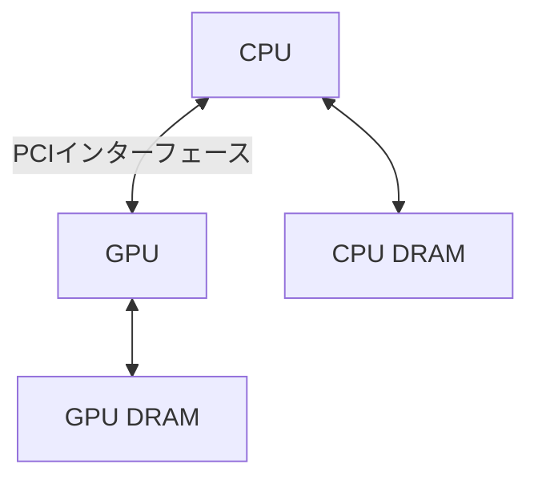

## 概要

このレクチャーでは，CPUとGPUの根本的な違いを解説し，なぜGPUのハードウェアを理解することがパフォーマンス最適化に不可欠なのかを説明します．逐次実行と並列実行の違い，CPUとGPUの共存関係，そしてNvidia GPUの内部構造（`Streaming Multiprocessor`）の基本を学びます．

## 主要な内容

### GPUのハードウェア理解の重要性

GPUのパフォーマンスを最大限に引き出すためには，GPUハードウェアの各ユニットやセグメントを深く理解する必要があります．これは外科医が手術を行う際に人体の解剖学を熟知している必要があるのと同じです．コードを書いてGPUで実行するだけでは，最適なパフォーマンスは得られません．

### CPUとGPUの類似点と相違点

CPUとGPUはどちらも`DRAM`（グローバルメモリ），キャッシュメモリ階層，演算ユニットといった類似のコンポーネントを持っています．CPUには`L1`，`L2`，`L3`の3段階のキャッシュがあり，GPUには`L1`と`L2`の2段階があります．CPUの`ALU`（Arithmetic and Logic Unit）に相当するのが，GPUの`コア`です．

1対1の比較では，CPUの`ALU`はGPUのコアよりもはるかに強力です．例えば，現代のCPUは3〜4GHzの周波数で動作しますが，2020年リリースの`A100` GPUのコア周波数は765〜1200MHz（約1.2GHz）で，CPUの平均速度の約4分の1です．

### 逐次実行と並列実行

```mermaid
graph LR
    subgraph 逐次実行（CPU向き）
        A1[ADD R1=R2+R3] --> M1[MUL R4=R1*R5] --> D1[DIV R6=R4/R7]
    end
```

命令間に依存関係がある場合（各命令が前の命令の結果を必要とする場合），複数のコアがあっても同時実行はできません．この場合はCPUの少数の高速`ALU`が最適です．

```mermaid
graph LR
    subgraph 並列実行（GPU向き）
        A2[ADD R1=R2+R3]
        M2[MUL R4=R5*R6]
        D2[DIV R7=R8/R9]
    end
```

命令が互いに独立している場合，複数のコアに各命令を割り当てて同時実行が可能です．例えば1000個の独立した命令があれば，1000コアで1サイクルで完了できます．依存関係がある場合は1000サイクル必要です．

### CPUとGPUの共存

一般的なマザーボード上で，CPUは`PCIインターフェース`を通じてGPUと接続されます．CPUには専用の`DRAM`（RAM）があり，GPUにも専用のメモリがあります．



### Nvidia GPUの内部構造

GPUカード内部の最も重要なコンポーネントは`Streaming Multiprocessor`（`SM`）です．各`SM`には以下のユニットが含まれます：

- 浮動小数点演算用コア
- 整数演算用コア
- `Tensor Core`（行列演算専用）
- 特殊関数ユニット（log計算など）
- ロード/ストアユニット
- `L1`キャッシュメモリ
- スケジューラとディスパッチャ
- レジスタ

`A100` GPUを例にとると，108個の`SM`を搭載し，各`SM`に64個の単精度コアがあるため，全体で約7000個の単精度コアを持ちます．さらに約7000個の整数演算コア，特殊関数ユニット，`Tensor Core`も搭載されています．

### GPUの実用例

`A100` GPUは世界中の多くのスーパーコンピュータの中核コンポーネントとして使用されています．Top500スーパーコンピュータリストでは，上位10台のうち3台に`A100` GPUが搭載されています．後継の`H100` GPUは2022年にリリースされ，さらなる性能向上が実現されています．

## まとめ

- CPUは逐次的な依存関係のある命令の実行に優れ，GPUは多数の独立した命令の並列実行に優れている
- GPUのパフォーマンス最適化には，ハードウェアの深い理解が不可欠である
- `Streaming Multiprocessor`（`SM`）はNvidia GPUの中核ユニットであり，様々な種類のコアやメモリを内蔵している
- `A100` GPUは約7000個の単精度コアを持ち，世界トップクラスのスーパーコンピュータに採用されている
