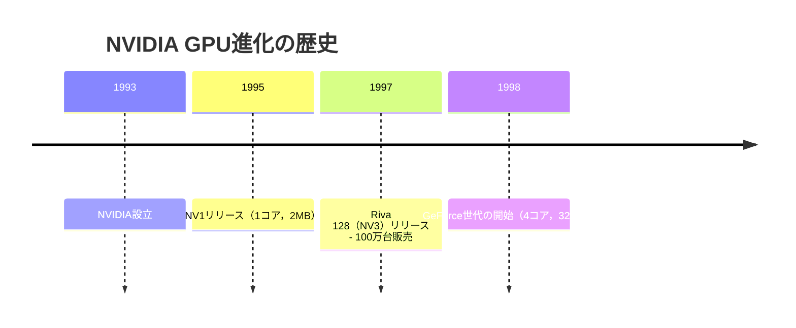

import Quiz from '@/components/content/Quiz.astro'

## 概要

このレクチャーでは，NVIDIAの創業から現在に至るまでの歴史を振り返り，GPU技術がどのように進化してきたかを解説します．1993年の創業から初期の`NV1`デバイス，`Riva 128`の市場成功，そして`GeForce`世代の登場まで，NVIDIAがどのようにしてgpu業界を支配するに至ったかを学びます．

## 主要な内容

### NVIDIAの創業

NVIDIAは1993年にジェンスン・フアン（Jensen Huang）によって設立されました．20世紀最後の20年間に設立された多くの主要テクノロジー企業の一つです．

### 最初の製品：NV1

創業からわずか2年後の1995年，NVIDIAは最初の製品である`NV1`デバイスを発売しました．このデバイスの仕様は非常にシンプルでした：

- メモリ：2MB
- バス幅：64ビット
- コア数：1

### NV1から最新GPUへの進化

`NV1`と最新のGPU（`GeForce RTX 4090 Ti`）を比較すると，驚異的な進化が見られます：

| 仕様 | NV1（1995年） | GeForce RTX 4090 Ti |
|------|-------------|-------------------|
| コア数 | 1 | 約18,000（10,000倍以上） |
| メモリ容量 | 2MB | 48GB（24,000倍） |
| 周波数 | 75MHz | 約2,400MHz（32倍） |

### Riva 128の成功（1997年）

1997年にNVIDIAは`Riva 128`（`NV3`とも呼ばれる）を発表しました．このデバイスは消費者市場に3Dアクセラレーションをもたらした初期のGPUの一つであり，前身の`NV1`よりも大きな成功を収めました．わずか4か月で約100万台を販売し，NVIDIAの市場での存在感を確固たるものにしました．

### GeForce世代の登場（1998年）

1998年，NVIDIAは後に象徴的となる`GeForce`世代を発表しました．この世代のGPUは多くのデスクトップやラップトップに搭載されており，現在も広く知られています．

初代`GeForce`は4つのコア（処理ユニット）を搭載し，メモリは32MBに増加しました．1998年当時，1つのデバイスに4つのコアを搭載することは画期的なことでした．

### 現在のNVIDIA

以降，NVIDIAはgpu分野で世界的に最もよく知られた企業となり，計算処理の高速化とゲーム業界の両方で主導的な地位を確立しています．

## まとめ

- NVIDIAは1993年に設立され，1995年にコア1個・メモリ2MBの`NV1`を発売した
- `Riva 128`（1997年）は4か月で100万台を販売し，NVIDIAの最初の大きな市場成功となった
- `GeForce`世代（1998年〜）の登場がGPU技術の革命的な転換点となった
- 約25年間でコア数は10,000倍以上，メモリは24,000倍に進化した

<Quiz questions={[
  {
    question: "NVIDIAが設立された年はいつですか？",
    options: [
      "1990年",
      "1993年",
      "1995年",
      "1997年"
    ],
    answer: 1,
    explanation: "NVIDIAは1993年にジェンスン・フアン（Jensen Huang）によって設立されました．最初の製品NV1は1995年にリリースされています．"
  },
  {
    question: "NVIDIAが初めて大きな市場成功を収めた製品はどれですか？",
    options: [
      "NV1",
      "GeForce",
      "Riva 128（NV3）",
      "GeForce RTX 4090 Ti"
    ],
    answer: 2,
    explanation: "Riva 128（NV3）は1997年に発表され，わずか4か月で約100万台を販売しました．これがNVIDIAの最初の大きな市場成功となりました．"
  },
  {
    question: "NV1（1995年）と最新GPUを比較した場合，メモリ容量はおよそ何倍に増加しましたか？",
    options: [
      "1,000倍",
      "10,000倍",
      "24,000倍",
      "100,000倍"
    ],
    answer: 2,
    explanation: "NV1のメモリは2MBでしたが，GeForce RTX 4090 Tiのメモリは48GBです．これは約24,000倍の増加に相当します．"
  }
]} />
