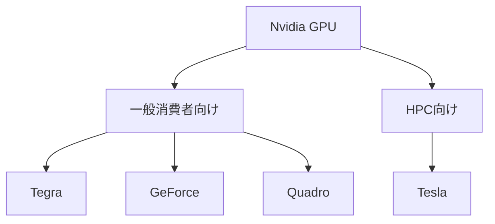

## 概要

このレクチャーでは，Nvidia GPUにおける「アーキテクチャ」と「世代（Generation）」という2つの重要な概念の違いと関係性を解説します．アーキテクチャはGPUチップの設計と能力を指し，世代はGPUの用途別カテゴリを指します．`Tegra`，`GeForce`，`Quadro`，`Tesla`の各世代の特徴も詳しく学びます．

## 主要な内容

### アーキテクチャとは

`アーキテクチャ`とは，GPUの基本的な設計と構造を指します．コアの配置，データの処理・転送方法，グラフィックス描画や計算タスクの手法など，GPUの最も根本的なレベルでの設計です．Nvidiaは各アーキテクチャに`Turing`や`Pascal`などの有名な科学者・発明家の名前を付けています．Nvidiaは1〜2年ごとに新しいアーキテクチャをリリースしています．

### 世代（Generation）とは

Nvidia GPUは用途別に大きく2つのカテゴリに分かれます：

### アーキテクチャと世代の関係

| 用語 | 意味 | 例 |
|------|------|------|
| アーキテクチャ | GPUチップの設計と能力 | Hopper，Ampere，Volta |
| 世代 | GPUの用途別カテゴリ | GeForce，Tesla，Quadro |

各アーキテクチャは複数の世代のGPUを含むことができます．例えば`Ampere`アーキテクチャ（2020年リリース）には，`GeForce`世代の`RTX 3090`（一般消費者向け）と`Tesla`世代の`A100`（HPC向け）の両方が含まれます．つまり，同じアーキテクチャに基づきながら，異なる市場向けに設計されたGPUが存在します．

### 各世代の詳細

- `Tegra`：モバイルデバイス向けのSoC（System on Chip）で，GPUとCPUを1つのチップに統合したもの．スマートフォン，タブレット，Nintendo Switchなどに使用
- `GeForce`：一般消費者向け，特にゲーマー向けのGPU．3Dグラフィックス，レンダリング，ゲームにおける高パフォーマンスを提供．`RTX 3090`，`RTX 3080`などが代表例
- `Quadro`：プロフェッショナルワークステーション向けのGPU．デザイナーやエンジニアが必要とする高精度と計算能力を提供．HP Zシリーズなどのワークステーションに搭載．なお最近のアップデートにより，`Quadro`の名称は`RTX`ラベルに置き換えられた
- `Tesla`：HPC（高性能計算）環境向けのGPU．スーパーコンピュータやクラウドサーバーで使用．Elon Muskの企業とは無関係

### Top500スーパーコンピュータとGPU世代

Top500スーパーコンピュータリストを確認すると，`Tesla`世代のGPU（`A100`，`V100`，`P100`など）が多数のスーパーコンピュータに採用されている一方，`GeForce`の`RTX`シリーズはトップランクのスーパーコンピュータにはほとんど見られません．これは各世代が設計された用途の違いを明確に示しています．

## まとめ

- 「アーキテクチャ」はGPUチップの設計・能力を指し，「世代」はGPUの用途別カテゴリを指す
- 1つのアーキテクチャから複数の世代のGPUが製造される（例：`Ampere`から`GeForce RTX 3090`と`Tesla A100`）
- `GeForce`は一般消費者・ゲーマー向け，`Tesla`はHPC・スーパーコンピュータ向けに設計されている
- `Quadro`の名称は最近`RTX`ラベルに統一された
- 用途に応じた適切なGPUの選択には，これらの区別の理解が重要である
