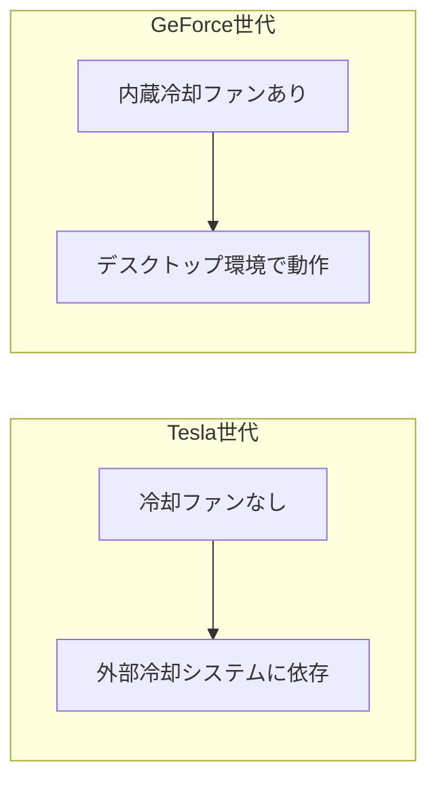

## 概要

このレクチャーでは，特定のGPUのアーキテクチャと世代を調べる具体的な方法を解説します．`TechPowerUp`ウェブサイトを使った仕様の確認方法と，`GeForce`と`Tesla`世代のGPUを外見から見分ける方法を学びます．

## 主要な内容

### TechPowerUpでGPUの仕様を調べる

GPUの仕様を確認するには，`TechPowerUp`というウェブサイトが便利です．このサイトには，様々なメーカーのGPUの詳細なデータベースが掲載されています．

調べ方は簡単で，Googleで「GPU名 TechPowerUp」と検索するだけです．例えば：
- `A100 GPU TechPowerUp`
- `RTX 3090 TechPowerUp`

### RTX 3090とA100の比較

`TechPowerUp`で2つのGPUの仕様を比較すると，以下のことがわかります：

| 項目 | A100 | RTX 3090 |
|------|------|----------|
| チップ名 | `GA100` | - |
| コア数（単精度） | 約6,912 | 約10,000以上 |
| 世代 | Tesla | GeForce 30 |
| アーキテクチャ | Ampere | Ampere |

注目すべき点は，`A100`の6,912コアという数値は単精度演算専用のコア数であり，GPUの全コア数ではないということです．`A100`には整数演算コアや倍精度演算コアなど，他の種類のコアも搭載されています．

### アーキテクチャと世代の確認

- `RTX 3090`：世代は`GeForce`（一般デスクトップ・ラップトップ向け），アーキテクチャは`Ampere`
- `A100`：世代は`Tesla`（HPC・スーパーコンピュータ向け），アーキテクチャは`Ampere`

同じ`Ampere`アーキテクチャに基づいていながら，異なる用途のために設計されています．

### 外見から世代を見分ける方法

- `Tesla`世代のGPU（`A100`，`V100`，`P100`など）：冷却ファンが搭載されていない．これはHPC環境に外部の堅牢な冷却システムがあるため
- `GeForce`世代のGPU（`RTX`シリーズなど）：内蔵の冷却ファンが搭載されている．一般的なデスクトップやワークステーション環境で発生する熱を放散するために必要

## まとめ

- GPUの仕様は`TechPowerUp`ウェブサイトで簡単に確認できる
- 仕様ページには世代名とアーキテクチャ名が明記されている
- 同じアーキテクチャでも異なる世代のGPUが存在する（例：`Ampere`アーキテクチャの`RTX 3090`と`A100`）
- `Tesla`世代のGPUには冷却ファンがなく，`GeForce`世代には内蔵ファンがあることで外見から区別できる
