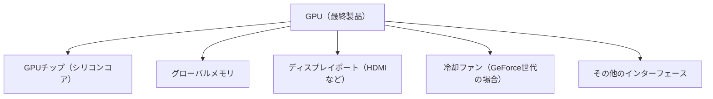

import Quiz from '@/components/content/Quiz.astro'

## 概要

このレクチャーでは，「GPU」と「GPUチップ」の違いを明確にします．GPUチップはGPUの心臓部であるシリコンコアであり，GPUはチップにメモリ，インターフェース，冷却機構などを統合した最終製品です．この区別は各アーキテクチャを理解するための前提知識として重要です．

## 主要な内容

### GPUチップとは

`GPUチップ`はGPUの心臓部です．周辺機器を持たない，純粋なシリコンコア（電子チップ）です．チップ内部には様々なコア，メモリコントローラ，その他の電子部品が集積されており，GPUの計算処理を担当します．

例えば，`Fermi`アーキテクチャのチップは`GF100`と命名されています（Gは「GPU」，Fは「Fermi」を意味します）．

### GPUとは

`GPU`は消費者が購入する最終製品です．チップに加えて，必要なシステムやインターフェースが完全に統合されています：

### 具体例：Fermiアーキテクチャ

- GPUチップ：`GF100`（シリコンコア単体）
- GPU製品：`GeForce GTX 480`（`GF100`チップを搭載した完成品）

`GeForce GTX 480`は`GeForce`世代のGPUなので，一般的なデスクトップやワークステーション環境向けに冷却ファンが搭載されています．

### 具体例：Ampereアーキテクチャ

- GPUチップ：`GA100`（Aは`Ampere`を意味する）
- GPU製品：`A100`（`GA100`チップを搭載した完成品）

`TechPowerUp`ウェブサイトで`A100` GPUのページを見ると，チップ名として`GA100`が記載されています．チップ名で検索すると，周辺部品のない電子チップ単体の画像を確認できます．

### チップの命名規則

NVIDIAのチップ命名は一貫したパターンに従っています：

| アーキテクチャ | チップ名 | 命名パターン |
|------------|---------|----------|
| Fermi | `GF100` | G + F（Fermi） + 番号 |
| Ampere | `GA100` | G + A（Ampere） + 番号 |

## まとめ

- `GPUチップ`はGPUの心臓部（シリコンコア）であり，コアやメモリコントローラなどの電子部品が集積されている
- `GPU`はチップにメモリ，インターフェース，冷却機構を統合した消費者向けの最終製品である
- チップ名にはアーキテクチャを示す文字が含まれている（例：`GF100`のFは`Fermi`，`GA100`のAは`Ampere`）
- この区別を理解することが，各アーキテクチャの詳細を学ぶための前提となる

<Quiz questions={[
  {
    question: "「GPUチップ」と「GPU」の違いとして正しいものはどれですか？",
    options: [
      "GPUチップとGPUは同じものを指す",
      "GPUチップはメモリやインターフェースを含む最終製品である",
      "GPUチップはシリコンコア単体であり，GPUはチップにメモリやインターフェースを統合した最終製品である",
      "GPUは設計図であり，GPUチップは実物である"
    ],
    answer: 2,
    explanation: "GPUチップはGPUの心臓部であるシリコンコア（電子チップ）です．GPUはそのチップにグローバルメモリ，ディスプレイポート，冷却ファンなどを統合した，消費者が購入する最終製品です．"
  },
  {
    question: "NVIDIAのチップ名「GA100」のアルファベット部分が意味するものは何ですか？",
    options: [
      "Gは「GeForce」，Aは「Advanced」を意味する",
      "Gは「GPU」，Aは「Ampere」アーキテクチャを意味する",
      "Gは「Graphics」，Aは「Accelerator」を意味する",
      "GAは「General Architecture」の略称である"
    ],
    answer: 1,
    explanation: "NVIDIAのチップ命名規則では，Gは「GPU」を意味し，2文字目はアーキテクチャ名の頭文字を示します．GA100のAは「Ampere」，GF100のFは「Fermi」を意味します．"
  }
]} />
