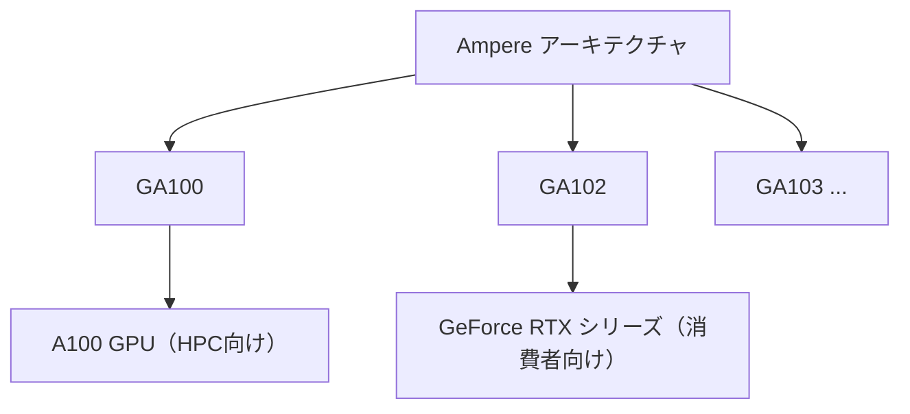

import Quiz from '@/components/content/Quiz.astro'

## 概要

このレクチャーでは，各GPUアーキテクチャ内で複数のチップがリリースされること，そして各チップがどのような市場セグメント向けのGPU製品に使用されるかを解説します．同じアーキテクチャのチップでもHPC向けと一般消費者向けで異なるチップが使い分けられる仕組みを学びます．

## 主要な内容

### アーキテクチャ内の複数チップ

各NVIDIA GPUアーキテクチャでは，複数のチップがリリースされます．各チップは独自の仕様を持ちますが，同じ基盤アーキテクチャを共有しています．

例えば`Ampere`アーキテクチャには以下のチップが含まれます：

チップ名の「A」は`Ampere`アーキテクチャを示しています．

### チップと市場セグメント

- `GA100`チップ：主にHPC向けのGPU製造に使用．代表例は`A100` GPU（`Tesla`世代，スーパーコンピュータやHPCサーバーで使用）．`TechPowerUp`で確認すると，このチップを使ったGPUには冷却ファンがないものが多い
- `GA102`チップ：主に一般消費者やゲーマー向けのGPU製造に使用．`GeForce RTX`シリーズなど，冷却ファンを搭載したGPUが多い

### チップのバージョン違い

NVIDIAは同じチップの異なるバージョンをリリースすることがあります．例えば`GA102`チップの場合：

| バージョン | 用途 | ラベル |
|----------|------|-------|
| 100〜350 | ゲーム市場向け | 一般消費者版 |
| 890 | HPC向け | HPC指向版 |

このように，同じチップでも異なるバージョンが異なる市場向けに最適化されています．

### 周波数の違い

各チップおよびチップバージョンは，GPUモデルやメーカーによって異なる速度（周波数）で動作することがあります．これはNVIDIAがGPUチップとライセンスを市場の様々な企業に提供しているためです．その結果，各企業は周波数などに若干の違いがあるGPUを製造する場合があります．

## まとめ

- 1つのアーキテクチャから複数のチップがリリースされ，それぞれ異なる市場セグメント向けのGPU製造に使用される
- 一部のチップはHPC向け（例：`GA100`），他のチップは一般消費者向け（例：`GA102`）に特化している
- 同じチップでもHPC版と消費者版のバージョン違いが存在することがある
- チップの動作周波数はGPUモデルやメーカーによって異なる場合がある

<Quiz questions={[
  {
    question: "Ampereアーキテクチャにおいて，HPC向けGPU（A100）に使用されるチップはどれですか？",
    options: [
      "GA102",
      "GA103",
      "GA100",
      "GF100"
    ],
    answer: 2,
    explanation: "GA100チップはAmpereアーキテクチャのHPC向けチップです．A100 GPUに搭載されており，スーパーコンピュータやHPCサーバーで使用されます．一方，GA102チップは一般消費者・ゲーマー向けのGeForce RTXシリーズに使用されます．"
  },
  {
    question: "同じチップから異なるバージョンのGPUが製造される理由として正しいものはどれですか？",
    options: [
      "製造コストを削減するため",
      "異なる市場セグメント（HPC向け・消費者向け）に最適化するため",
      "チップの不良品を有効活用するため",
      "各国の規制に対応するため"
    ],
    answer: 1,
    explanation: "NVIDIAは同じチップの異なるバージョンをリリースし，HPC向けと一般消費者向けなど，異なる市場セグメントに最適化しています．例えば，GA102チップにはゲーム市場向けバージョンとHPC向けバージョンが存在します．"
  }
]} />
