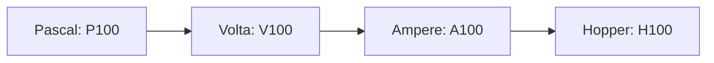
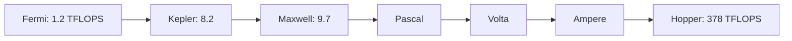

## 概要

このレクチャーでは，2010年の`Fermi`アーキテクチャから最新の`Hopper`アーキテクチャまで，NvidiaがリリースしてきたGPUアーキテクチャを時系列で比較します．各アーキテクチャの製造プロセス，代表的なGPU，スループットとクロック速度の進化を概観します．

## 主要な内容

### アーキテクチャ比較の観点

各アーキテクチャを以下の観点で比較します：

- アーキテクチャ名とリリース年
- 代表的なGPUチップ
- HPC向けGPUと一般消費者向けGPU
- スループット（TFLOPS）とクロック速度

### Fermiアーキテクチャ（2010年）

`Fermi`は40nm技術で製造され，GPU設計の大きな飛躍でした．代表チップは`GF100`です．

| GPU | 用途 | スループット | クロック速度 |
|-----|------|-----------|-----------|
| Tesla X2070 | HPC | 1.2 TFLOPS | 655MHz |
| GeForce GTX 480 | 一般消費者 | 1.3 TFLOPS | 701MHz |

一見すると消費者向けの`GTX 480`の方が性能が高く見えますが，GPU性能の評価は単純ではありません．`GTX 480`のスループットが上回るのは単精度演算の値であり，倍精度演算では`X2070`が`GTX 480`の約4倍の性能（582 GFLOPS vs 168 GFLOPS）を発揮します．

### Keplerアーキテクチャ（2012年）

28nm技術で製造．`Tesla K80`はHPC向けGPUで，1枚のボード上に2つの`GK210`チップを搭載し，合計約8.2 TFLOPSのスループットを実現（`Fermi`比で約6倍の向上）．Nvidiaは同じアーキテクチャのアップグレード版をリリースすることがあり，`Kepler`も2013〜2015年に新バージョンが登場しました．

### Maxwellアーキテクチャ（2014年）

28nm技術で製造．代表チップは`GM200`です．

| GPU | 用途 | スループット | クロック速度 |
|-----|------|-----------|-----------|
| Tesla M60 | HPC | 9.7 TFLOPS | 557MHz |
| GeForce GTX 980 Ti | 一般消費者 | 6.1 TFLOPS | 1000MHz |

HPC向けの`M60`はクロック速度が低いですが，これはエネルギー消費と直接関係しています．

### Pascal以降の命名パターン

`Pascal`以降，HPC向けGPUはアーキテクチャの頭文字+100という命名パターンを採用しています：

チップも同様に`GP100`，`GV100`，`GA100`，`GH100`と命名されています．

### Pascalアーキテクチャ（2016年）

16nmまたは14nm技術で製造．製造技術が2種類あるのは，各メーカーが異なるレベルの技術にアクセスできたためです．

### スループットの劇的な進化

`Fermi`の1.2 TFLOPSから`Hopper`の378 TFLOPSまで，約300倍以上のスループット向上が実現されました．

## まとめ

- Nvidiaは1〜2年ごとに新しいアーキテクチャをリリースしている
- 製造プロセスは`Fermi`の40nmから`Hopper`の最先端プロセスまで微細化が進んだ
- GPU性能の評価には単一の指標だけでなく，スループット，クロック速度，精度別の性能など複数の指標を考慮する必要がある
- `Fermi`から`Hopper`までのスループットは300倍以上向上した
- HPC向けGPUはクロック速度を抑える傾向があり，これはエネルギー効率と関連している
