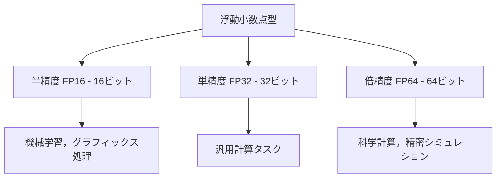

import Quiz from '@/components/content/Quiz.astro'

## 概要

このレクチャーでは，GPUにおけるデータ型とサイズ，特に半精度（`FP16`），単精度（`FP32`），倍精度（`FP64`）の浮動小数点演算の違いを解説します．各精度が速度と精度にどのように影響するか，そしてどのような用途に適しているかを学びます．

## 主要な内容

### 整数型のデータサイズ

GPUでは，整数値を格納するために異なるビット数を使用できます：

| ビット数 | 格納可能な範囲（符号なし） | 格納可能な範囲（符号あり） |
|---------|---------------------|---------------------|
| 8ビット | 0〜255 | -127〜128 |
| 16ビット | - | - |
| 32ビット | - | - |
| 64ビット | 0〜約18京 | - |

### 浮動小数点の3つの精度



### 半精度（FP16）

- 16ビット（2バイト）のメモリを使用
- 精度は低いが，計算リソースの消費が少ない
- 機械学習やグラフィックス処理など，高精度が不要な用途に適している
- 円周率πの表現：小数点以下2桁程度

### 単精度（FP32）

- 32ビットのメモリを使用
- 速度と精度のバランスが良い
- 幅広い計算タスクで標準的に使用される
- 円周率πの表現：小数点以下7桁

### 倍精度（FP64）

- 64ビットのメモリを使用
- 最高精度を提供
- 気候パターンや分子構造のシミュレーションなど，すべての小数点が重要な科学計算に使用
- 円周率πの表現：小数点以下15桁

### CUDAにおける宣言

```cpp
// 整数型
int x = 10;     // 32ビット整数
long y = 100;   // 64ビット整数（多くの場合）

// 浮動小数点型
float a = 3.14f;   // 32ビット単精度
double b = 3.14;   // 64ビット倍精度
```

### 精度と実行速度のトレードオフ

研究論文によると，倍精度計算は4実行サイクルを必要としますが，単精度計算は2サイクルで完了します：

```cpp
// 単精度：2サイクルで完了
float x = 10.3f, y = 5.8f, z;
z = x + y;

// 倍精度：4サイクルで完了
double x = 10.3, y = 5.8, z;
z = x + y;
```

半精度は非常に小さな数値を正確に表現できないため，そのような値はゼロに近似されてしまいます．これが半精度が精密な計算には不向きである理由です．

## まとめ

- GPUは`FP16`（半精度），`FP32`（単精度），`FP64`（倍精度）の3つの浮動小数点精度をサポートする
- 精度が高いほど実行サイクル数が増え，計算速度は低下する
- 半精度は機械学習向き，単精度は汎用計算向き，倍精度は科学計算向きである
- 適切な精度を選択することが，GPUの効率的な利用の鍵となる

<Quiz questions={[
  {
    question: "単精度（FP32）の浮動小数点演算に必要な実行サイクル数はいくつですか？",
    options: [
      "1サイクル",
      "2サイクル",
      "4サイクル",
      "8サイクル"
    ],
    answer: 1,
    explanation: "研究論文によると，単精度（FP32）計算は2サイクルで完了します．一方，倍精度（FP64）計算は4サイクルを必要とします．精度が高いほど実行サイクル数が増え，計算速度は低下します．"
  },
  {
    question: "半精度（FP16）が最も適している用途はどれですか？",
    options: [
      "気候パターンのシミュレーション",
      "分子構造の精密計算",
      "機械学習やグラフィックス処理",
      "天文学の軌道計算"
    ],
    answer: 2,
    explanation: "半精度（FP16）は16ビットのメモリを使用し，精度は低いですが計算リソースの消費が少ないため，高精度が不要な機械学習やグラフィックス処理に適しています．科学計算など精密さが求められる用途には倍精度（FP64）が使用されます．"
  },
  {
    question: "CUDAにおいて倍精度浮動小数点数を宣言するためのデータ型はどれですか？",
    options: [
      "float",
      "int",
      "double",
      "long"
    ],
    answer: 2,
    explanation: "CUDAでは倍精度（FP64）浮動小数点数にdouble型を使用します．float型は単精度（FP32）です．doubleは64ビットのメモリを使用し，円周率πを小数点以下15桁まで表現できます．"
  }
]} />
