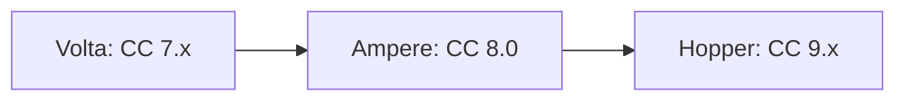
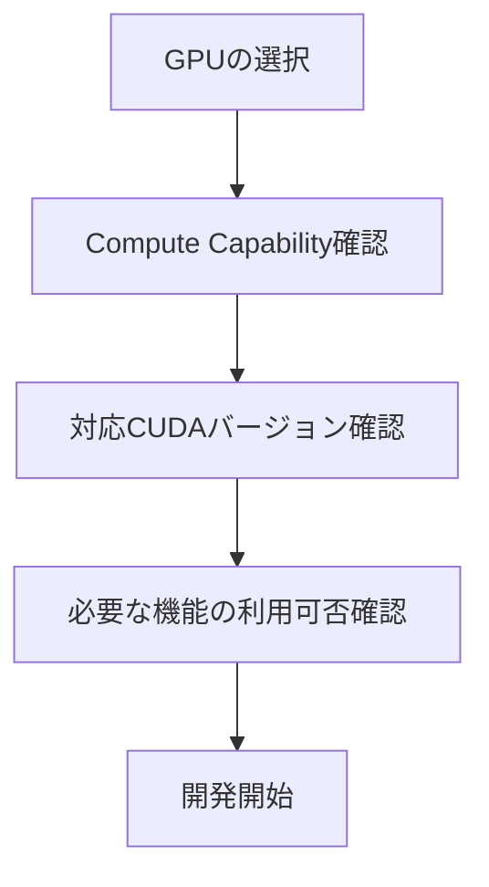

## 概要

このレクチャーでは，Nvidia GPUの`Compute Capability`（CC）という重要な概念を解説します．CCはGPUの設計分類を示すバージョン番号で，対応する機能，ソフトウェア互換性，CUDAツールキットとの関係を決定します．

## 主要な内容

### Compute Capabilityとは

`Compute Capability`（`CC`）は，NvidiaがGPUの一般的な機能と処理能力を示すために使用する設計分類です．`3.0`，`5.1`，`7.5`のようなバージョン番号で表現されます．

- ドットの前の数字（メジャー番号）：主要なアーキテクチャの変更を示す
- ドットの後の数字（マイナー番号）：軽微な改善や拡張を示す

### 機能のサポート

異なるCCバージョンは異なる機能をサポートします．CUDAプログラミングドキュメントには，各CCバージョンで利用可能な機能を示す比較表が掲載されています．

主な例：

| 機能 | CC 5.0 | CC 7.0以上 |
|------|--------|-----------|
| 半精度演算 | 非対応 | 対応 |
| `Tensor Core` | 非対応 | 対応 |

`Tensor Core`はCC 7.0（`Volta`）以上でのみ利用可能です．

### ソフトウェア互換性

GPUの`Compute Capability`は，どのバージョンのCUDAツールキットを実行できるかを決定します．

| アーキテクチャ | CC | 最小CUDAバージョン |
|------------|------|----------------|
| Maxwell | 5.x | 6.5 |
| Hopper | 9.x | 11.8 |

最小値より古いCUDAバージョンを使用すると，互換性エラーが発生します．例えば`Hopper`アーキテクチャでCUDA 11.8未満を使用するとエラーメッセージが表示されます．

### PTX命令との関係

一部の`PTX`命令（GPUのアセンブリ言語に相当）は，特定のCCバージョンに依存しています．例えば`Warp Shuffle Functions`（ワープ内のスレッドが共有メモリやグローバルメモリを介さずにデータを共有する機能）は，CC 5.0以上のデバイスでのみ利用可能です．

### 実践的な影響

最新の機械学習プロジェクトや複雑なシミュレーションに取り組む場合，GPUの`Compute Capability`が最新のCUDAツールキット（最新の機能と最適化を含む）と互換性があるかを確認する必要があります．

## まとめ

- `Compute Capability`はGPUの機能と処理能力を示すバージョン番号である
- メジャー番号はアーキテクチャの大きな変更，マイナー番号は軽微な改善を示す
- CCバージョンによって対応する機能（半精度演算，`Tensor Core`など）が異なる
- CUDAツールキットとの互換性はCCバージョンによって決まるため，ハードウェアとソフトウェアの整合性が重要である
