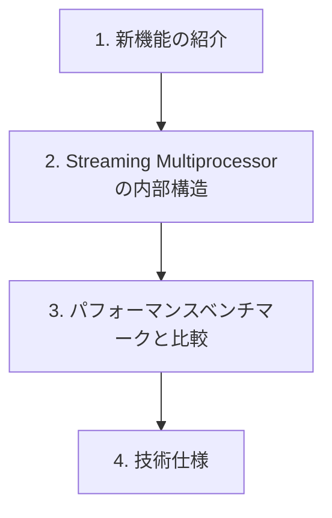

import Quiz from '@/components/content/Quiz.astro'

## 概要

このレクチャーでは，NVIDIAのホワイトペーパー（技術仕様書）の入手方法と読み方を解説します．ホワイトペーパーは各GPUアーキテクチャの詳細な技術仕様を含む最も重要なドキュメントであり，すべてのホワイトペーパーに共通する構造を理解することで，どのアーキテクチャのドキュメントも効率的に読めるようになります．

## 主要な内容

### ホワイトペーパーの入手方法

ホワイトペーパーを入手するには，Googleでチップ名と「white paper」を検索します：

- `GF100 white paper`（Fermiアーキテクチャ）
- `GA100 white paper`（Ampereアーキテクチャ）

検索結果からPDFファイルを探してください．記事やサマリーではなく，公式のフルレングスのホワイトペーパーが必要です．

### ホワイトペーパーの共通構造

すべてのNVIDIAホワイトペーパーは標準化された構造に従っています：

### 1. 新機能の紹介

各ホワイトペーパーは，新しい技術や改善点を紹介するセクションから始まります．これには新しいコアの種類（AI計算用の`Tensor Core`など），改善されたシェーディング技術，ソフトウェアやハードウェアの改善が含まれます．

### 2. Streaming Multiprocessorの内部構造

すべてのホワイトペーパーで最も重要なセクションの一つです．各GPUアーキテクチャの`SM`設計の詳細な図と説明が提供されます：

- `Pascal`（`GP100`チップ）：GPU全体の図，比較表，`SM`内部コンポーネントの詳細
- `Volta`（`GV100`チップ）：同様のレイアウトに加え，`Tensor Core`ユニットの追加
- `Ampere`（`GA100`チップ）：`Volta`と類似した内部構造
- `Hopper`（`GH100`チップ）：コア数の増加が主な違い

### 3. パフォーマンスベンチマークと比較

NVIDIAは新しいアーキテクチャのホワイトペーパー内で，前世代との性能比較を必ず含めています．例えば`A100`のホワイトペーパーには`Volta`や`Pascal`との比較が含まれます．そのため，同じ比較表が複数のホワイトペーパーに登場することがあります．

### 4. 技術仕様

コア数，メモリサイズ，メモリ帯域幅，メモリ技術，消費電力などの詳細な仕様が，GPUの能力を包括的に示すために記載されています．

### ホワイトペーパー間の一貫性

1つのNVIDIAホワイトペーパーの読み方を理解すれば，他のホワイトペーパーも理解できます．構造，提供される情報の種類，比較表のフォーマットはすべて共通のパターンに従っています．この一貫性により，最新技術の動向を把握し，各アーキテクチャの進歩を明確に理解できます．

## まとめ

- ホワイトペーパーはチップ名+「white paper」でGoogle検索して入手できる
- すべてのホワイトペーパーは共通の4部構成（新機能，SM内部構造，ベンチマーク，技術仕様）に従っている
- 1つのホワイトペーパーの読み方を習得すれば，他のすべてに応用できる
- NVIDIAは常に新アーキテクチャと前世代の性能比較を含めている

<Quiz questions={[
  {
    question: "NVIDIAのホワイトペーパーを入手するための検索方法として正しいものはどれですか？",
    options: [
      "GPU名+「specifications」で検索する",
      "チップ名+「white paper」で検索する",
      "アーキテクチャ名+「manual」で検索する",
      "世代名+「datasheet」で検索する"
    ],
    answer: 1,
    explanation: "ホワイトペーパーを入手するには，チップ名（例：GF100，GA100）と「white paper」をGoogleで検索します．記事やサマリーではなく，公式のフルレングスのPDFファイルを探すことが重要です．"
  },
  {
    question: "NVIDIAのホワイトペーパーに共通する4部構成の正しい順序はどれですか？",
    options: [
      "技術仕様→新機能→ベンチマーク→SM内部構造",
      "新機能の紹介→SM内部構造→パフォーマンスベンチマーク→技術仕様",
      "SM内部構造→新機能→技術仕様→ベンチマーク",
      "ベンチマーク→技術仕様→新機能→SM内部構造"
    ],
    answer: 1,
    explanation: "すべてのNVIDIAホワイトペーパーは，(1)新機能の紹介，(2)Streaming Multiprocessorの内部構造，(3)パフォーマンスベンチマークと比較，(4)技術仕様という共通の4部構成に従っています．"
  }
]} />
