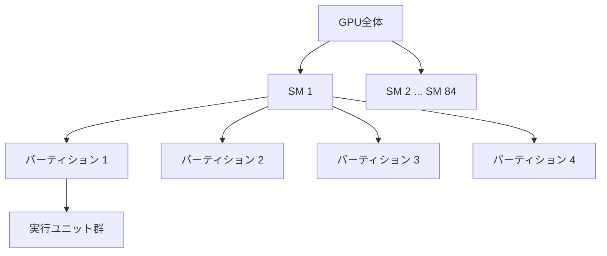

## 概要

このレクチャーでは，`Volta`アーキテクチャのホワイトペーパーを詳細に読み解き，`Pascal`および`Ampere`アーキテクチャとの比較を行います．`SM`の内部構造，`Tensor Core`，`NVLink`，ワープスケジューラ，SIMT（Single Instruction Multiple Thread）実行モデルなど，GPUハードウェアの核心的な概念を学びます．

## 主要な内容

### Voltaアーキテクチャの主要な強化点

`V100` GPUは約210億トランジスタを搭載しています（比較：`Hopper`は800億トランジスタで約4倍）．

#### SMの強化

- エネルギー効率が`Pascal`比で50%向上
- 単精度・倍精度コアの性能改善（同じ消費電力で高速化）
- `Tensor Core`の初導入（スループット最大12倍向上）
- 整数演算と浮動小数点演算の同時実行が可能に（`Pascal`以前は排他的実行）
- キャッシュメモリと共有メモリの統合・高速化

#### 命令レイテンシの改善

| 命令（加算など） | Pascal | Volta | Ampere |
|-------------|--------|-------|--------|
| レイテンシ | 6サイクル | 4サイクル | 2サイクル |

### SM（Streaming Multiprocessor）の内部構造

`Volta`の各`SM`は4つのパーティションに分割されており，ハードウェア階層は以下のようになります：



各パーティションには以下のユニットが含まれます：

- `L0命令キャッシュ`：頻繁に使用される命令へのアクセスを高速化
- `ワープスケジューラ`：32スレッド（1ワープ）の実行を管理
- `ディスパッチャ`：スケジューラの戦略に基づき命令を適切な実行ユニットに送信
- `レジスタファイル`：一時データを保持する高速ストレージ
- 16個の単精度コア，16個の整数コア
- `Tensor Core`，特殊関数ユニット

4つのパーティションは`L1キャッシュメモリ`，`共有メモリ`，`テクスチャメモリ`を共有します．

### SIMT（Single Instruction Multiple Thread）

`ワープ`は32スレッドのグループで，全スレッドが同じ命令を異なるデータに対して実行します．

```mermaid
graph LR
    subgraph ワープ（32スレッド）
        T1[スレッド1: A1+B1]
        T2[スレッド2: A2+B2]
        T3[スレッド3: A3+B3]
        T4[... スレッド32]
    end
```

ベクトル加算の例では，各スレッドが同じ「加算」命令を異なる要素に対して実行します．これがSIMT（Single Instruction Multiple Thread）方式です．

### Pascal・Volta・Ampereの比較表

| 仕様 | Pascal（P100） | Volta（V100） | Ampere（A100） |
|------|-------------|-------------|-------------|
| SM数 | 56 | 80 | 108 |
| 単精度コア数 | 約3,500 | 約5,000 | 約7,000 |
| 倍精度コア数 | 約1,700 | - | 約3,400 |
| 整数コア | なし（共用） | 約5,000 | 約7,000 |
| Tensor Core | なし | 640 | 432 |
| メモリ帯域幅 | 約700 GB/s | 900 GB/s | 1,500 GB/s |
| L2キャッシュ | - | 6MB | 40MB以上 |
| メモリバス幅 | - | 約4,000ビット | 5,120ビット以上 |

`Ampere`の`Tensor Core`数が`Volta`より少ないのは，各`Tensor Core`の性能が大幅に向上しているためです．スループットでは`Ampere`が`Volta`の2倍以上を実現しています．

### NVLink

`NVLink`はGPU間およびGPU-CPU間の高速データ転送を実現するインターコネクトです．

- `Pascal`（第1世代）：GPU間に1本の接続
- `Volta`（第2世代）：GPU間に2本の接続，リンク速度の向上
- 帯域幅：`Pascal`の160 GB/sから`Volta`の300 GB/sに向上

`NVLink`はNvidiaの`DGX`サーバー（4〜8基のGPUを搭載）の標準機能であり，AI・HPC向けの高い計算性能を支えています．

### Compute Capability表

ホワイトペーパーにはCUDAプログラミング時に必要な`Compute Capability`の制限事項も記載されています．最大スレッド数，最大ブロック数などの制約を理解することで，効率的なCUDAプログラムの設計が可能になります．

## まとめ

- `Volta`は`Tensor Core`の初導入，整数・浮動小数点の同時実行，エネルギー効率50%向上など画期的な改善を実現した
- `SM`は4つのパーティションに分割され，各パーティションがワープスケジューラやコア群を持つ
- SIMT方式により，32スレッド（1ワープ）が同じ命令を異なるデータに対して同時実行する
- `Pascal`から`Ampere`にかけてメモリ帯域幅は約2倍，`L2`キャッシュは7倍以上に増加した
- `NVLink`によりマルチGPU構成での高速通信が実現されている
