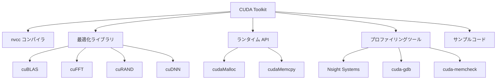

## 概要

CUDAツールキットは単なるコンパイラではなく，GPU プログラミングに必要なコンパイラ，ライブラリ，ランタイムAPI，プロファイリングツール，サンプルコードを含む包括的なプラットフォームである．このレクチャーでは，CUDAツールキットに含まれる主要コンポーネントとその役割を解説する．

## 主要な内容

### NVCCコンパイラ

CUDA開発の中心にあるのが`nvcc`（NVIDIA CUDA Compiler）である．`nvcc`は高レベルのCUDAコードをGPUが理解できる形式に変換する役割を持つ．CUDAアプリケーションを`PTX`コードに変換し，さまざまなNVIDIAアーキテクチャと互換性のある実行ファイルを生成する．

### 最適化ライブラリ群

CUDAツールキットには，特定の用途に最適化された複数のライブラリが含まれている．

- `cuBLAS` - 線形代数演算用ライブラリ
- `cuFFT` - 高速フーリエ変換用ライブラリ
- `cuRAND` - 乱数生成用ライブラリ
- `cuDNN` - ディープラーニング向けニューラルネットワーク高速化ライブラリ

これらのライブラリは事前に最適化された関数を提供し，開発者の作業時間を短縮しつつパフォーマンスを向上させる．

### ランタイムAPI

CUDAランタイムAPIは，デバイスの初期化，メモリ割り当て，カーネル起動を管理する．代表的なAPI関数として以下がある．

- `cudaMalloc` - GPU上にメモリを確保する関数．C言語の`malloc`に相当するが，GPU側のメモリを対象とする
- `cudaMemcpy` - ホスト（CPU）とデバイス（GPU）間でデータを転送する関数

### プロファイリング・デバッグツール

GPUアプリケーション開発ではコードの効率性と安定性の確保が重要である．CUDAツールキットには以下のツールが含まれている．

- `Nsight Systems` / `Nsight Compute` - アプリケーションのプロファイリングと分析
- `cuda-gdb` - Linux/macOS上でのCUDAアプリケーションデバッグ環境
- `cuda-memcheck` - メモリ問題の検出と診断

### サンプルコード

CUDAツールキットには豊富なサンプルコードが付属しており，基本概念から高度な操作までさまざまなCUDAプログラミング技法を実践的に学ぶことができる．

## まとめ

- CUDAツールキットは`nvcc`コンパイラ，最適化ライブラリ，ランタイムAPI，プロファイリングツール，サンプルコードを含む包括的な開発プラットフォームである
- `cudaMalloc`や`cudaMemcpy`といったランタイムAPIにより，CPUとGPU間のメモリ管理やデータ転送を行う
- `Nsight Systems`や`cuda-gdb`などのツールを使い，アプリケーションの最適化とデバッグが可能である
- CUDAの各バージョンでは新しいGPUアーキテクチャ（Hopper，Ada Lovelaceなど）の機能に対応するためライブラリやツールが更新される
