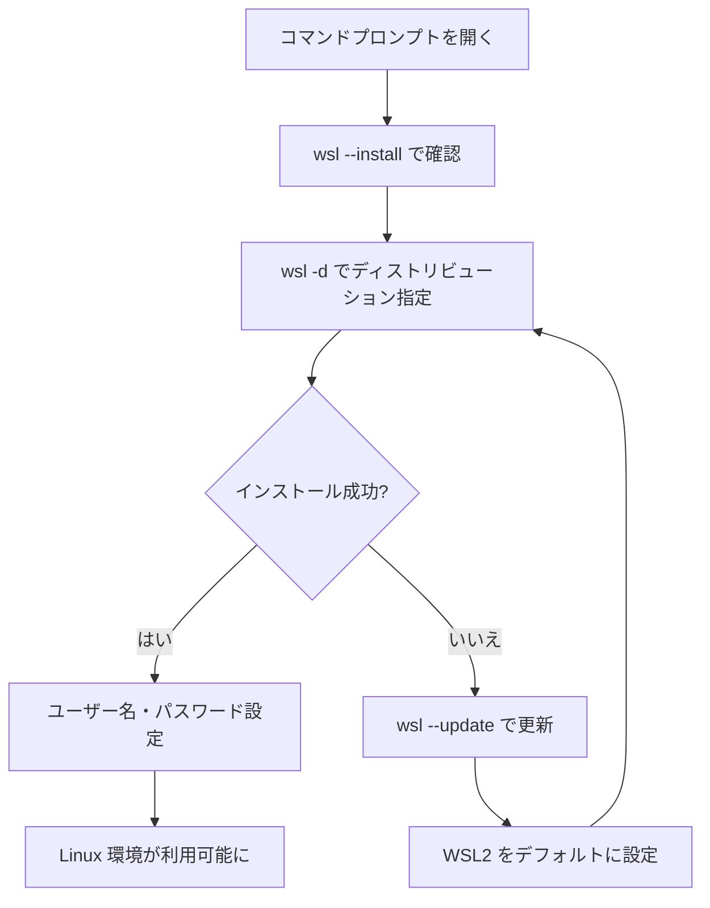

import Quiz from '@/components/content/Quiz.astro'

## 概要

WSL（Windows Subsystem for Linux）を使うと，Windowsを置き換えることなくLinuxディストリビューションをWindows上にインストールできる．このレクチャーでは，WSLのインストール手順とトラブルシューティングの方法を解説する．

## 主要な内容

### WSLのインストール手順

WSLのインストールは，コマンドプロンプト（cmd）から簡単に行える．

1. スタートメニューからコマンドプロンプトを開く
2. 利用可能なディストリビューションを確認する

```bash
wsl --install
```

このコマンドにより，Ubuntu，Debianなど利用可能なLinuxディストリビューションの一覧が表示される．

3. 特定のディストリビューションを指定してインストールする

```bash
wsl -d Ubuntu-20.04
```

`-d`オプションでディストリビューション名を指定する．

### トラブルシューティング

インストール中にエラーが発生した場合は，以下の手順で対処する．

1. エラーメッセージをコピーしてGoogleで検索する
2. WSLを最新バージョンに更新する

```bash
wsl --update
```

3. WSLのデフォルトバージョンをWSL2に設定する

```bash
wsl --set-default-version 2
```

4. 再度ディストリビューションのインストールを試みる

### Linuxの初期設定

インストールが成功すると，Linuxシステムが起動し初期設定が求められる．

1. ユーザー名を作成する
2. パスワードを設定する
3. パスワードを再入力して確認する

設定完了後，Ubuntuのコマンドラインが利用可能になり，Linuxコマンドを実行できるようになる．



## まとめ

- WSLを使えばWindowsを置き換えずにLinux環境を構築できる
- `wsl --install`コマンドで利用可能なディストリビューションを確認し，`-d`オプションで指定してインストールする
- エラー発生時は`wsl --update`でWSLを更新し，WSL2をデフォルトバージョンに設定して再試行する
- 次のレクチャーで，このLinux環境上にCUDAツールキットをインストールする方法を学ぶ

<Quiz questions={[
  {
    question: "WSLで特定のLinuxディストリビューションを指定してインストールするコマンドはどれですか？",
    options: [
      "wsl --install Ubuntu-20.04",
      "wsl -d Ubuntu-20.04",
      "wsl --setup Ubuntu-20.04",
      "wsl --linux Ubuntu-20.04"
    ],
    answer: 1,
    explanation: "wsl -dオプションでディストリビューション名を指定してインストールします．例えば，wsl -d Ubuntu-20.04と入力することでUbuntu 20.04をインストールできます．"
  },
  {
    question: "WSLのインストール中にエラーが発生した場合，最初に試すべきコマンドはどれですか？",
    options: [
      "wsl --reset",
      "wsl --reinstall",
      "wsl --update",
      "wsl --repair"
    ],
    answer: 2,
    explanation: "WSLのインストール中にエラーが発生した場合，まずwsl --updateコマンドでWSLを最新バージョンに更新し，その後wsl --set-default-version 2でWSL2をデフォルトに設定してから再試行します．"
  }
]} />
