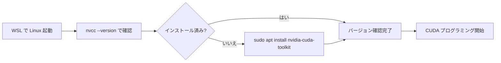

## 概要

Linux環境にCUDAツールキットをインストールする手順を解説する．WSLで構築したUbuntuシステム上で`nvcc`コンパイラを使えるようにするまでの流れを説明する．

## 主要な内容

### Linux環境の起動

WSLを使用している場合は，コマンドプロンプトから`wsl`コマンドを実行してLinuxシステムを起動する．ネイティブLinuxを使用している場合は，通常どおりターミナルを開く．

### nvccコンパイラの確認

まず，`nvcc`コンパイラがすでにインストールされているかを確認する．

```bash
nvcc --version
```

まだインストールされていない場合は「command not found」と表示される．

### CUDAツールキットのインストール方法

NVIDIAの公式ダウンロードページからインストールする方法もあるが，初心者には以下のコマンドを使う方法が最も簡単である．

```bash
sudo apt install nvidia-cuda-toolkit
```

パスワードを入力し，続行するか確認されたら`y`を入力する．インストールには30-40分程度かかるため，辛抱強く待つ必要がある．

### インストールの確認

インストール完了後，再度バージョンを確認する．

```bash
nvcc --version
```

正常にインストールされていれば，以下のような情報が表示される．

- `nvcc: NVIDIA (R) Cuda compiler driver`
- CUDAツールキットのリリースバージョン（例: Release 11.5）

CUDAツールキットをインストールすると，`nvcc`コンパイラに加えて，前のレクチャーで解説したすべてのライブラリやツールが利用可能になる．



## まとめ

- `sudo apt install nvidia-cuda-toolkit`コマンドで簡単にCUDAツールキットをインストールできる
- インストール後は`nvcc --version`でコンパイラのバージョンを確認する
- CUDAツールキットには`nvcc`コンパイラのほか，すべてのライブラリやプロファイリングツールが含まれる
- 慣れてきたらNVIDIA公式ダウンロードページから最新バージョンを選んでインストールすることも可能である
