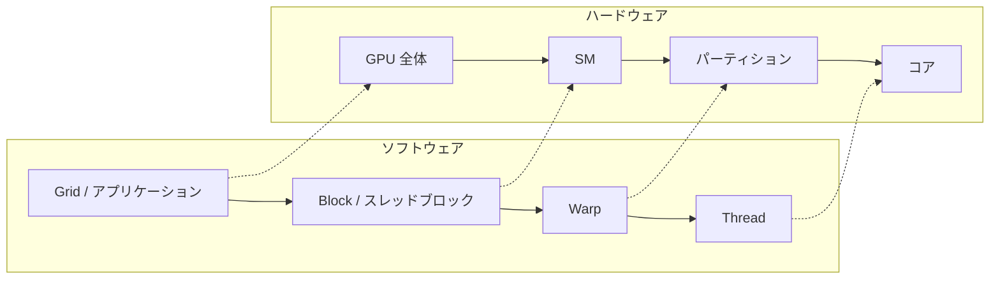

import Quiz from '@/components/content/Quiz.astro'

## 概要

CUDAのソフトウェア階層（グリッド，ブロック，ワープ，スレッド）がGPUのハードウェア階層（GPU全体，SM，パーティション，コア）にどのようにマッピングされるかを解説する．CUDAプログラミングの基礎となるホストとデバイスの概念，および`Giga Thread Unit`や`Warp Scheduler`の役割を理解する．

## 主要な内容

### CUDAの基本概念

CUDA（Compute Unified Device Architecture）はNVIDIAが提供する並列コンピューティングプラットフォームおよびAPIである．以下の3つの重要なポイントがある．

- CUDAはC言語をベースとしており，C言語に精通した開発者がGPU上で動作するコードを容易に記述できる
- CUDAコンパイラは`nvcc`と呼ばれ，CUDAコードを実行ファイルやマシンコードに変換するだけでなく，開発プロセスにおいて複数の重要な役割を果たす
- ホスト（Host）はCPUとそのRAMを，デバイス（Device）はGPUとそのグローバルメモリを指す

### GPUハードウェアの4階層構造

GPUのハードウェアは以下の4つのレベルで階層化されている．

1. GPU全体 - すべてのユニットを包含する最上位レベル
2. Streaming Multiprocessor（SM） - GPU内に複数存在する処理ユニット
3. パーティション - 各SM内を分割した領域（Volta/Ampereでは各SMに4パーティション）
4. 演算コア - 各パーティション内の個別の演算ユニット（例: FP32コア）

### ソフトウェアからハードウェアへのマッピング

CUDAアプリケーションのソフトウェア階層は，ハードウェアの4階層に対応する．



- アプリケーション全体（Grid）はGPU全体で実行される
- 各ブロックは個別のSMに割り当てられる
- 各ワープはSM内のパーティションで実行される
- 各スレッドはパーティション内の個別コアで実行される

### Giga Thread UnitとWarp Scheduler

ソフトウェアブロックをSMに割り当てる役割を担うのが`Giga Thread Unit`である．GPU全体の中に配置され，すべてのSMと接続して，ソフトウェアブロック（タスク）を各SMに効率的に分配する．

SM内のパーティションレベルでは，`Warp Scheduler`がワープの実行を管理する．1つのパーティションに複数のワープが割り当てられた場合，Warp Schedulerが各サイクルで実行するワープを選択する．

### CUDAアプリケーションの設定パラメータ

CUDAアプリケーションを起動する際に指定する2つの重要なパラメータがある．

- ブロック数（Grid Size） - アプリケーション全体のブロック数
- ブロックあたりのスレッド数（Block Size） - 各ブロック内のスレッド数

ワープ数は以下の式で計算できる．1ワープは常に32スレッドで固定である．

```
ブロックあたりのワープ数 = ブロックあたりのスレッド数 / 32
```

## まとめ

- GPUのハードウェアは4階層（GPU全体，SM，パーティション，コア）で構成され，CUDAソフトウェアの4階層（Grid，Block，Warp，Thread）と対応する
- `Giga Thread Unit`がブロックを各SMに分配し，`Warp Scheduler`がパーティション内のワープ実行を管理する
- CUDAアプリケーション起動時にはブロック数とブロックあたりのスレッド数を指定する
- 1ワープは32スレッドで固定であり，ワープ数はブロックサイズを32で割って算出する

<Quiz questions={[
  {
    question: "CUDAソフトウェアの4階層（Grid，Block，Warp，Thread）のうち，GPUのSM（Streaming Multiprocessor）に対応するのはどれか？",
    options: [
      "Grid",
      "Block",
      "Warp",
      "Thread"
    ],
    answer: 1,
    explanation: "Blockは各SMに割り当てられる．Gridは GPU全体，WarpはSM内のパーティション，Threadはパーティション内の個別コアに対応する．"
  },
  {
    question: "1ワープに含まれるスレッド数はいくつか？",
    options: [
      "16",
      "32",
      "64",
      "128"
    ],
    answer: 1,
    explanation: "1ワープは常に32スレッドで固定されている．この値はアーキテクチャに関わらず一定である．"
  },
  {
    question: "ソフトウェアブロックを各SMに分配する役割を担うハードウェアユニットは何か？",
    options: [
      "Warp Scheduler",
      "L2 Cache Controller",
      "Giga Thread Unit",
      "Memory Controller"
    ],
    answer: 2,
    explanation: "Giga Thread UnitはGPU全体の中に配置され，すべてのSMと接続して，ソフトウェアブロック（タスク）を各SMに効率的に分配する役割を担う．"
  }
]} />
