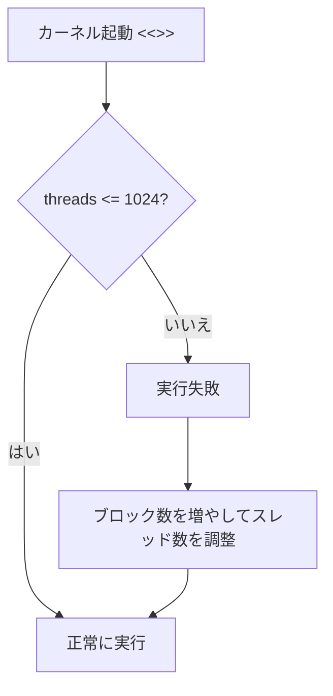

## 概要

最初のCUDAプロジェクトとして，ブロックIDとスレッドIDを出力するHello Worldプログラムを作成する．カーネルの定義方法，起動パラメータの設定，およびGPUハードウェアの制約（ブロックあたり最大1024スレッド）を実践的に学ぶ．

## 主要な内容

### カーネルと関数の違い

CUDAプログラムでは，C言語と同様に`main`関数が必要である．加えて，GPU上で実行される関数を「カーネル」と呼ぶ．

- 関数（Function） - CPU上で実行される通常の関数
- カーネル（Kernel） - GPU上で実行される関数．`__global__`修飾子で宣言する

```cuda
// GPU カーネルの定義
__global__ void hello_kernel() {
    // GPU 上で実行されるコード
}

int main() {
    // カーネルの起動
    hello_kernel<<<1, 1>>>();
    return 0;
}
```

### カーネルの起動パラメータ

カーネルを呼び出す際には，`<<<ブロック数, ブロックあたりのスレッド数>>>`の形式で設定を指定する．

```cuda
// ブロック数: 1, スレッド数/ブロック: 1
hello_kernel<<<1, 1>>>();

// ブロック数: 2, スレッド数/ブロック: 8
hello_kernel<<<2, 8>>>();
```

### ブロックIDとスレッドIDの出力

CUDAには事前定義変数が用意されており，各スレッドが自身のIDを取得できる．

- `blockIdx.x` - 現在のスレッドが属するブロックのID
- `threadIdx.x` - ブロック内でのスレッドID

```cuda
__global__ void hello_kernel() {
    printf("\n Block ID: %d, Thread ID: %d",
           blockIdx.x, threadIdx.x);
}
```

### ハードウェア制約の確認

ブロックあたりのスレッド数には上限がある．Ampereアーキテクチャの場合，最大スレッドブロックサイズは1024スレッドである．

- `<<<1, 1024>>>` - 正常に動作する
- `<<<1, 2048>>>` - 動作しない（上限超過）

1024を超えるスレッドが必要な場合は，ブロック数を増やして対応する．

```cuda
// 2048 スレッドが必要な場合
// NG: hello_kernel<<<1, 2048>>>();
// OK: ブロック数を 2 に増やす
hello_kernel<<<2, 1024>>>();
```

ブロック数の上限はSMあたりの最大ブロック数（例: 32）にSM数を乗じた値で決まるため，ホワイトペーパーで仕様を確認することが重要である．



## コード例

```cuda
#include <stdio.h>

__global__ void hello_kernel() {
    printf("\n Block ID: %d, Thread ID: %d",
           blockIdx.x, threadIdx.x);
}

int main() {
    // 2 ブロック, 各 8 スレッド = 合計 16 スレッド
    hello_kernel<<<2, 8>>>();
    cudaDeviceSynchronize();
    return 0;
}
```

## まとめ

- `__global__`修飾子でGPUカーネルを定義し，`<<<ブロック数, スレッド数>>>`で起動する
- `blockIdx.x`と`threadIdx.x`でそれぞれブロックIDとスレッドIDを取得できる
- ブロックあたりのスレッド数は最大1024（Ampereアーキテクチャ）であり，超過するとカーネルが実行されない
- より多くのスレッドが必要な場合はブロック数を増やして対応する
- 並列実行のため，出力順序はスレッドの実行完了順に依存する
