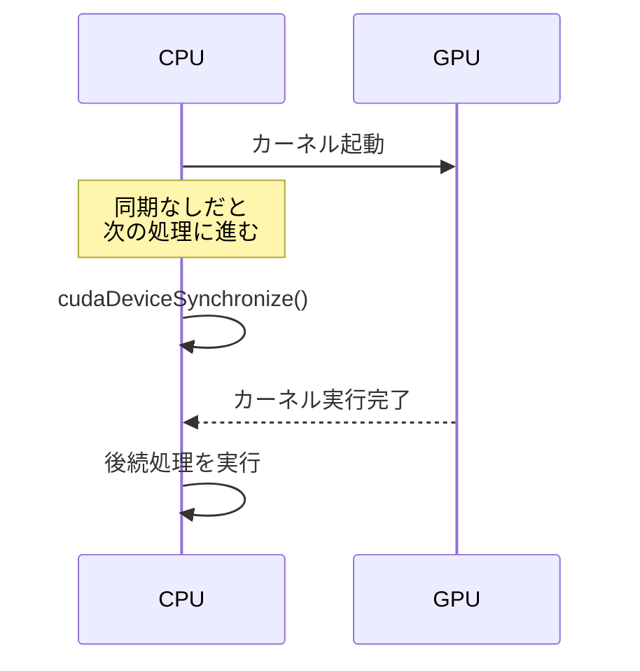

## 概要

Linux環境でCUDAプログラムをコンパイルし実行する方法を解説する．`nvcc`コマンドの使い方，`cudaDeviceSynchronize`による同期の重要性，およびコンパイルエラーのデバッグ方法を学ぶ．

## 主要な内容

### nvccコンパイラによるコンパイル

Linux環境では，Visual Studioのようなビルドボタンがないため，`nvcc`コマンドを使ってコマンドラインからコンパイルする．

```bash
nvcc -o project_001 project_001.cu
```

- `nvcc` - CUDAコンパイラの呼び出し
- `-o project_001` - 出力する実行ファイル名の指定（既存ファイルがあれば上書き）
- `project_001.cu` - コンパイルするCUDAソースファイル

### プログラムの実行

コンパイル完了後，以下のコマンドで実行する．

```bash
./project_001
```

### cudaDeviceSynchronizeの重要性

CPUは`main`関数内の命令を逐次実行する．カーネル起動命令に到達すると，GPUにカーネルの実行を送出するが，GPUの完了を待たずに次の命令へ進む．このため，`cudaDeviceSynchronize`を使わないと出力が表示されない場合がある．

```cuda
hello_kernel<<<2, 64>>>();
cudaDeviceSynchronize();  // GPU の処理完了を待つ
```

`cudaDeviceSynchronize`を入れることで，CPUがGPUカーネルの実行完了を待ってから次の処理に進むため，確実に出力がターミナルに表示される．



### コンパイルエラーのデバッグ

コンパイル時にエラーが発生すると，エラーの行番号と内容が表示される．ただし，表示される行番号は実際の問題箇所の次の行を指すことがある．例えば，セミコロンの欠落の場合，エラーは次の命令の行で検出されるため，1行前を確認する必要がある．

## コード例

```cuda
#include <stdio.h>

__global__ void hello_kernel() {
    printf("\n Block ID: %d, Thread ID: %d, Warp ID: %d",
           blockIdx.x, threadIdx.x, threadIdx.x / 32);
}

int main() {
    hello_kernel<<<2, 64>>>();
    cudaDeviceSynchronize();
    return 0;
}
```

コンパイルと実行:

```bash
nvcc -o project_001 project_001.cu
./project_001
```

## まとめ

- `nvcc -o <出力ファイル> <ソースファイル.cu>`でCUDAプログラムをコンパイルする
- `cudaDeviceSynchronize()`はCPUがGPUの処理完了を待つために必要であり，これがないと出力が表示されない場合がある
- コンパイルエラーは表示される行番号の前の行に原因がある場合がある
- この手順はWindowsユーザーもLinuxユーザーも理解しておくべきである
