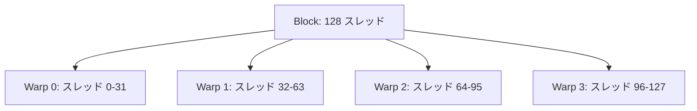

import Quiz from '@/components/content/Quiz.astro'

## 概要

CUDAソフトウェアの第3レベルであるワープIDの算出方法を学ぶ．ブロックIDやスレッドIDとは異なり，ワープIDには事前定義変数が存在しないため，スレッドIDから計算で求める必要がある．

## 主要な内容

### CUDAソフトウェアの4階層の復習

CUDAアプリケーションは以下の4つのソフトウェアレベルで構成される．

1. Grid（グリッド） - アプリケーション全体
2. Block（ブロック） - グリッド内の各ブロック
3. Warp（ワープ） - ブロック内の各ワープ
4. Thread（スレッド） - ワープ内の各スレッド

前のプロジェクトでブロックIDとスレッドIDの出力方法を学んだ．今回はワープIDの計算方法を学ぶ．

### ワープIDの計算方法

CUDAにはワープIDの事前定義変数が存在しない．そのため，スレッドIDを使って以下の式で計算する．

```
warp_id = threadIdx.x / 32
```

1ワープは常に32スレッドで構成されるため，スレッドIDを32で割った商がワープIDとなる．

例えば，ブロックあたり128スレッドの場合:

- スレッド0-31 → ワープID 0
- スレッド32-63 → ワープID 1
- スレッド64-95 → ワープID 2
- スレッド96-127 → ワープID 3



### ワープIDの適用範囲

ワープIDはブロック単位で計算される．複数のブロックがある場合，各ブロック内で独立にワープIDが0から始まる．

例えば，2ブロック・各64スレッドの構成では:

- ブロック0: ワープID 0, 1（計2ワープ）
- ブロック1: ワープID 0, 1（計2ワープ）
- GPU全体のワープ数は4だが，各ブロック内のワープIDは0と1のみ

## コード例

```cuda
#include <stdio.h>

__global__ void hello_kernel() {
    int warp_id = threadIdx.x / 32;
    printf("\n Block ID: %d, Thread ID: %d, Warp ID: %d",
           blockIdx.x, threadIdx.x, warp_id);
}

int main() {
    // 1 ブロック, 128 スレッド = 4 ワープ
    hello_kernel<<<1, 128>>>();
    cudaDeviceSynchronize();
    return 0;
}
```

## まとめ

- CUDAにはワープIDの事前定義変数がなく，`threadIdx.x / 32`で計算する
- 1ワープは常に32スレッドで構成される
- ワープIDはブロックごとに独立して計算され，各ブロック内で0から始まる
- ブロックあたりのワープ数は`ブロックあたりのスレッド数 / 32`で求められる

<Quiz questions={[
  {
    question: "CUDAでワープIDを計算する正しい式はどれか？",
    options: [
      "blockIdx.x / 32",
      "threadIdx.x % 32",
      "threadIdx.x / 32",
      "blockIdx.x * 32"
    ],
    answer: 2,
    explanation: "CUDAにはワープIDの事前定義変数が存在しないため，`threadIdx.x / 32`で計算する．1ワープは32スレッドで構成されるため，スレッドIDを32で割った商がワープIDとなる．"
  },
  {
    question: "ブロックあたり256スレッドの構成の場合，各ブロックには何個のワープが含まれるか？",
    options: [
      "4",
      "8",
      "16",
      "32"
    ],
    answer: 1,
    explanation: "ブロックあたりのワープ数は`256 / 32 = 8`で求められる．1ワープは常に32スレッドで構成される．"
  },
  {
    question: "2ブロック・各64スレッドの構成において，ブロック1内のスレッド32のワープIDはいくつか？",
    options: [
      "0",
      "1",
      "2",
      "3"
    ],
    answer: 1,
    explanation: "ワープIDはブロックごとに独立して計算される．スレッド32のワープID = 32 / 32 = 1 である．ブロックIDに関わらず，ワープIDはブロック内で0から始まる．"
  }
]} />
