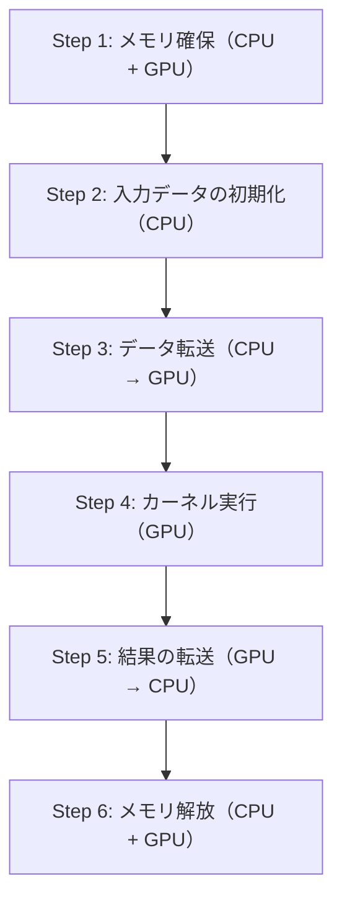

## 概要

ベクトル加算プロジェクトを通じて，CUDAアプリケーションの基本的なステップ（メモリ確保，データ初期化，CPU-GPU間データ転送，カーネル実行，結果の取得，メモリ解放）を学ぶ．CPUでの逐次処理とGPUでの並列処理の違いを理解し，スレッドIDを使った要素のインデックス指定方法を習得する．

## 主要な内容

### ベクトル加算の概要

2つのベクトルA，B（各1024要素）の対応する要素を加算し，結果をベクトルCに格納する．CPUでは`for`ループで逐次処理するが，GPUではスレッドIDを使って各要素を並列に処理する．

### スレッドIDによるインデックス指定

1ブロック・1024スレッドの構成では，スレッドIDが0-1023となり，ベクトルのインデックスと一致する．各スレッドが自身のスレッドIDに対応する要素の加算を担当する．

```cuda
__global__ void vector_add(int *a, int *b, int *c, int n) {
    int tid = threadIdx.x;
    c[tid] = a[tid] + b[tid];
}
```

### CUDAプロジェクトの基本ステップ

すべてのCUDAアプリケーションは以下の6つのステップで構成される．



### Step 1: メモリ確保

CPU側とGPU側の両方でメモリを確保する．

```cuda
// CPU 側のメモリ確保
int *a, *b, *c;
a = (int *)malloc(size * sizeof(int));
b = (int *)malloc(size * sizeof(int));
c = (int *)malloc(size * sizeof(int));

// GPU 側のメモリ確保
int *d_a, *d_b, *d_c;
cudaMalloc(&d_a, size * sizeof(int));
cudaMalloc(&d_b, size * sizeof(int));
cudaMalloc(&d_c, size * sizeof(int));
```

### Step 2: 入力データの初期化

CPU上で`for`ループを使い，ベクトルAとBに値を設定する．

```cuda
for (int i = 0; i < size; i++) {
    a[i] = i;
    b[i] = size - i;
}
```

### Step 3: データ転送（CPU → GPU）

`cudaMemcpy`でホストからデバイスへデータを転送する．

```cuda
cudaMemcpy(d_a, a, size * sizeof(int), cudaMemcpyHostToDevice);
cudaMemcpy(d_b, b, size * sizeof(int), cudaMemcpyHostToDevice);
```

### Step 4: カーネル実行

GPU上でベクトル加算カーネルを起動する．

```cuda
vector_add<<<1, 1024>>>(d_a, d_b, d_c, size);
```

### Step 5: 結果の転送（GPU → CPU）

計算結果をGPUからCPUに転送する．転送方向が`cudaMemcpyDeviceToHost`になる点に注意する．

```cuda
cudaMemcpy(c, d_c, size * sizeof(int), cudaMemcpyDeviceToHost);
```

### Step 6: メモリ解放

CPU側は`free`，GPU側は`cudaFree`で確保したメモリを解放する．

```cuda
// GPU メモリ解放
cudaFree(d_a);
cudaFree(d_b);
cudaFree(d_c);

// CPU メモリ解放
free(a);
free(b);
free(c);
```

## まとめ

- CUDAアプリケーションは「メモリ確保 → 初期化 → CPU→GPU転送 → カーネル実行 → GPU→CPU転送 → メモリ解放」の6ステップで構成される
- `cudaMalloc`でGPU側メモリを確保し，`cudaMemcpy`でCPU-GPU間のデータ転送を行う
- GPUカーネルではスレッドIDをベクトルのインデックスとして使い，`for`ループなしで並列処理を実現する
- 転送方向（`cudaMemcpyHostToDevice` / `cudaMemcpyDeviceToHost`）を正しく指定することが重要である
