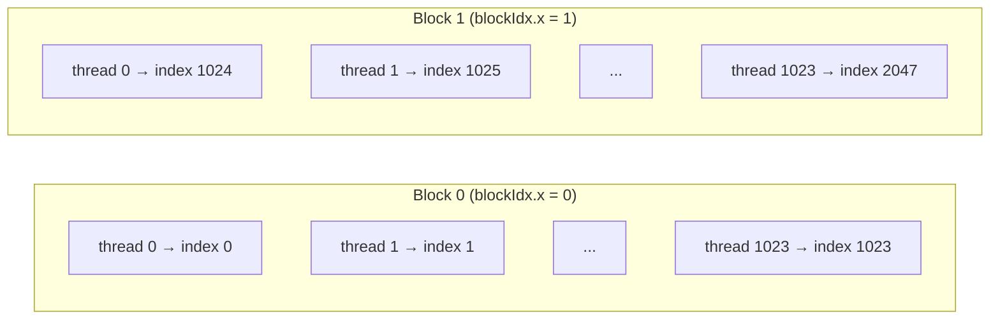

## 概要

ベクトルサイズを2048に拡張し，複数ブロックを使ったベクトル加算を実装する．ブロックIDとスレッドIDからグローバルインデックスを計算する重要な式を学び，ブロック数とスレッド数の設定がGPU使用率とパフォーマンスに与える影響を理解する．

## 主要な内容

### 複数ブロックの必要性

ベクトルサイズを2048に拡張すると，1ブロックあたり最大1024スレッドという制約から，1ブロックでは全要素を処理できない．解決策として，ブロック数を増やし，各ブロックで一部の要素を担当する．

### グローバルインデックスの計算式

複数ブロック構成では，スレッドIDだけではベクトル全体のインデックスを一意に特定できない．以下の式でグローバルインデックスを計算する．

```
index = threadIdx.x + blockIdx.x * blockDim.x
```

- `threadIdx.x` - ブロック内のスレッドID
- `blockIdx.x` - ブロックID
- `blockDim.x` - ブロックあたりのスレッド数

例（2ブロック，各1024スレッド）:



### GPU使用率とパフォーマンス

ブロック数とスレッド数の設定はGPU使用率に直接影響する．

- 2ブロック × 1024スレッド: 2つのSMのみ使用（A100の場合，108SM中2SM = 約2%の使用率）
- 64ブロック × 32スレッド: 64のSMを使用（約59%の使用率）

ブロックサイズが小さいほど各ブロックの実行時間が短縮され，より多くのSMを同時に活用できるため，パフォーマンスが向上する．

### 実行時間の計測

CUDAの`Event` APIを使って実行時間を計測できる．

```cuda
cudaEvent_t start, stop;
cudaEventCreate(&start);
cudaEventCreate(&stop);

cudaEventRecord(start);
vector_add<<<blocks, threads>>>(d_a, d_b, d_c, n);
cudaEventRecord(stop);

float milliseconds = 0;
cudaEventSynchronize(stop);
cudaEventElapsedTime(&milliseconds, start, stop);
printf("Execution time: %f ms\n", milliseconds);
```

ただし，この方法は精度が低いため，正確な計測にはNVIDIAのプロファイラ（`Nsight Systems`，`Nsight Compute`）の使用が推奨される．

## コード例

```cuda
#include <stdio.h>

#define SIZE 2048

__global__ void vector_add(int *a, int *b, int *c, int n) {
    int index = threadIdx.x + blockIdx.x * blockDim.x;
    c[index] = a[index] + b[index];
}

int main() {
    // メモリ確保・初期化・転送の処理（前のレクチャーと同様）

    // 構成1: 2 ブロック × 1024 スレッド（低 GPU 使用率）
    vector_add<<<2, 1024>>>(d_a, d_b, d_c, SIZE);

    // 構成2: 64 ブロック × 32 スレッド（高 GPU 使用率）
    vector_add<<<64, 32>>>(d_a, d_b, d_c, SIZE);

    // 結果の転送・メモリ解放の処理
    return 0;
}
```

## まとめ

- 複数ブロックを使う場合，`index = threadIdx.x + blockIdx.x * blockDim.x`でグローバルインデックスを計算する
- スレッド総数は常にベクトルの要素数と一致させる必要がある
- ブロック数を増やしてブロックサイズを小さくすると，より多くのSMを活用でき，GPU使用率とパフォーマンスが向上する
- ブロックあたりの最小スレッド数は32（1ワープ）であり，通常は2の累乗を使用する
- 実行時間の計測にはCUDA Event APIよりもプロファイラ（`Nsight Systems`）の方が正確である
