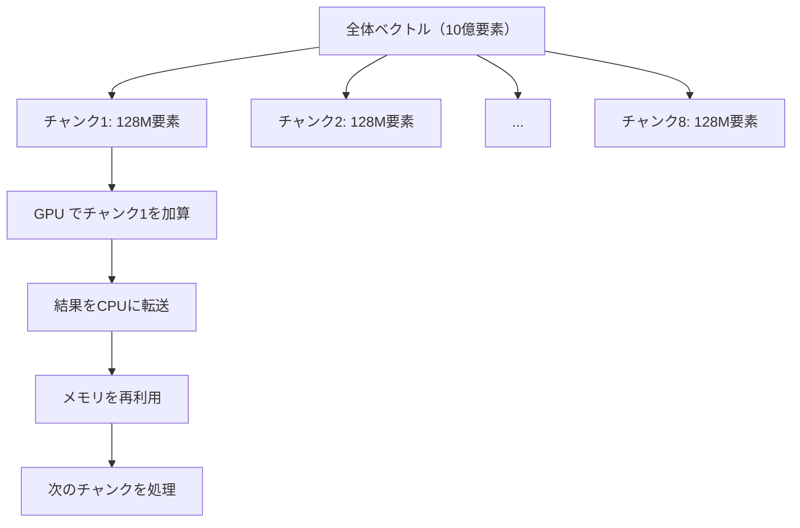

import Quiz from '@/components/content/Quiz.astro'

## 概要

4億要素を超える大規模ベクトルの加算に取り組む．メモリ不足（RAM制約）によるランタイムエラーの原因を特定するデバッグ手法と，ベクトルをチャンクに分割して処理するソリューションを学ぶ．

## 主要な内容

### 大規模ベクトルへのスケールアップ

ベクトルサイズを`1024 * 432 * 1024`（約4億要素）に拡大する場合，ブロック数とスレッド数を適切に設定すれば正常に動作する．しかし，ベクトルサイズを`1024 * 1024 * 1024`（約10億要素）に倍増させると，コンパイルは成功するがランタイムエラーが発生する．

### ランタイムエラーのデバッグ手法

ランタイムエラーの原因を特定するため，コード内の複数箇所に`printf`を挿入するデバッグ手法が有効である．

```cuda
printf("\n Hello 00");  // メモリ確保前
// ... CPU メモリ確保処理 ...
printf("\n Hello 01");  // GPU メモリ確保後
// ... データ転送処理 ...
printf("\n Hello 02");  // データ転送後
```

出力結果を確認し，どの`printf`まで実行されたかでエラー箇所を特定する．例えば「Hello 00」「Hello 01」は出力されるが「Hello 02」が出力されない場合，CPU側のメモリ確保（`malloc`）でメモリ不足が発生していると判断できる．

### メモリ不足の原因

各ベクトルのサイズを計算すると:

```
1024 * 1024 * 1024 * 4 bytes = 4 GB（1ベクトルあたり）
```

3つのベクトル（A, B, C）で合計12GBのRAMが必要になるが，利用可能なRAMが不足している場合にエラーが発生する．

### チャンク分割による解決策

大規模ベクトルをメモリに収まるサイズのチャンクに分割して処理する．



処理の流れ:

1. GPU側のメモリはベクトル全体分を確保（GPUメモリが十分な場合）
2. CPU側はチャンクサイズ分のみ確保
3. `for`ループでチャンクごとに以下を繰り返す:
   - チャンク分のデータを初期化
   - CPU → GPU へデータ転送
   - カーネル実行
   - GPU → CPU へ結果転送
   - 結果の処理（出力，保存など）

## コード例

```cuda
#include <stdio.h>

#define TOTAL_SIZE (1024 * 1024 * 1024)
#define CHUNK_SIZE (128 * 1024 * 1024)
#define BLOCK_SIZE 1024

__global__ void vector_add(int *a, int *b, int *c, int n) {
    int index = threadIdx.x + blockIdx.x * blockDim.x;
    if (index < n) {
        c[index] = a[index] + b[index];
    }
}

int main() {
    int num_chunks = TOTAL_SIZE / CHUNK_SIZE;

    // GPU メモリ確保（チャンクサイズ分）
    int *d_a, *d_b, *d_c;
    cudaMalloc(&d_a, CHUNK_SIZE * sizeof(int));
    cudaMalloc(&d_b, CHUNK_SIZE * sizeof(int));
    cudaMalloc(&d_c, CHUNK_SIZE * sizeof(int));

    // CPU メモリ確保（チャンクサイズ分のみ）
    int *chunk_a = (int *)malloc(CHUNK_SIZE * sizeof(int));
    int *chunk_b = (int *)malloc(CHUNK_SIZE * sizeof(int));
    int *chunk_c = (int *)malloc(CHUNK_SIZE * sizeof(int));

    int grid_size = CHUNK_SIZE / BLOCK_SIZE;

    for (int i = 0; i < num_chunks; i++) {
        int offset = i * CHUNK_SIZE;

        // チャンクの初期化
        for (int j = 0; j < CHUNK_SIZE; j++) {
            chunk_a[j] = offset + j;
            chunk_b[j] = TOTAL_SIZE - (offset + j);
        }

        // CPU → GPU 転送
        cudaMemcpy(d_a, chunk_a, CHUNK_SIZE * sizeof(int),
                   cudaMemcpyHostToDevice);
        cudaMemcpy(d_b, chunk_b, CHUNK_SIZE * sizeof(int),
                   cudaMemcpyHostToDevice);

        // カーネル実行
        vector_add<<<grid_size, BLOCK_SIZE>>>(d_a, d_b, d_c,
                                               CHUNK_SIZE);

        // GPU → CPU 転送
        cudaMemcpy(chunk_c, d_c, CHUNK_SIZE * sizeof(int),
                   cudaMemcpyDeviceToHost);
    }

    // メモリ解放
    cudaFree(d_a);
    cudaFree(d_b);
    cudaFree(d_c);
    free(chunk_a);
    free(chunk_b);
    free(chunk_c);

    return 0;
}
```

## まとめ

- 大規模ベクトルではCPU側のRAM不足によりランタイムエラーが発生することがある
- `printf`を複数箇所に挿入することで，ランタイムエラーの発生箇所を特定できる
- ベクトルをチャンク（小片）に分割し，チャンクごとに「初期化 → 転送 → 実行 → 結果取得」を繰り返すことでメモリ制約を回避できる
- チャンクサイズは利用可能なRAM容量に応じて調整する

<Quiz questions={[
  {
    question: "1024 x 1024 x 1024個のint型要素を持つベクトル1本のメモリサイズはいくつか？",
    options: [
      "1 GB",
      "2 GB",
      "4 GB",
      "8 GB"
    ],
    answer: 2,
    explanation: "1024 x 1024 x 1024 = 約10億要素 x 4バイト（int型） = 4 GBである．3つのベクトル（A，B，C）では合計12 GBが必要となる．"
  },
  {
    question: "大規模ベクトルでランタイムエラーの発生箇所を特定するために有効なデバッグ手法はどれか？",
    options: [
      "コンパイラの最適化レベルを変更する",
      "コード内の複数箇所にprintfを挿入する",
      "ブロックサイズを減らす",
      "GPUメモリを増設する"
    ],
    answer: 1,
    explanation: "コード内の複数箇所に`printf`を挿入し，どの`printf`まで実行されたかを確認することで，ランタイムエラーの発生箇所を特定できる．"
  },
  {
    question: "メモリ不足を回避するためのチャンク分割処理で，各チャンクごとに行う処理の正しい順序はどれか？",
    options: [
      "カーネル実行 → 初期化 → CPU→GPU転送 → GPU→CPU転送",
      "初期化 → CPU→GPU転送 → カーネル実行 → GPU→CPU転送",
      "CPU→GPU転送 → 初期化 → GPU→CPU転送 → カーネル実行",
      "初期化 → カーネル実行 → CPU→GPU転送 → GPU→CPU転送"
    ],
    answer: 1,
    explanation: "チャンクごとの処理は「初期化 → CPU→GPU転送 → カーネル実行 → GPU→CPU転送」の順で行う．CPU上でデータを初期化してからGPUに送り，計算後に結果を取得する．"
  }
]} />
