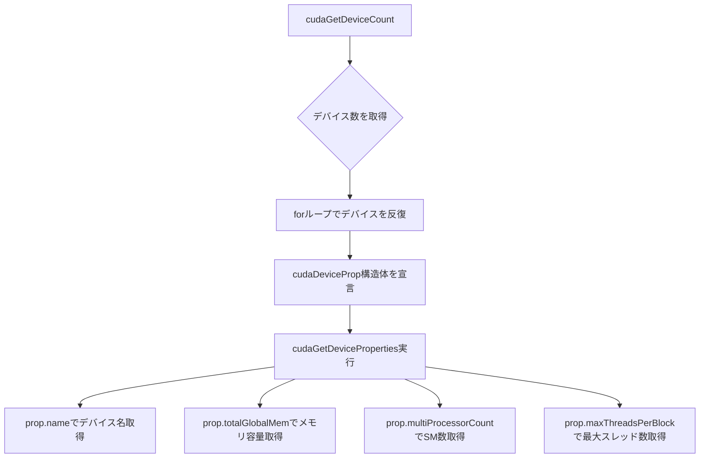

import Quiz from '@/components/content/Quiz.astro'

## 概要

CUDAランタイムAPIは，GPU開発者がデバイスの性能や制約を効率的に取得するための高レベルインターフェースを提供する．このレクチャーでは，`cudaGetDeviceProperties`関数を中心に，GPUのプロパティ（デバイス名，メモリ容量，最大スレッド数，Compute Capabilityなど）をプログラムから直接クエリする方法を解説する．ホワイトペーパーを読む代わりにAPIで迅速に情報を取得できる利点を学ぶ．

## 主要な内容

### ランタイムAPIの概要

CUDAランタイムAPIは，デバイス管理，メモリ割り当て，並列カーネルの実行など，GPU開発に必要な機能を網羅する高レベルインターフェースである．NVIDIAの公式ドキュメントには，数十種類のAPI関数が掲載されており，デバイス管理や非同期計算などの機能をカバーしている．

### cudaGetDeviceProperties関数の使い方

`cudaGetDeviceProperties`関数は，CUDA対応GPUのプロパティと性能を照会するための関数である．取得できる主な情報は以下の通りである．

- デバイス名（例: GeForce RTX 3090）
- メモリクロックレート，メモリバス幅
- ピークメモリバンド幅
- トータルグローバルメモリ
- SM（Streaming Multiprocessor）の数
- ブロックあたりの最大スレッド数（各次元ごと）
- グリッドあたりの最大ブロック数（各次元ごと）

### ランタイムAPI関数の動作特性

ランタイムAPI関数には以下の重要な特性がある．

- 通常の関数とは異なり，結果は戻り値ではなくパラメータを通じて出力される（例: `cudaGetDeviceCount`は`int *count`パラメータに結果を格納する）
- 各関数は実行ステータスを返す．成功時は`cudaSuccess`，失敗時はエラーコードが返される
- エラーコードを解析することで，関数が期待通りに実行されなかった理由を特定できる

## コード例

```cuda
#include <stdio.h>

int main() {
    int nDevices;
    cudaGetDeviceCount(&nDevices);

    for (int i = 0; i < nDevices; i++) {
        cudaDeviceProp prop;
        cudaGetDeviceProperties(&prop, i);

        printf("Device ID: %d\n", i);
        printf("Device Name: %s\n", prop.name);
        printf("Memory Clock Rate (KHz): %d\n", prop.memoryClockRate);
        printf("Memory Bus Width (bits): %d\n", prop.memoryBusWidth);
        printf("Total Global Memory (bytes): %zu\n", prop.totalGlobalMem);
        printf("Number of SMs: %d\n", prop.multiProcessorCount);
        printf("Max Threads per Block: %d\n", prop.maxThreadsPerBlock);
        printf("Max Threads Dim: (%d, %d, %d)\n",
               prop.maxThreadsDim[0],
               prop.maxThreadsDim[1],
               prop.maxThreadsDim[2]);
        printf("Max Grid Size: (%d, %d, %d)\n",
               prop.maxGridSize[0],
               prop.maxGridSize[1],
               prop.maxGridSize[2]);
    }
    return 0;
}
```



## まとめ

- CUDAランタイムAPIは，ホワイトペーパーを読む代わりにGPUのプロパティを効率的に取得できる
- `cudaGetDeviceProperties`関数で，デバイス名，メモリ容量，SM数，最大スレッド数などの情報をプログラムから直接照会できる
- ランタイムAPI関数は戻り値ではなくパラメータで結果を返し，実行ステータスをエラーコードとして返す
- 取得したプロパティは，後続のプロファイリングやパフォーマンス分析で重要な役割を果たす

<Quiz questions={[
  {
    question: "GPUのプロパティ（デバイス名，メモリ容量，SM数など）をプログラムから取得するために使用するCUDA関数はどれか？",
    options: [
      "cudaGetDeviceCount",
      "cudaGetDeviceProperties",
      "cudaDeviceQuery",
      "cudaGetDeviceInfo"
    ],
    answer: 1,
    explanation: "`cudaGetDeviceProperties`関数は，`cudaDeviceProp`構造体にGPUの各種プロパティ（デバイス名，メモリ容量，SM数，最大スレッド数など）を格納する．"
  },
  {
    question: "CUDAランタイムAPI関数の結果はどのように返されるか？",
    options: [
      "戻り値として直接返される",
      "グローバル変数に格納される",
      "パラメータを通じて出力され，戻り値はエラーコードとなる",
      "標準出力に表示される"
    ],
    answer: 2,
    explanation: "CUDAランタイムAPI関数は，結果をパラメータ（ポインタ）を通じて出力する．関数自体の戻り値は実行ステータス（成功時は`cudaSuccess`，失敗時はエラーコード）である．"
  },
  {
    question: "cudaDeviceProp構造体のmultiProcessorCountメンバが示す情報は何か？",
    options: [
      "GPUのコア総数",
      "SM（Streaming Multiprocessor）の数",
      "ブロックあたりの最大スレッド数",
      "ワープスケジューラの数"
    ],
    answer: 1,
    explanation: "`multiProcessorCount`はGPU内のSM（Streaming Multiprocessor）の数を示す．SM数はGPUの並列処理能力に直結する重要な指標である．"
  }
]} />
