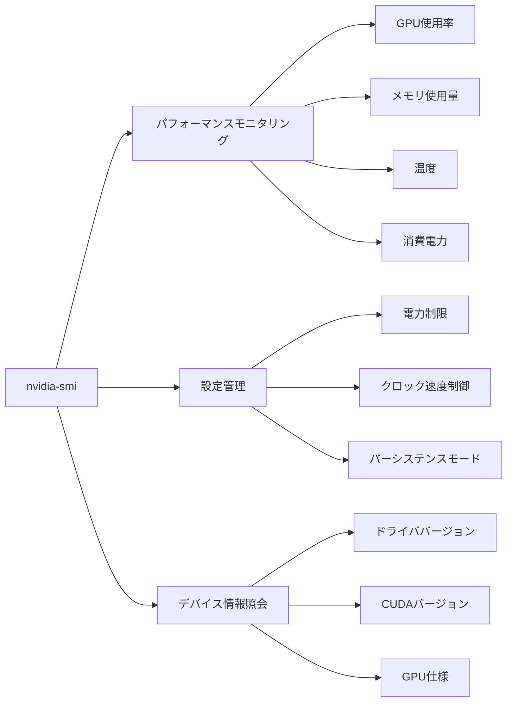

import Quiz from '@/components/content/Quiz.astro'

## 概要

`nvidia-smi`（NVIDIA System Management Interface）は，NVIDIAが提供するコマンドラインユーティリティで，GPUのリアルタイム監視と設定管理を行う．このレクチャーでは，パフォーマンスモニタリング（GPU使用率，メモリ使用量，温度，消費電力），設定管理（クロック速度，電力制限），デバイス情報の照会という3つの主要機能を実践的に解説する．

## 主要な内容

### 基本的なnvidia-smiコマンド

`nvidia-smi`コマンドを実行すると，2つのテーブルが表示される．1つ目のテーブルには以下の情報が含まれる．

- ドライババージョンとCUDAバージョン
- GPU名（例: GeForce RTX 3090）
- 消費電力（現在値／最大値）
- GPU温度
- メモリ使用量（使用中／総容量）
- GPU使用率（%）

2つ目のテーブルには，GPUで実行中のプロセス情報が表示される．

### パフォーマンスモニタリング

継続的にGPUの状態を監視するには，以下のコマンドを使用する．

- `nvidia-smi -l 5`: 5秒ごとにメトリクスを更新表示
- `nvidia-smi --query-gpu=name,driver_version,temperature.gpu --format=csv`: 特定のメトリクスをCSV形式で取得

CUDAアプリケーション実行中は，GPU使用率，メモリ使用量，消費電力，温度が大きく変動する．例えば行列積アプリケーションの実行時には，消費電力が31Wから318Wへ約10倍に増加する．

### 設定管理

`nvidia-smi`では以下の設定を制御できる．

- 電力制限の設定: `nvidia-smi -i 0 -pl 200`（GPU 0の電力制限を200Wに設定）
- パーシステンスモード: クロック速度の変更前に有効化が必要
- クロック速度の設定: メモリとSMのクロック速度をペアで指定
- 対応クロックの確認: GPUがサポートするクロック速度の一覧を取得

### クロック速度の確認と制御

GPUのクロック速度は負荷に応じて動的に変化する．CUDAアプリケーション実行時には，グラフィックスクロックが570MHzから1695MHzへ自動的に増加する．固定クロック速度を設定することも可能だが，GPUが対応するクロック速度のみ使用できる．

## まとめ

- `nvidia-smi`はGPUのリアルタイム監視，設定管理，デバイス情報照会の3つの機能を提供する
- `-l`オプションで継続的なモニタリングが可能で，CUDAアプリケーション実行時のメトリクス変動を観察できる
- 電力制限やクロック速度の制御が可能だが，GPUの対応状況を確認する必要がある
- 出力をCSVファイルに保存してExcelで分析することもできる

<Quiz questions={[
  {
    question: "nvidia-smiが提供する3つの主要機能として正しい組み合わせはどれか？",
    options: [
      "コンパイル，デバッグ，プロファイリング",
      "パフォーマンスモニタリング，設定管理，デバイス情報照会",
      "メモリ管理，カーネル起動，エラーチェック",
      "コード最適化，メモリ転送，スレッド管理"
    ],
    answer: 1,
    explanation: "`nvidia-smi`はパフォーマンスモニタリング（GPU使用率，メモリ使用量，温度，消費電力），設定管理（クロック速度，電力制限），デバイス情報照会（ドライバ・CUDAバージョン）の3つの機能を提供する．"
  },
  {
    question: "nvidia-smiで5秒ごとにGPUメトリクスを継続的に更新表示するコマンドはどれか？",
    options: [
      "nvidia-smi -r 5",
      "nvidia-smi -l 5",
      "nvidia-smi -t 5",
      "nvidia-smi --interval 5"
    ],
    answer: 1,
    explanation: "`nvidia-smi -l 5`で5秒間隔でGPUメトリクスを継続的に更新表示できる．`-l`はloopの略で，指定した秒数ごとにメトリクスを更新する．"
  }
]} />
