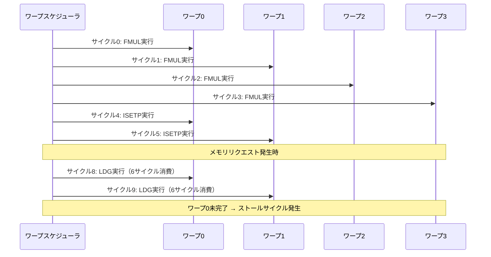

import Quiz from '@/components/content/Quiz.astro'

## 概要

GPUのオキュパンシー（Occupancy）は，GPUリソースの利用率を測定する重要なパフォーマンス指標である．このレクチャーでは，理論的オキュパンシーと達成オキュパンシーの2種類の違いを解説し，ブロックサイズの変更がオキュパンシーに与える影響を実例で示す．さらに，GPUのレイテンシ隠蔽（Latency Hiding）メカニズムについても詳しく説明する．

## 主要な内容

### 理論的オキュパンシー

理論的オキュパンシーは以下の式で計算される．

`理論的オキュパンシー = (アプリケーションで使用するワープ数 / SMあたりの最大ワープ数) * 100%`

分母（SMあたりの最大ワープ数）はGPUのハードウェア制約であり，ホワイトペーパーやランタイムAPIから取得できる．例えばRTX 3090では，SMあたりの最大スレッド数が1536，最大ワープ数が48である．

ブロックサイズの変更による理論的オキュパンシーへの影響は以下の通りである．

- ブロックサイズ32（1ワープ）: 割り当てアクティブブロック16 → 16ワープ / 48 = 33.33%
- ブロックサイズ64（2ワープ）: 割り当てアクティブブロック16 → 32ワープ / 48 = 66.67%
- ブロックサイズ96（3ワープ）: 割り当てアクティブブロック16 → 48ワープ / 48 = 100%

### 達成オキュパンシー

達成オキュパンシーは，実行時のワープスケジューリングに基づく実際の利用率である．各サイクルで少なくとも1つのワープが命令を実行できる状態であればアクティブサイクル，すべてのワープが待ち状態であればストールサイクルとなる．

`達成オキュパンシー = (アクティブサイクル数 / 総サイクル数) * 100%`

達成オキュパンシーは常に理論的オキュパンシー以下になる．例えば理論的オキュパンシーが100%であっても，メモリアクセスの待ち時間や命令依存関係により，達成オキュパンシーは72.8%程度になることがある．

### レイテンシ隠蔽（Latency Hiding）

GPUがCPUに対して持つ大きな利点の1つがレイテンシ隠蔽である．

CPUでは命令依存関係がある場合に`Out-of-Order`実行で対処するが，GPUでは多数のワープを切り替えることで対処する．あるワープがメモリアクセス待ちでストールしても，別のワープの命令を実行することでストールサイクルを最小化できる．

### メモリアクセスのレイテンシ

メモリアクセスのレイテンシはキャッシュレベルによって大きく異なる．

- L1キャッシュヒット: 約30サイクル
- L2キャッシュヒット: 約190-200サイクル
- グローバルメモリアクセス: 約300サイクル

### 達成オキュパンシーの計算範囲

達成オキュパンシーはGPU全体で計算される．各パーティションの達成オキュパンシーを算出し，SM内の4パーティション（AmpereおよびVoltaアーキテクチャの場合）の平均をSMの達成オキュパンシーとする．さらに全SMの達成オキュパンシーの平均がGPU全体の達成オキュパンシーとなる．

## まとめ

- 理論的オキュパンシーは使用ワープ数と最大ワープ数の比率で計算され，理想的な条件を前提とする
- 達成オキュパンシーはメモリレイテンシや命令依存関係の影響を受け，常に理論的オキュパンシー以下になる
- レイテンシ隠蔽はGPUの重要な特徴であり，多数のワープを切り替えることでストールサイクルを最小化する
- ブロックサイズの選択がオキュパンシーに直接影響するため，適切な設定が性能最適化の鍵となる
- 高いオキュパンシーが常に高い性能を意味するわけではないが，GPUリソースの利用状況を把握する重要な指標である

<Quiz questions={[
  {
    question: "理論的オキュパンシーの計算式として正しいものはどれか？",
    options: [
      "（使用スレッド数 / SMあたりの最大スレッド数）x 100%",
      "（使用ワープ数 / SMあたりの最大ワープ数）x 100%",
      "（アクティブサイクル数 / 総サイクル数）x 100%",
      "（使用ブロック数 / SMあたりの最大ブロック数）x 100%"
    ],
    answer: 1,
    explanation: "理論的オキュパンシーは（アプリケーションで使用するワープ数 / SMあたりの最大ワープ数）x 100%で計算される．達成オキュパンシーはアクティブサイクル数に基づく実行時の実際の利用率である．"
  },
  {
    question: "GPUのレイテンシ隠蔽（Latency Hiding）の仕組みとして正しいものはどれか？",
    options: [
      "キャッシュメモリを大量に搭載してメモリアクセスを高速化する",
      "あるワープがメモリアクセス待ちの間に別のワープの命令を実行する",
      "CPUと同様にOut-of-Order実行で命令を並べ替える",
      "メモリアクセスのレイテンシ自体を短縮する技術を使う"
    ],
    answer: 1,
    explanation: "GPUのレイテンシ隠蔽は，あるワープがメモリアクセス待ちでストールしても，別のワープの命令を実行することでストールサイクルを最小化する仕組みである．CPUのOut-of-Order実行とは異なるアプローチである．"
  },
  {
    question: "グローバルメモリアクセスのレイテンシ（サイクル数）として最も近い値はどれか？",
    options: [
      "約10サイクル",
      "約30サイクル",
      "約100サイクル",
      "約300サイクル"
    ],
    answer: 3,
    explanation: "グローバルメモリアクセスのレイテンシは約300サイクルである．L1キャッシュヒットは約30サイクル，L2キャッシュヒットは約190-200サイクルと，キャッシュレベルによって大きく異なる．"
  }
]} />
