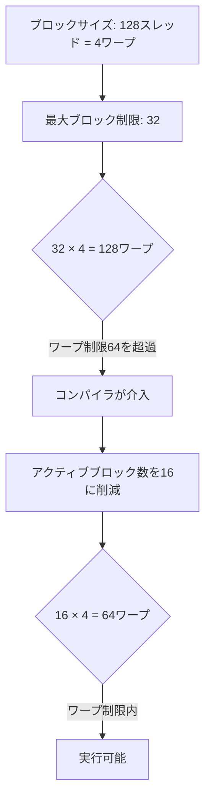
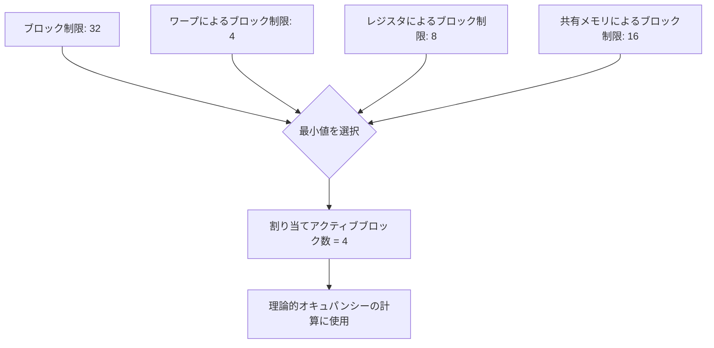

## 概要

SMあたりの割り当てアクティブブロック数（Allocated Active Blocks per SM）は，オキュパンシーに直接影響する重要な概念である．このレクチャーでは，ワープ制限，レジスタ制限，共有メモリ制限がSMあたりの同時実行ブロック数をどのように制約するかを，A100 GPUのホワイトペーパーのテーブルを用いて詳細に解説する．

## 主要な内容

### ハードウェア制約テーブルの4つの重要な行

A100 GPUのAmpereアーキテクチャにおけるハードウェア制約は以下の通りである．

- SMあたりの最大スレッドブロック数: 32ブロック
- SMあたりの最大ワープ数: 64ワープ
- SMあたりの最大レジスタ数: 65,536
- SMあたりの共有メモリ制限: アーキテクチャ依存

### ワープ制限によるブロック数の制約

ワープ制限がSMあたりの同時実行ブロック数を制御する仕組みは以下の通りである．

例えば，SMあたり最大32ブロックを配置する場合に，各ブロックが4ワープ（128スレッド）を含むとすると，合計ワープ数は32 x 4 = 128ワープとなる．しかしワープ制限が64であるため，コンパイラはアクティブブロック数を16に削減する（16 x 4 = 64ワープ，制限内に収まる）．

### レジスタ制限によるブロック数の制約

ブロックサイズが512スレッドで，各スレッドが16レジスタを使用する場合の計算例は以下の通りである．

- ブロックあたりのレジスタ数: 512 x 16 = 8,192
- レジスタ制限65,536に対する同時実行可能ブロック数: 65,536 / 8,192 = 8ブロック

スレッドあたりのレジスタ使用量が制限を超えると，`レジスタスピリング`が発生する．レジスタスピリングとは，レジスタに収まらない値をローカルメモリに退避する現象であり，ローカルメモリはレジスタより低速であるため性能低下を引き起こす．

### 割り当てアクティブブロック数の決定

コンパイラは以下の4つの制約の最小値を採用してSMあたりの同時実行ブロック数を決定する．

- ブロック制限（ハードウェアの上限）
- ブロックワープ制限
- ブロックレジスタ制限
- ブロック共有メモリ制限

### 割り当てブロック数と配置ブロック数の違い

GPU全体に配置可能なブロック数は数百万に達するが，SMあたりの同時実行ブロック数は制約される．例えばA100の108 SM全体に1000ブロック以上を配置できるが，各SMで同時に実行できるのは制約された数のブロックのみである．残りのブロックは先行ブロックの完了を待ってからウェーブとして実行される．

## まとめ

- SMあたりの割り当てアクティブブロック数は，ワープ制限，レジスタ制限，共有メモリ制限の3つの制約と，ハードウェアのブロック上限の最小値で決定される
- ワープ制限が同時実行ブロック数を制御する最も一般的な制約要因である
- レジスタ使用量が制限を超えるとレジスタスピリングが発生し，性能低下を招く
- NsightComputeのオキュパンシーセクションで各制約値を確認でき，理論的オキュパンシーの計算に直結する
