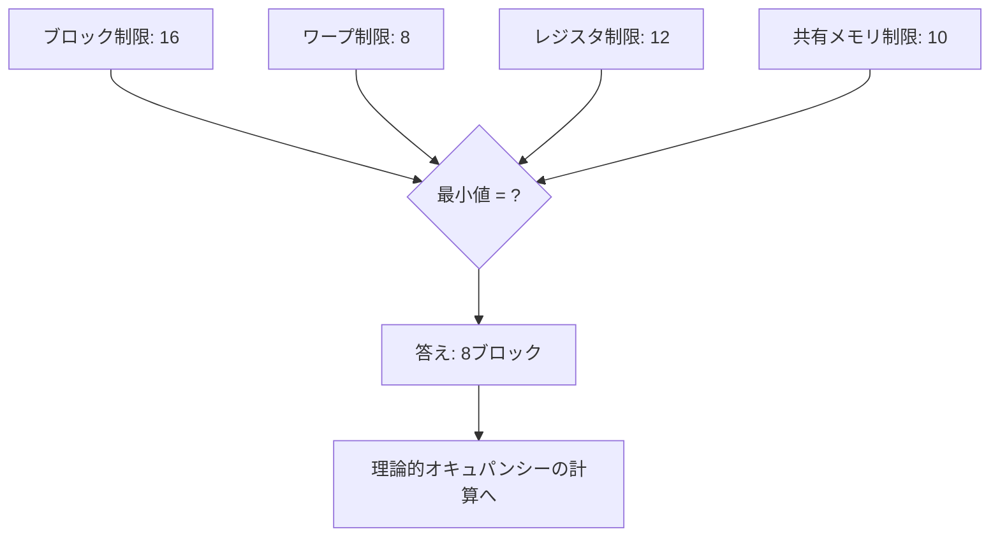

## 概要

このクイズでは，SMあたりの同時実行ブロック数を決定する要因について理解度を確認する．前のレクチャーで学んだ割り当てアクティブブロック数（Allocated Active Blocks per SM）の概念を，具体的な計算問題を通じて定着させる．

## 主要な内容

### 問題1: ワープ制限によるブロック数の計算

以下の条件でSMあたりの同時実行ブロック数を求めよ．

- SMあたりの最大ワープ数: 48
- ブロックサイズ: 128スレッド（4ワープ）
- SMあたりの最大ブロック数: 16

解答: 各ブロックが4ワープを含むため，ワープ制限から 48 / 4 = 12ブロック．最大ブロック制限16よりワープ制限の12ブロックが小さいため，答えは12ブロックである．

### 問題2: レジスタ制限によるブロック数の計算

以下の条件でSMあたりの同時実行ブロック数を求めよ．

- SMあたりの最大レジスタ数: 65,536
- ブロックサイズ: 256スレッド
- スレッドあたりのレジスタ数: 32

解答: ブロックあたりのレジスタ数 = 256 x 32 = 8,192．レジスタ制限から 65,536 / 8,192 = 8ブロック．

### 問題3: 複合制約の最小値選択

以下の条件でSMあたりの同時実行ブロック数を求めよ．

- ブロック制限（ハードウェア上限）: 16
- ワープによるブロック制限: 8
- レジスタによるブロック制限: 12
- 共有メモリによるブロック制限: 10

解答: すべての制約の最小値を選択するため，答えは8ブロック（ワープ制限による）．

### 問題4: 理論的オキュパンシーの計算

問題3の結果を使い，ブロックサイズが192スレッド（6ワープ），SMあたりの最大ワープ数が48のとき，理論的オキュパンシーを求めよ．

解答: 同時実行ワープ数 = 8ブロック x 6ワープ = 48ワープ．理論的オキュパンシー = 48 / 48 x 100% = 100%．

### 問題5: ブロックサイズ変更の影響

ブロックサイズを192スレッドから256スレッド（8ワープ）に変更した場合，SMあたりの最大ワープ数が48のとき，ワープによるブロック制限はどう変化するか．

解答: ワープによるブロック制限 = 48 / 8 = 6ブロック．ブロックサイズを増やすとワープによるブロック制限が減少し，同時実行ブロック数が制約される可能性がある．

## まとめ

- SMあたりの同時実行ブロック数は，ワープ制限，レジスタ制限，共有メモリ制限，ハードウェアブロック上限の最小値で決定される
- ブロックサイズの変更は各制約値に影響を与え，結果としてオキュパンシーが変化する
- 最適なブロックサイズを選択するためには，すべての制約を考慮した計算が必要である
