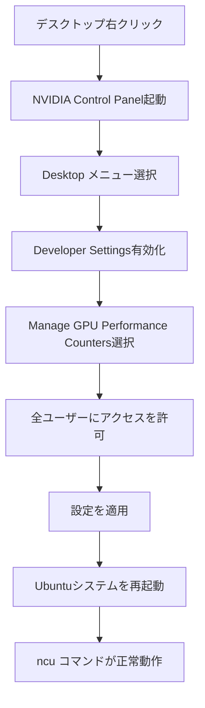

## 概要

Nsight Computeツールを使ったCUDAアプリケーションのプロファイリングを開始する際に，特にWindows環境（WSL使用時）で発生するGPUパフォーマンスカウンターへのアクセス権限の問題とその解決方法を解説する．`ncu`コマンドの基本的な使い方と，権限設定の変更手順を実践的に示す．

## 主要な内容

### 問題の発生

CUDAアプリケーション自体は正常に実行できるにもかかわらず，`ncu`コマンドでプロファイリングしようとするとエラーが発生する．主なエラーメッセージは以下の通りである．

- ドライバリソースが利用不可
- ユーザーにGPUパフォーマンスカウンターへのアクセス権限がない

`nvidia-smi`コマンドでGPU，ドライバ，CUDAバージョンが正常に検出されても，パフォーマンスカウンターへのアクセス権限が原因でプロファイリングに失敗する場合がある．

### 解決方法（Windows環境）

Windowsシステムでは，GPUドライバのインストール時にパフォーマンスカウンターへのアクセスが管理者ユーザーのみに制限される．解決手順は以下の通りである．

1. デスクトップで右クリックし，NVIDIA Control Panelを開く
2. Desktopメニューから Developer Settings を有効化する
3. Manage GPU Performance Countersを選択する
4. 全ユーザーにアクセスを許可するオプションを選択して適用する
5. Ubuntuシステムを再起動する（`sudo reboot`）

### ncuの基本的な出力

権限問題を解決した後，`ncu ./executable`を実行すると以下のセクションが表示される．

- DRAMの周波数とメモリスループット
- ブロックサイズ，グリッドサイズ，スレッドあたりのレジスタ数
- オキュパンシー（各制約値と達成オキュパンシー）

## まとめ

- Windows環境（WSL使用時）では，GPUパフォーマンスカウンターのアクセス権限がプロファイリングの障壁となる
- NVIDIA Control Panelの Developer Settings から全ユーザーへのアクセスを許可することで解決できる
- 設定変更後はシステムの再起動が必要である
- `sudo`を使用しても`ncu`コマンドが見つからないケースがあるため，権限設定の変更が推奨される
