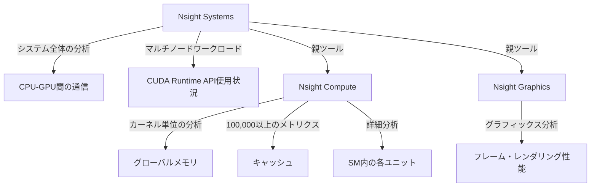

## 概要

NVIDIAはCUDAアプリケーションのプロファイリングと分析のために7つの主要ツールを提供している．このレクチャーでは各ツールの役割と使い分けを解説し，特にNsightスイート（Nsight Systems，Nsight Compute，Nsight Graphics）の3ツールの関係性と適用場面に焦点を当てる．なお`nvprof`は非推奨となっているため使用を推奨しない．

## 主要な内容

### NVIDIAプロファイリングツール一覧

NVIDIAが提供する主なプロファイリング・デバッグツールは以下の7つである．

- CUDA Memcheck: メモリエラー（範囲外アクセス，アラインメント不正など）の検出・診断
- NVIDIA Visual Profiler（NVVP）: タイムラインとハードウェアカウンターのグラフィカル表示
- CUDA-GDB: CUDAプログラムのデバッグツール
- Nsight Systems: システム全体のパフォーマンス分析
- Nsight Compute: カーネル単位の詳細パフォーマンス分析
- Nsight Graphics: グラフィックスアプリケーションの分析
- nvprof: 非推奨（使用しないこと）

### Nsightスイートの関係性

- Nsight Systems: アプリケーション全体のシステムレベル分析に適する．CPU-GPU間のインタラクション，CUDA Runtime APIの使用状況，マルチノードワークロードの分析が可能．複数のカーネルを含むアプリケーション全体を俯瞰するサーバープロファイリングツール
- Nsight Compute: 個々のカーネルの詳細分析に特化．グローバルメモリ，キャッシュ，SM内の各ユニットに至るまで，100,000以上のメトリクスを提供するカーネルプロファイリングツール
- Nsight Graphics: グラフィックスアプリケーション向けの専門ツール．フレームやレンダリング性能の詳細な分析を提供

### コースでの焦点

本コースではNsight Computeを中心にプロファイリングを学ぶ．Nsight Systemsについても一部取り扱う可能性がある．

## まとめ

- NVIDIAは7つのプロファイリング・デバッグツールを提供しており，`nvprof`は非推奨のため使用しない
- Nsight SystemsはシステムレベルでNsight Computeはカーネルレベルの分析に適している
- Nsight Computeは100,000以上のメトリクスを提供し，SM内の個々のユニットまで詳細に分析できる
- 用途に応じてNsight Systems（全体俯瞰）とNsight Compute（カーネル詳細）を使い分けることが重要である
