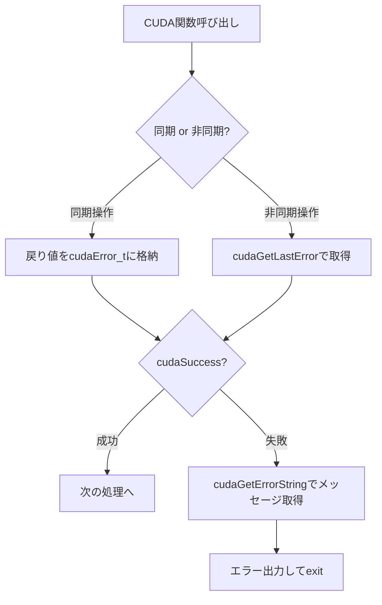

## 概要

CUDAアプリケーションのプロファイリング前に，CUDA関数のエラーチェックを確実に行うことが重要である．このレクチャーでは，同期操作と非同期操作の2つのカテゴリにおけるエラーチェック手法を解説し，マクロを用いた効率的なエラーチェックの実装方法を紹介する．

## 主要な内容

### エラーチェックの重要性

CUDAアプリケーションはコンパイル時にエラーが検出されなくても，実行時にメモリ不足などの問題で正常に動作しないケースがある．例えばメモリ割り当てに十分な空間がない場合，コンパイルは成功するが実行時に`Segmentation Fault`が発生する．このような実行時エラーを特定するために，すべてのCUDA関数にエラーチェックを実装することが必要である．

### 同期操作のエラーチェック

`cudaMalloc`や`cudaMemcpy`などの同期操作は，GPU上の処理が完了するまでホストコードの実行をブロックする．これらの関数は`cudaError_t`型のエラーコードを返す．

```cuda
cudaError_t error;
error = cudaMalloc((void**)&d_a, size);
if (error != cudaSuccess) {
    fprintf(stderr, "Failed to allocate device memory: %s\n",
            cudaGetErrorString(error));
    exit(EXIT_FAILURE);
}
```

`cudaGetErrorString`関数は，エラーIDを人間が読めるエラーメッセージ文字列に変換する．

### 非同期操作のエラーチェック

カーネル起動（`kernel<<<grid, block>>>()`）は非同期操作であり，ホストコードの実行をブロックしない．そのため同期操作とは異なる方法でエラーチェックを行う．

```cuda
kernel<<<grid, block>>>(args);
cudaError_t error = cudaGetLastError();
if (error != cudaSuccess) {
    fprintf(stderr, "Kernel launch failed: %s\n",
            cudaGetErrorString(error));
    exit(EXIT_FAILURE);
}
```

`cudaGetLastError`関数は，最後に実行されたCUDA操作のエラーコードを取得する．

### マクロによる効率化

エラーチェックのコードは繰り返し記述されるため，マクロとインライン関数で効率化する．

```cuda
inline void gpuAssert(cudaError_t code, const char *file, int line) {
    if (code != cudaSuccess) {
        fprintf(stderr, "GPU assert: %s %s %d\n",
                cudaGetErrorString(code), file, line);
        exit(code);
    }
}
#define cudaCheckError(ans) { gpuAssert((ans), __FILE__, __LINE__); }

// 同期操作での使用
cudaCheckError(cudaMalloc((void**)&d_a, size));

// 非同期操作での使用
kernel<<<grid, block>>>(args);
inline void gpuKernelAssert(const char *file, int line) {
    cudaError_t code = cudaGetLastError();
    if (code != cudaSuccess) {
        fprintf(stderr, "GPU kernel assert: %s %s %d\n",
                cudaGetErrorString(code), file, line);
        exit(code);
    }
}
#define cudaKernelCheckError() { gpuKernelAssert(__FILE__, __LINE__); }
```



### マクロ版のメリット

マクロを使用すると，エラー発生時にファイル名と行番号が出力されるため，問題の特定が容易になる．また`exit`によるプログラム終了を含めることで，最初のエラー時点で実行を停止し，無駄な処理を防ぐことができる．

## まとめ

- CUDA関数のエラーチェックは，コンパイル時に検出できない実行時エラーを特定するために不可欠である
- 同期操作は関数の戻り値で，非同期操作は`cudaGetLastError`でエラーを取得する
- マクロとインライン関数を使うことで，エラーチェックコードの重複を排除し，ファイル名・行番号付きのエラーメッセージを出力できる
- エラー発生時に即座に`exit`することで，後続の無意味な処理を防止できる
