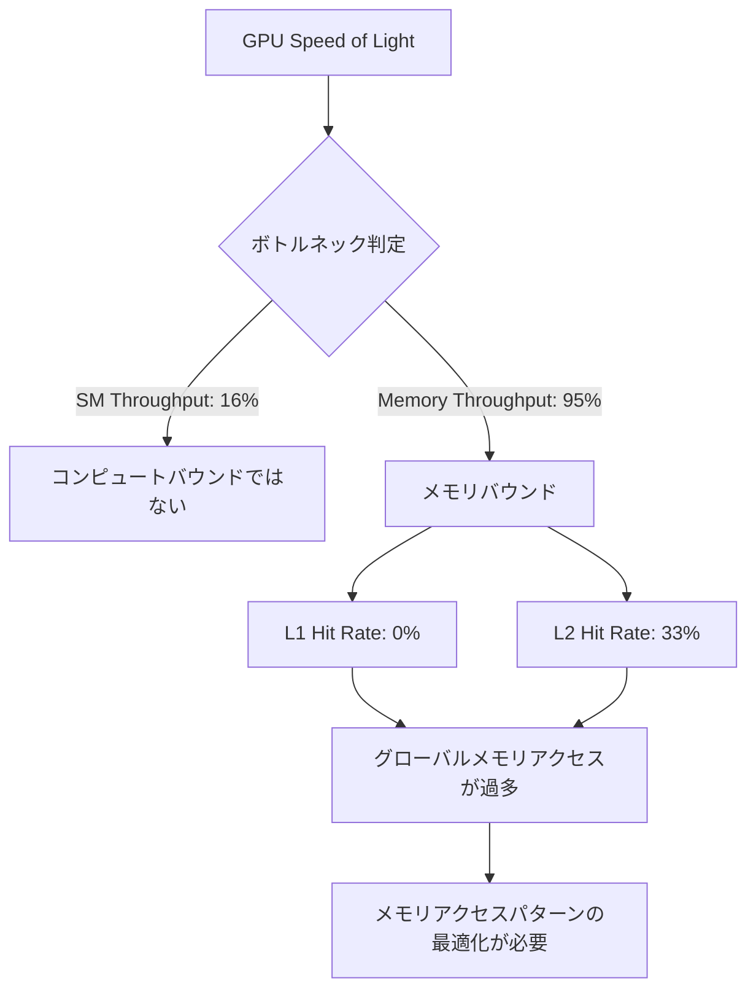

import Quiz from '@/components/content/Quiz.astro'

## 概要

Nsight ComputeのGUI（グラフィカルユーザーインターフェース）を使用したプロファイリング手法を解説する．GUIではコマンドライン分析と同じメトリクスをグラフやチャートで視覚的に確認でき，メモリ階層のデータフロー図やソースコードとアセンブリの対応関係，命令依存関係の表示といった高度な分析機能を活用できる．

## 主要な内容

### GUI の起動とプロジェクト設定

Nsight Compute GUIはCUDAツールキットに同梱されている．新規プロジェクト作成時に設定すべき主な項目は以下の通りである．

- アプリケーション実行ファイルのパス
- 作業ディレクトリ
- キャッシュフラッシュ設定（全キャッシュクリアを推奨）
- クロック制御（ベースクロック or なし）

プロファイリングの開始手順は，`ncu --mode launch ./executable`でプロセスを起動し，GUIからアタッチした後，カーネルを選択してプロファイリングを実行する．

### メトリクス選択

プロファイリング前に収集するメトリクスのセクションを選択する．主要なセクションは以下の通りである．

- Speed of Light Throughput: スループット概要
- Speed of Light Roofline Chart: ルーフラインモデル
- Compute Workload Analysis: 演算ワークロード分析
- Memory Workload Analysis: メモリワークロード分析
- Scheduler Statistics: スケジューラ統計
- Warp State Statistics: ワープ状態統計
- Instruction Statistics: 命令統計
- Occupancy: オキュパンシー分析

### GUI独自の可視化機能

GUIの最大の利点は，セクション展開時のグラフ表示機能である．

メモリワークロード分析のチャートでは，SM（演算ユニット）からL1キャッシュ，L2キャッシュ，デバイスメモリへのデータフローが視覚化され，各レベル間で転送されたデータ量とヒット率が表示される．

### ソースコードとアセンブリの対応

Sourceタブでは，CUDAソースコードとSASS（GPUアセンブリ）命令の対応関係を確認できる．命令依存関係が三角形のマーカーで表示され，ストールの原因となる命令を特定できる．

例えば加算命令（`IADD3`）がロード命令（`LDG`）の結果に依存している場合，ロードが完了するまで加算が実行できずストールが発生する．この情報はWarp Stall Samplingタブでも確認でき，ストールの93%以上がこの依存関係に起因することがわかる．

### オキュパンシー分析ツール

GUIには，以下のパラメータ変更がオキュパンシーに与える影響を視覚的にシミュレーションできるツールが含まれている．

- スレッドあたりのレジスタ数の変更
- ブロックサイズの変更
- ブロックあたりの共有メモリサイズの変更

### API統計

CUDAランタイムAPIの実行時間も確認できる．例えば`cudaMemcpy`が40ミリ秒，`cudaMalloc`が7ミリ秒など，各API呼び出しのコストを把握できる．

## まとめ

- Nsight Compute GUIはコマンドライン分析と同じメトリクスを，グラフ・チャートで視覚的に分析できる
- メモリワークロードチャートにより，L1/L2キャッシュとグローバルメモリ間のデータフローとヒット率を一目で把握できる
- ソースコードとアセンブリの対応表示で，ストールの原因となる命令依存関係を直接特定できる
- オキュパンシー分析ツールで，ブロックサイズやレジスタ数の変更が性能に与える影響をシミュレーションできる
- SM Throughput（16%）対Memory Throughput（95%）のような比較から，アプリケーションがメモリバウンドかコンピュートバウンドかを判定できる

<Quiz questions={[
  {
    question: "SM Throughputが16%，Memory Throughputが95%の場合，このアプリケーションのボトルネックは何か？",
    options: [
      "コンピュートバウンド",
      "メモリバウンド",
      "レイテンシバウンド",
      "I/Oバウンド"
    ],
    answer: 1,
    explanation: "Memory Throughputが95%と非常に高く，SM Throughputが16%と低い場合，メモリアクセスがボトルネックとなっている（メモリバウンド）．演算ユニットの能力は十分にあるが，メモリからのデータ供給が追いついていない状態である．"
  },
  {
    question: "Nsight Compute GUIのSourceタブで確認できる情報として正しいものはどれか？",
    options: [
      "GPUの温度と消費電力の推移グラフ",
      "CUDAソースコードとSASS（GPUアセンブリ）命令の対応関係",
      "CPUとGPU間のデータ転送量のタイムライン",
      "複数GPU間の通信帯域幅"
    ],
    answer: 1,
    explanation: "Sourceタブでは，CUDAソースコードとSASS（GPUアセンブリ）命令の対応関係を確認でき，命令依存関係が三角形のマーカーで表示される．これによりストールの原因となる命令を特定できる．"
  },
  {
    question: "Nsight Compute GUIのオキュパンシー分析ツールでシミュレーションできるパラメータとして正しくないものはどれか？",
    options: [
      "スレッドあたりのレジスタ数の変更",
      "ブロックサイズの変更",
      "SM数の変更",
      "ブロックあたりの共有メモリサイズの変更"
    ],
    answer: 2,
    explanation: "オキュパンシー分析ツールでは，スレッドあたりのレジスタ数，ブロックサイズ，ブロックあたりの共有メモリサイズの変更をシミュレーションできる．SM数はハードウェアの物理的な仕様であり，ソフトウェアから変更できない．"
  }
]} />
