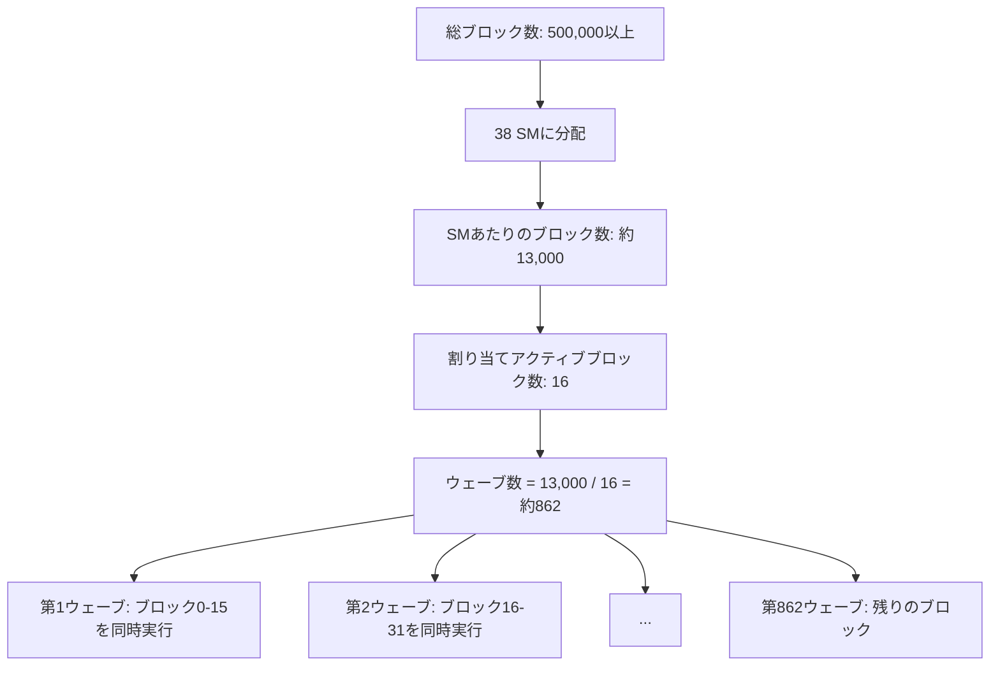
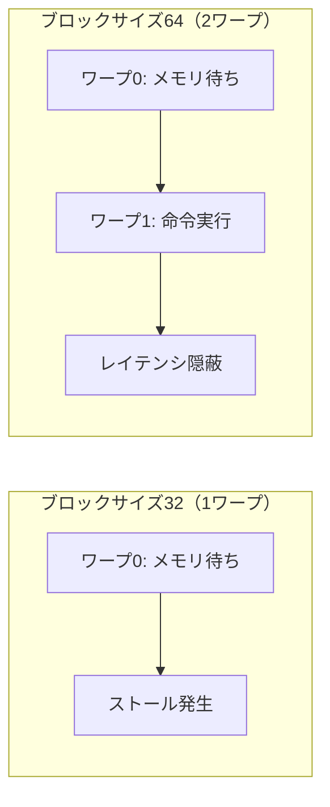

## 概要

ブロックサイズの変更がCUDAアプリケーションのパフォーマンスに与える影響を，Nsight Computeを用いて体系的に分析する．ベクトル加算アプリケーションでブロックサイズを32から1024まで変化させ，実行時間，キャッシュヒット率，オキュパンシー，メモリバンド幅などのメトリクスの変動を観察し，ウェーブの概念を使って性能差の原因を解明する．

## 主要な内容

### ウェーブ（Wave）の概念

割り当てアクティブブロック数は，1つのSMで同時に実行できるブロック数を決定する．GPUに配置された全ブロックは，この同時実行可能数に基づいて複数のウェーブに分割される．



ウェーブ数の計算式は以下の通りである．

`ウェーブ数 = (総ブロック数 / SM数) / 割り当てアクティブブロック数`

1つのウェーブに含まれるブロックがすべて完了するまで，次のウェーブのブロックはそのSMでは実行されない．

### ブロックサイズの影響分析

Pythonスクリプトを使って，ブロックサイズを32から1024まで（32刻み）変化させながら以下のメトリクスを自動収集する．

- 実行時間と アクティブサイクル数
- L1キャッシュヒット率，L2キャッシュヒット率
- オキュパンシー（達成値）
- メモリバンド幅（DRAMスループット）
- 分岐効率

### 分析結果

分析の結果，以下のパターンが観察される．

- 実行時間: ブロックサイズ32のときが最も長く，64以上ではほぼ一定
- L1/L2ヒット率: ブロックサイズに関わらずほぼ一定（L1: 0%，L2: 約33%）
- オキュパンシー: ブロックサイズ32のときが最も低く，64以上で急増
- メモリバンド幅: 実行時間と逆の関係（ブロックサイズ32で最低）

### 性能差の原因

ブロックサイズ32（1ワープ）の場合，各ブロックには1つのワープしか含まれないため，そのワープがメモリアクセスで待ち状態になるとSM上で実行できる命令がなくなりストールが発生する．

一方，ブロックサイズ64（2ワープ）の場合，1つ目のワープがメモリアクセス待ちの間に2つ目のワープの命令を実行できるため，レイテンシ隠蔽が効果的に機能し，ストールサイクルが減少する．



## コード例

```python
import subprocess
import matplotlib.pyplot as plt

metrics = [
    "gpu__time_duration.sum",
    "sm__cycles_active.avg",
    "l1tex__t_sector_hit_rate.pct",
    "lts__t_sector_hit_rate.pct",
    "sm__warps_active.avg.pct_of_peak_sustained_active",
    "dram__bytes.sum.per_second"
]

block_sizes = range(32, 1025, 32)

for bs in block_sizes:
    cmd = f"ncu --metrics {','.join(metrics)} --csv ./test.x {bs}"
    result = subprocess.run(cmd, shell=True, capture_output=True, text=True)
    # 結果をCSVファイルに保存して分析
```

## まとめ

- ウェーブは同時実行可能なブロック群を表し，全ブロックはウェーブ単位で順次実行される
- ブロックサイズ32（1ワープ）は最もパフォーマンスが低く，ワープ内のレイテンシ隠蔽が不十分になる
- ブロックサイズ64以上ではレイテンシ隠蔽が効果的に機能し，実行時間が大幅に改善される
- L1/L2キャッシュヒット率はブロックサイズの変更では改善されず，メモリアクセスパターンの変更が必要である
- Pythonスクリプトを活用することで，複数の設定を自動的にプロファイリングし体系的な分析が可能となる
