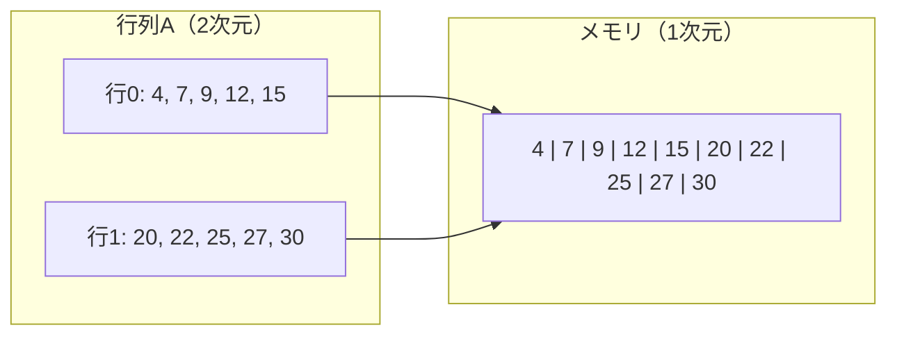
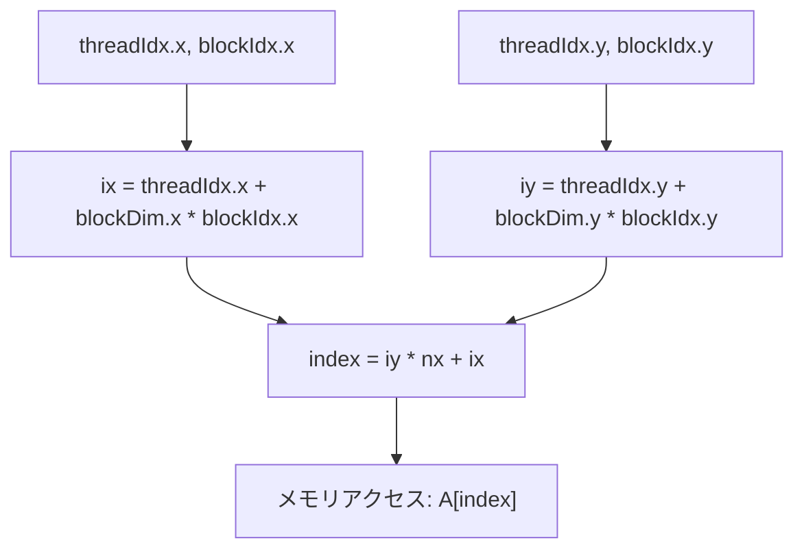

import Quiz from '@/components/content/Quiz.astro'

## 概要

このレクチャーでは，1次元のブロック・スレッド構成から2次元構成へ移行し，2つの行列を要素ごとに加算する方法を解説する．2次元スレッド・ブロックのインデックスから行列要素のメモリインデックスへのマッピングが最も重要なポイントである．

## 主要な内容

### 1次元から2次元への拡張

これまでのベクトル加算では，1次元のスレッドとブロックを使用していた．2次元に拡張するには，`blockDim`と`gridDim`にそれぞれ`x`と`y`の2つの次元を指定する．

- `blockDim.x` x `blockDim.y` の積は，Ampereアーキテクチャの場合，最大1024スレッドを超えてはならない
- 例: `(32, 32)`，`(64, 16)`，`(1, 512)` など，積が1024以下であれば任意の組み合わせが可能
- `gridDim`にも同様に2次元の値を指定する

### 行列のメモリ配置（Row-Major順序）

行列は2次元だが，メモリは1次元である．Row-Major配置では，各行の要素が連続してメモリに格納される．



2次元の座標 `(i, j)` からメモリインデックスへの変換式は以下の通りである:

```
index = j * row_size + i
```

例えば，値`25`の座標が `(i=3, j=1)` で行サイズが5の場合:

```
index = 1 * 5 + 3 = 8
```

### スレッドID・ブロックIDからインデックスへのマッピング

2次元のスレッドとブロックを使用する場合，各次元でインデックスを計算する:

```cuda
// X方向のインデックス（行列内の列位置）
int ix = threadIdx.x + blockDim.x * blockIdx.x;

// Y方向のインデックス（行列内の行位置）
int iy = threadIdx.y + blockDim.y * blockIdx.y;

// 1次元メモリインデックスへの変換
int index = iy * nx + ix;
```



### グリッドサイズの計算

行列サイズに応じてグリッドサイズを自動計算する:

```cuda
dim3 blockDim(32, 32);
dim3 gridDim(
    (nx + blockDim.x - 1) / blockDim.x,
    (ny + blockDim.y - 1) / blockDim.y
);
```

総スレッド数が行列の総要素数と一致することを保証する必要がある．

## コード例

```cuda
__global__ void matrixAdd(float *A, float *B, float *C, int nx, int ny) {
    int ix = threadIdx.x + blockDim.x * blockIdx.x;
    int iy = threadIdx.y + blockDim.y * blockIdx.y;
    int index = iy * nx + ix;

    if (ix < nx && iy < ny) {
        C[index] = A[index] + B[index];
    }
}

int main() {
    int nx = 4096, ny = 4096;
    size_t size = nx * ny * sizeof(float);

    // ホスト・デバイスメモリの確保，データ転送（省略）

    dim3 block(32, 32);
    dim3 grid((nx + block.x - 1) / block.x,
              (ny + block.y - 1) / block.y);

    matrixAdd<<<grid, block>>>(d_A, d_B, d_C, nx, ny);

    // 結果の転送，メモリ解放（省略）
}
```

### ブロックサイズとオキュパンシの関係

- `(32, 32)` = 1024スレッド/ブロック: オキュパンシ約50%，1SM当たり1ブロックのみ実行可能
- `(16, 16)` = 256スレッド/ブロック: オキュパンシ約74%，1SM当たり6ブロック実行可能
- ブロックサイズを小さくすると，より多くのブロックが同時実行でき，オキュパンシが向上する場合がある

## まとめ

- 2次元行列は，Row-Major順序で1次元メモリに格納される
- `ix`と`iy`をスレッド・ブロックIDから計算し，`index = iy * nx + ix`で1次元メモリインデックスに変換する
- ブロックサイズの選択はオキュパンシと実行性能に直接影響する
- 総スレッド数が行列の総要素数と一致するようにグリッドサイズを計算する必要がある

<Quiz questions={[
  {
    question: "2次元行列の座標 (i=3, j=1) にある要素を，行サイズ5のRow-Major配置で1次元メモリインデックスに変換するとき，正しい式はどれか？",
    options: [
      "index = i * row_size + j = 3 * 5 + 1 = 16",
      "index = j * row_size + i = 1 * 5 + 3 = 8",
      "index = i + j = 3 + 1 = 4",
      "index = i * j + row_size = 3 * 1 + 5 = 8"
    ],
    answer: 1,
    explanation: "Row-Major配置では index = j * row_size + i で計算する．j=1, row_size=5, i=3 のとき，index = 1 * 5 + 3 = 8 となる．"
  },
  {
    question: "2Dブロック・スレッド構成で，blockDim = (32, 32) とした場合の1ブロックあたりのスレッド数と，オキュパンシへの影響として正しいものはどれか？",
    options: [
      "512スレッド，オキュパンシ約100%",
      "1024スレッド，オキュパンシ約50%で1SM当たり1ブロックのみ実行可能",
      "1024スレッド，オキュパンシ約100%で1SM当たり4ブロック実行可能",
      "64スレッド，オキュパンシ約74%"
    ],
    answer: 1,
    explanation: "32 x 32 = 1024スレッドとなり，Ampereアーキテクチャの最大値に達する．この場合，1SM当たり1ブロックしか実行できず，オキュパンシは約50%に低下する．"
  },
  {
    question: "CUDAカーネル内で2Dインデックスを1Dメモリインデックスに変換する際，ix と iy の計算として正しいものはどれか？",
    options: [
      "ix = threadIdx.y + blockDim.y * blockIdx.y, iy = threadIdx.x + blockDim.x * blockIdx.x",
      "ix = threadIdx.x * blockDim.x + blockIdx.x, iy = threadIdx.y * blockDim.y + blockIdx.y",
      "ix = threadIdx.x + blockDim.x * blockIdx.x, iy = threadIdx.y + blockDim.y * blockIdx.y",
      "ix = blockIdx.x * gridDim.x + threadIdx.x, iy = blockIdx.y * gridDim.y + threadIdx.y"
    ],
    answer: 2,
    explanation: "各次元のインデックスは ix = threadIdx.x + blockDim.x * blockIdx.x，iy = threadIdx.y + blockDim.y * blockIdx.y で計算する．これにより，スレッドIDとブロックIDから行列内の位置を求められる．"
  }
]} />
