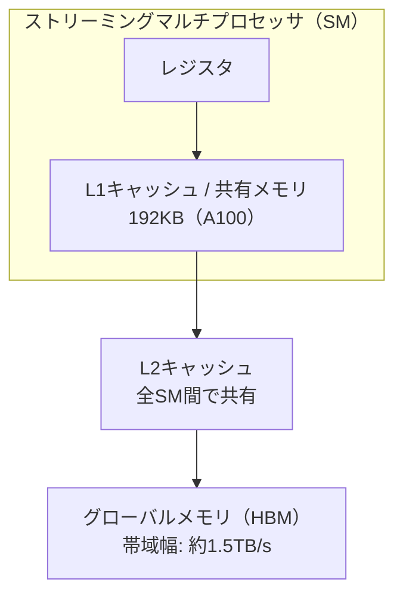
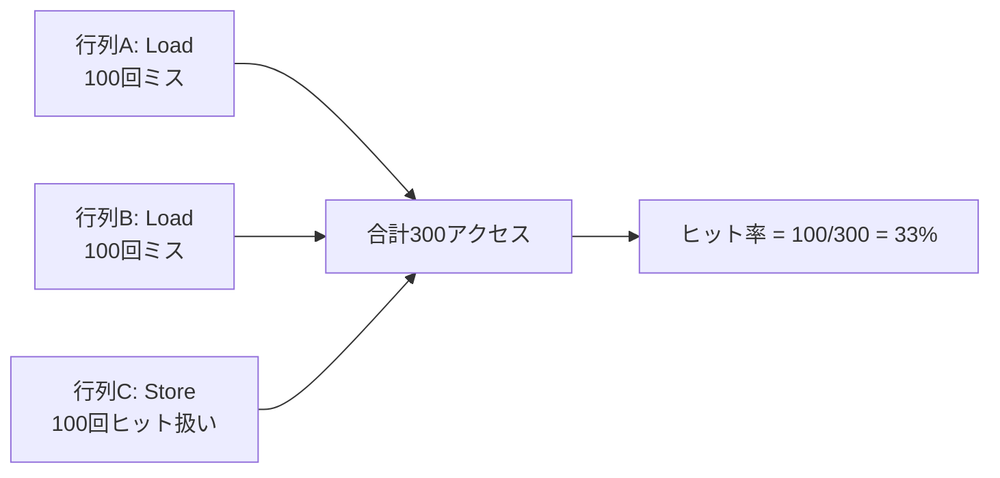

## 概要

このレクチャーでは，行列加算アプリケーションにおいてL1キャッシュのヒット率がゼロになる理由を解説する．GPUのメモリ階層（HBM，L2キャッシュ，L1キャッシュ）の仕組みと，Nsight ComputeでのL2キャッシュヒット率の注意点についても詳しく説明する．

## 主要な内容

### GPUのメモリ階層

NVIDIA GPUには以下のメモリ階層が存在する:

- グローバルメモリ（HBM）: すべてのスレッドとCPUからアクセス可能，高帯域幅だが高レイテンシ
- L2キャッシュ: 全SM間で共有，グローバルメモリよりサイズが小さく低レイテンシ
- L1キャッシュ: 各SM内に配置，そのSM内のスレッドのみアクセス可能，ハードウェア管理

### データアクセスの流れ

コアがデータを必要とする際の流れ:

1. ロード/ストアユニットがL1キャッシュに要求を送信
2. L1にデータがあればヒット（L1ヒット率が増加）
3. L1にない場合，L2キャッシュに要求を転送
4. L2にもない場合，HBMメモリから読み込む

### 行列加算でL1ヒット率がゼロになる理由

行列加算では，各要素を1回しか読み込まない．`A[i] + B[i]`の計算において，同じ要素を再利用することがないため，L1キャッシュにヒットするデータが存在しない．

これに対して，行列乗算では:
- A の各行がB のすべての列と掛け合わされるため，同じデータが複数回読み込まれる
- データの再利用が発生するため，L1・L2のヒット率が0より大きくなる

### キャッシュラインとワープのメモリアクセス

- L1キャッシュラインのサイズは128バイト
- 1ワープ（32スレッド）が`float`（4バイト）を連続的にアクセスする場合: 32 x 4 = 128バイト = 1キャッシュライン
- ロード/ストアユニットが32スレッドの要求を1つのキャッシュラインリクエストに結合（コアレッシング）

### L2キャッシュヒット率の注意点

Nsight Computeでの計測結果:
- L1ヒット率: 0%（想定通り）
- L2総合ヒット率: 約33%（予想外に見える値）
- L2読み込みヒット率: 0%（想定通り）

L2の総合ヒット率が33%になる理由:

Nsight Computeは，L2キャッシュにおけるすべての書き込み（Store）操作をヒットとして扱う．行列加算では読み込み2回（A, B）+ 書き込み1回（C）のため，書き込みがすべてヒット扱いとなり，総合ヒット率が33%となる．

L2キャッシュの性能を正しく評価するには，総合ヒット率ではなく読み込みヒット率（`l2_tex__t_sector_op_read.hit_rate`）を参照すべきである．

## まとめ

- 行列加算では各要素を1回しか読み込まないため，L1ヒット率はゼロになる
- Nsight ComputeはL2キャッシュの書き込み操作をすべてヒットとして扱うため，L2総合ヒット率が実態より高く表示される
- L2の正確な性能評価には，読み込みヒット率（Read Hit Rate）を使用する
- 行列乗算のようにデータ再利用がある場合はヒット率が向上する
