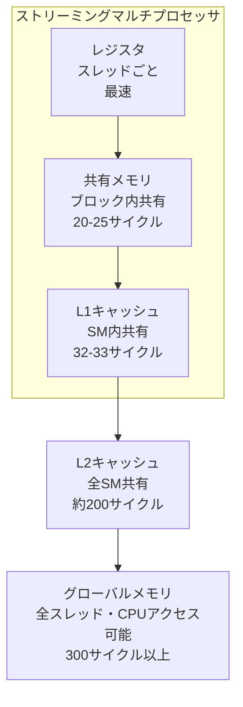
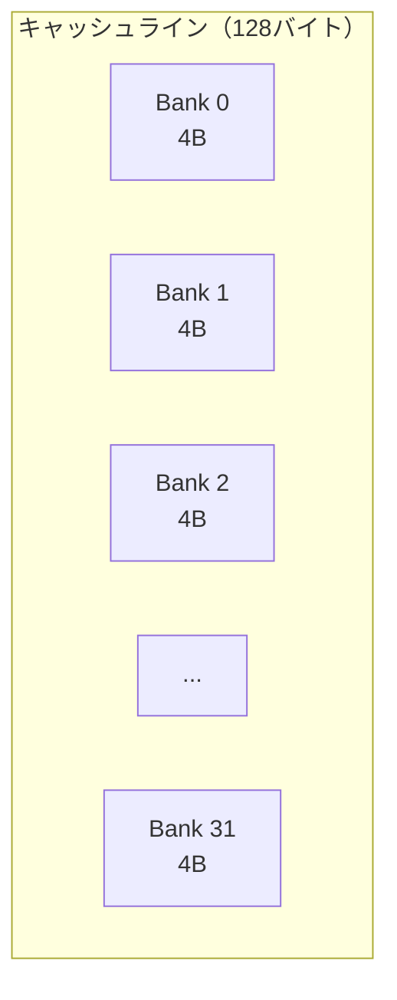

## 概要

このレクチャーでは，GPUメモリ階層における共有メモリ（Shared Memory）の位置付け，特徴，そしてバンクコンフリクトについて解説する．共有メモリはプログラマが直接制御できるソフトウェアキャッシュであり，データの再利用によるパフォーマンス最適化に不可欠な要素である．

## 主要な内容

### メモリ階層の全体像

GPUのメモリ階層と各レベルのアクセスレイテンシ:



- レジスタ: スレッドごとに割り当て，最速だがスレッドの生存期間のみ有効
- 共有メモリ: ブロック内の全スレッドで共有，ソフトウェア制御（プログラマブル）
- L1キャッシュ: SM内の全スレッドで共有，ハードウェア制御（自動管理）
- L2キャッシュ: 全SM間で共有
- グローバルメモリ: 全スレッドとCPUからアクセス可能

### 共有メモリの特徴

共有メモリはL1キャッシュと同じ物理ユニット上に存在するが，いくつかの重要な違いがある:

- ソフトウェアキャッシュ: `__shared__`キーワードで直接メモリを確保できる
- L1キャッシュ: ハードウェアが自動管理するため，直接確保は不可能
- レイテンシ: 共有メモリ（20-25サイクル）はL1キャッシュ（32-33サイクル）より低レイテンシ
  - L1はタグ検索・セット検索などの処理が必要なため，わずかに遅い

```cuda
// 共有メモリへの直接確保が可能
__shared__ float sharedData[256];

// L1キャッシュへの直接確保は不可能
// グローバルメモリに確保し，実行時に自動的にL1にキャッシュされる
```

### 共有メモリとL1キャッシュのサイズ設定（A100 GPU）

A100 GPUでは，共有メモリとL1キャッシュが1つの物理ユニット（合計192KB）を共有する:

- 共有メモリのサイズ: 0, 8, 16, 32, 64, 100, 132, 164 KB から選択可能
- L1キャッシュのサイズ = 192KB - 共有メモリサイズ
- 共有メモリの最大サイズは164KB（L1キャッシュを完全に無効にすることはできない）
- コンパイラが使用状況に基づいて自動設定する

### バンクコンフリクト

共有メモリはバンクという単位で構成されている:

- 1キャッシュライン = 128バイト = 32バンク
- 1バンク = 4バイト
- 各バンク（列）から1サイクルにつき1回のアクセスが可能



バンクコンフリクトは，同一バンク（列）に対して複数のアクセスが発生した場合に起きる:

- コンフリクトなし: 32スレッドがそれぞれ異なるバンクにアクセス → 1サイクルで完了
- コンフリクトあり: 同一バンクにN回アクセス → N-1回のコンフリクトが発生
- ブロードキャスト: 複数スレッドが同一バンクの同一アドレスを読む場合はコンフリクトなし

### バンクコンフリクトの例

16バイトストライドの場合（4バンク間隔）:

- 32スレッドが4バンク間隔でアクセスすると，4つのキャッシュラインにまたがる
- 各列に4つのアクセスが集中 → 3バンクコンフリクト → 4サイクル必要

倍精度（8バイト）要素の場合:

- 各スレッドが2バンク（8バイト）を消費 → 合計256バイト → 最低2キャッシュラインが必要
- 最低でも2サイクル必要

## コード例

```cuda
__global__ void exampleKernel(float *input, float *output, int n) {
    // 共有メモリの確保（静的）
    __shared__ float tile[256];

    int idx = threadIdx.x + blockDim.x * blockIdx.x;

    // グローバルメモリから共有メモリへロード
    if (idx < n) {
        tile[threadIdx.x] = input[idx];
    }

    // ブロック内の全スレッドの同期
    __syncthreads();

    // 共有メモリ上のデータを利用（低レイテンシ）
    if (idx < n) {
        output[idx] = tile[threadIdx.x] * 2.0f;
    }
}
```

## まとめ

- 共有メモリはプログラマが制御可能なソフトウェアキャッシュであり，L1キャッシュより低レイテンシ（20-25サイクル vs 32-33サイクル）
- A100ではL1キャッシュと合計192KBの物理ユニットを共有し，サイズ配分はコンパイラが自動調整する
- バンクコンフリクトは同一バンクへの複数アクセスで発生し，パフォーマンス低下の原因となる
- データの再利用がある場合，共有メモリへの明示的なロードによりグローバルメモリトラフィックを削減できる
