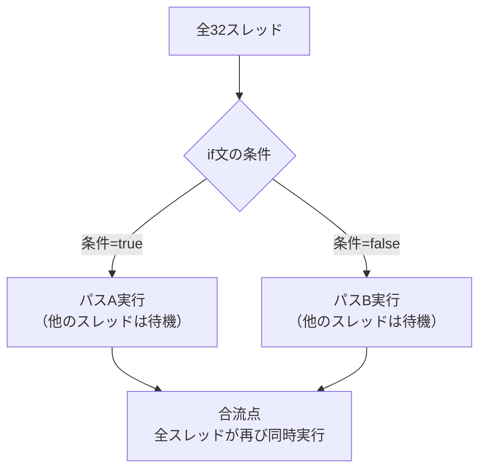
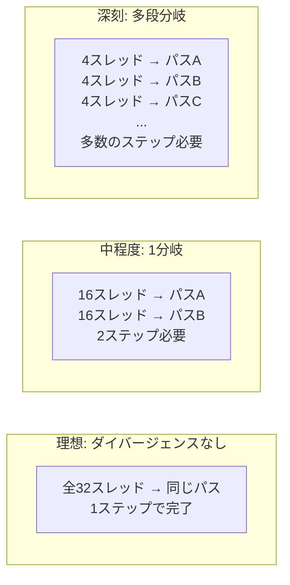

## 概要

このレクチャーでは，ワープダイバージェンス（Warp Divergence）の概念，発生原因，およびパフォーマンスへの影響について解説する．ワープ内のスレッドが異なる分岐パスを取ると直列化が発生し，GPUの実行効率が低下する重要な最適化課題である．

## 主要な内容

### ワープとSIMTモデルの復習

CUDAのスレッドはブロックに組織化され，さらにワープ（32スレッド単位）に分割される．ワープはSIMT（Single Instruction, Multiple Threads）モデルで実行される:

- 1つの命令を32スレッドが同時に異なるデータに対して実行する
- 各ワープは1つの命令スケジューラによって管理される
- 理想的には，1クロックで32スレッドを発行できる

### ワープダイバージェンスとは

ワープ内のスレッドが`if-else`文などの分岐によって異なる実行パスを取る場合，ワープダイバージェンスが発生する．



GPUは異なる分岐パスを直列化して実行する．つまり，パスAを実行中はパスBのスレッドがアイドル状態となり，パスBを実行中はパスAのスレッドがアイドル状態となる．

### ダイバージェンスが発生しないケース

境界チェックのための`if`文は，通常ワープダイバージェンスの問題にならない:

```cuda
int ix = threadIdx.x + blockDim.x * blockIdx.x;
if (ix < n) {  // 境界チェック: 最後のワープのみ影響
    C[ix] = A[ix] + B[ix];
}
```

この条件はベクトルの末尾でのみ不成立となるため，ほとんどのワープでは全スレッドが同じパスを実行する．

### ダイバージェンスの深刻度レベル



中程度のダイバージェンス:

```cuda
if (threadIdx.x < 16) {
    // パスA: 前半16スレッドが実行
} else {
    // パスB: 後半16スレッドが実行
}
```

深刻なダイバージェンス:

```cuda
if (threadIdx.x % 8 == 0) {
    // パス1
} else if (threadIdx.x % 8 == 1) {
    // パス2
} else if (threadIdx.x % 8 == 2) {
    // パス3
}
// ... 多数の分岐
```

### パフォーマンスへの影響

ワープダイバージェンスがパフォーマンスに与える影響:

- スループットの低下: 各サイクルでアクティブなスレッド数が減少するため，命令スループットが低下する
- リソースの非効率な利用: アイドル状態のスレッドがハードウェアリソースを占有したまま待機する
- 実行時間の増加: 分岐パスの直列化により，カーネル全体の実行時間が増加する
- スレッド利用率の低下: 特に多段分岐の場合，ほとんどのスレッドが各ステップでアイドル状態となる

### マスキングによる実行制御

GPUは内部的にスレッドマスクを使用して，各ステップでどのスレッドをアクティブにするかを制御する:

```
ステップ1: マスク = [1,0,1,0,1,0,...] → 偶数スレッドがパスA実行
ステップ2: マスク = [0,1,0,1,0,1,...] → 奇数スレッドがパスB実行
ステップ3: マスク = [1,1,1,1,1,1,...] → 全スレッドが合流後の処理を実行
```

## まとめ

- ワープダイバージェンスは，ワープ内のスレッドが異なる分岐パスを実行する際に発生する
- GPUは異なるパスを直列化して実行し，アイドル状態のスレッドがリソースを浪費する
- 分岐の深さが増すほどパフォーマンスへの影響が深刻になる
- 次セクションのベクトルリダクションで，ワープダイバージェンスの最適化手法を学ぶ
