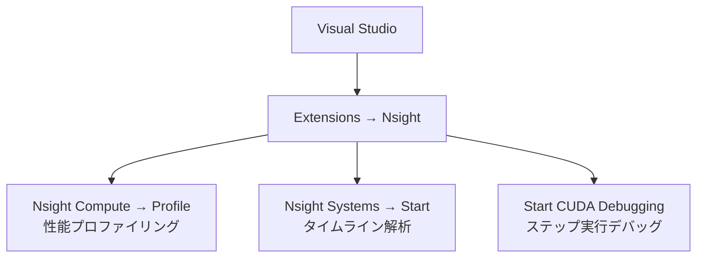

## 概要

このレクチャーでは，Visual Studioに統合されたNVIDIA Nsight Integrationを使用したCUDAアプリケーションのデバッグ方法を解説する．ブレークポイントの設定，メモリの確認，アセンブリコードの閲覧，さらにNsight ComputeやNsight SystemsをVisual Studioから直接起動する方法を学ぶ．

## 主要な内容

### デバッグツールの位置付け

コースの各レベルで異なるツールを使用する:


- Nsight Compute: 実行時間，SMの利用率，オキュパンシ，L1/L2ヒット率などの性能メトリクスを収集
- Nsight Integration: ブレークポイントで実行を停止し，変数の状態やメモリの内容を確認するデバッグツール

### インストール手順

2つのコンポーネントのインストールが必要:

1. Nsight Integration（Visual Studio拡張）
   - Visual Studioのメニュー: Extensions → Manage Extensions → "nsight" を検索
   - "NVIDIA Nsight Integration 64-bit" をインストール
   - Visual Studioを再起動して設定を完了

2. Nsight Visual Studio Edition（スタンドアロンツール）
   - NVIDIAの公式サイトからダウンロード・インストール
   - メモリウィンドウ，レジスタ表示，アセンブリコード表示などの追加機能を提供

### ブレークポイントによるデバッグ

カーネルコード内にブレークポイントを設定し，Extensions → Nsight → Start CUDA Debuggingでデバッグを開始する:

```cuda
__global__ void vectorAdd(int *a, int *b, int *c, int n) {
    int i = threadIdx.x + blockDim.x * blockIdx.x;
    if (i < n) {
        c[i] = a[i] + b[i];  // ← ここにブレークポイントを設定
    }
}
```

デバッグ中に確認できる情報:

- Launch Details: ブロックサイズ，グリッドサイズ，ブロックID，スレッドIDなどの実行構成
- 変数の値: `a`，`b`，`c` の各要素の現在の値
- インデックス変数: `i` の現在の値
- ステップ実行: "Step Over"で命令を1つずつ実行し，各ステップでの状態変化を追跡

### メモリウィンドウの活用

Debug → Windows → Memoryからメモリウィンドウを開き，配列変数の内容を直接確認できる:

- アドレスバーに変数名（例: `a`）を入力すると，その変数の先頭アドレスに移動
- 各要素は16進数で表示される（整数の場合，4バイト = 8桁の16進数）
- デバッグ中にステップ実行するたびに，新たに計算された要素が赤色でハイライトされる

```
変数a: 00 00 00 00 | 01 00 00 00 | 02 00 00 00 | ...
        (a[0]=0)      (a[1]=1)      (a[2]=2)
変数b: 02 00 00 00 | 03 00 00 00 | 04 00 00 00 | ...
        (b[0]=2)      (b[1]=3)      (b[2]=4)
変数c: 02 00 00 00 | 04 00 00 00 | 06 00 00 00 | ...
        (c[0]=2)      (c[1]=4)      (c[2]=6)
```

### アセンブリコード（Disassembly）の確認

Debug → Windowsからディスアセンブリウィンドウを開くと，CUDAコードに対応するGPUアセンブリ命令を確認できる:

- `MOV`命令: カーネルパラメータ（`a`，`b`，`c`，`n`のポインタ・値）の読み込み
- `TID`/`CTAID`: スレッドID（`threadIdx`），ブロックID（`blockIdx`）の読み込み
- `IMAD`/`IADD`: インデックス計算（乗算・加算）
- `ISETP`: `if`文の条件判定（`i < n` の比較）
- `BRA`: 条件分岐（条件不成立時のジャンプ）

### Visual StudioからのNsight Compute / Nsight Systems起動

従来のプロファイリング手順（コマンドライン → プロセスアタッチ → GUIで設定）を簡略化できる:



Nsight Compute:
- Extensions → Nsight → Compute → Profileを選択
- 出力ファイルの保存先を指定してLaunchをクリック
- SM利用率，メモリスループット，L1/L2ヒット率，実行時間などが表示される

Nsight Systems:
- Extensions → Nsight → Systems → Startを選択
- GPU，CPU，データ転送のタイムラインが視覚的に表示される
- ワープオキュパンシの推移やGPCクロック周波数の変動も確認可能

## まとめ

- Nsight IntegrationとNsight Visual Studio Editionの2つをインストールすることで，Visual StudioからCUDAデバッグが可能になる
- ブレークポイントを設定し，変数の値，メモリの状態，アセンブリコードをステップ実行しながら確認できる
- Nsight ComputeやNsight Systemsも Visual Studioから直接起動でき，プロファイリングの手順が大幅に簡素化される
- 次セクションのベクトルリダクション最適化では，実行時間の比較にNsight Computeを活用する
