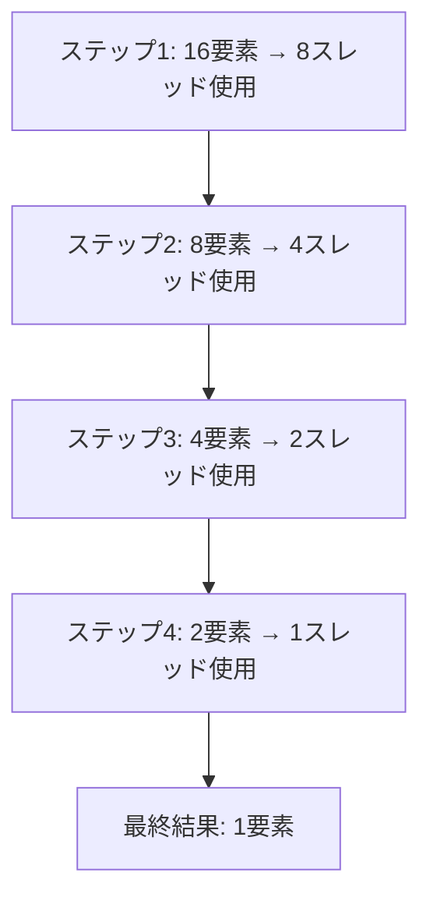

import Quiz from '@/components/content/Quiz.astro'

## 概要

ベクトルリダクションの基本概念と，グローバルメモリのみを使用したベースライン実装を解説する．ベクトル内のすべての要素を加算して1つの値にまとめるツリーベースアプローチの仕組みと，複数ブロックにまたがる場合のカーネル分割戦略について学ぶ．

## 主要な内容

### ベクトルリダクションとは

ベクトルリダクションとは，1つのベクトル内のすべての要素を加算し，その合計値を先頭位置に格納する操作である．ベクトル加算（2つのベクトルの対応要素を加算）とは異なり，1つのベクトルを対象とする点が特徴的である．行列積などの応用にも必要となる重要な操作である．

### ツリーベースアプローチ

リダクション処理は複数ステップで行われる．各ステップで隣接する2要素を加算し，使用するスレッド数を半減させていく．



各ステップではストライドが変化する．ステップ1ではストライド1，ステップ2ではストライド2，ステップ3ではストライド4と倍増していく．

### 偶数スレッドIDのフィルタリング

各ステップで実際に作業するスレッドは偶数IDのみである．このフィルタリングには剰余演算（`%`）を使用する．

```cuda
if (tid % (2 * stride) == 0) {
    input[index] = input[index] + input[index + stride];
}
```

また，境界チェックとして `index + stride < n` の条件も必要となる．ベクトルサイズを超えたメモリアクセスを防止するためである．

### 複数ブロックと部分和

ベクトル全体を1ブロックで処理できない場合，複数ブロックに分割する．各ブロックはベクトルの一部分を担当し，部分和（`partial sum`）を出力する．ブロック間にはグローバル同期機構がないため，カーネルを複数回起動して解決する．


## コード例

```cuda
__global__ void reduce_in_place(float* input, int n) {
    int tid = threadIdx.x;
    int index = blockDim.x * blockIdx.x + threadIdx.x;

    for (int stride = 1; stride < blockDim.x; stride *= 2) {
        if (tid % (2 * stride) == 0 && (index + stride) < n) {
            input[index] += input[index + stride];
        }
        __syncthreads();
    }

    // 部分和をブロック先頭に集約
    if (tid == 0) {
        input[blockIdx.x * blockDim.x] = input[index];
    }
}
```

## まとめ

- ベクトルリダクションは全要素の合計を1つの値にまとめる操作で，ツリーベースアプローチにより各ステップでスレッド数を半減させる
- 偶数スレッドIDのフィルタリングと境界チェックにより正しいメモリアクセスを保証する
- ブロック間同期が存在しないため，複数カーネルの起動で部分和を段階的に集約する
- このベースライン実装はグローバルメモリのみを使用しており，後続のレクチャーで最適化を施す

<Quiz questions={[
  {
    question: "ベクトルリダクションのツリーベースアプローチにおいて，各ステップで起きることとして正しいものはどれか？",
    options: [
      "すべてのスレッドが同時に全要素を加算する",
      "隣接する2要素を加算し，使用するスレッド数を半減させていく",
      "各スレッドがベクトルの全要素を順番に加算する",
      "ランダムな2要素を加算し，残りの要素を削除する"
    ],
    answer: 1,
    explanation: "ツリーベースアプローチでは，各ステップで隣接する2要素を加算し，使用するスレッド数を半減させていく．例えば16要素のベクトルでは，ステップ1で8スレッド，ステップ2で4スレッド，と段階的に減少する．"
  },
  {
    question: "ベクトルリダクションで複数ブロックを使用する場合，ブロック間の同期はどのように処理するか？",
    options: [
      "__syncthreads() で全ブロックを同期する",
      "atomicAdd を使って全ブロックの結果を合計する",
      "ブロック間にはグローバル同期機構がないため，カーネルを複数回起動して部分和を段階的に集約する",
      "ホストCPU側でブロック間の同期シグナルを管理する"
    ],
    answer: 2,
    explanation: "CUDAではブロック間のグローバル同期機構が存在しない．__syncthreads()はブロック内のスレッド同期のみを提供する．そのため，カーネルを複数回起動し，各起動で部分和を段階的に集約する方法を取る．"
  },
  {
    question: "ベースラインのリダクションカーネルで偶数スレッドIDのフィルタリングに使用される条件式はどれか？",
    options: [
      "if (tid / stride == 0)",
      "if (tid % (2 * stride) == 0)",
      "if (tid < stride)",
      "if (tid & 1 == 0)"
    ],
    answer: 1,
    explanation: "ベースライン実装では if (tid % (2 * stride) == 0) という剰余演算により，各ステップで偶数位置のスレッドのみが加算を実行する．これにより，正しい要素同士の加算が保証される．"
  }
]} />
