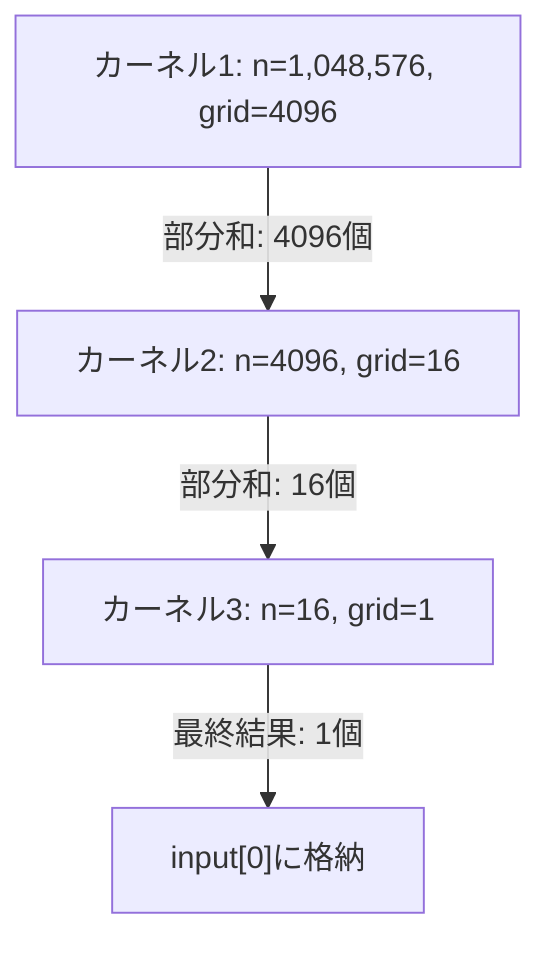

## 概要

ベクトルリダクションの完全なコード実装を解説し，CPU関数による出力検証，複数カーネルの起動による段階的リダクション，およびNsight Computeによるプロファイリング結果の分析を行う．

## 主要な内容

### CPU検証関数の実装

GPU カーネルの出力が正しいかを検証するために，CPU側でも同じリダクション処理を実装する．CPU関数はシンプルな`for`ループで全要素を加算し，その結果をGPU出力と比較する．

```cpp
float cpu_reduce(float* input, int n) {
    float sum = 0.0f;
    for (int i = 0; i < n; i++) {
        sum += input[i];
    }
    return sum;
}
```

### メイン関数の構成

CUDAアプリケーションの標準的な手順に従い，以下のステップで構成する．

1. ホストとデバイスのメモリ確保（`new`と`cudaMalloc`）
2. ホスト側でベクトルを初期化
3. `cudaMemcpy`でホストからデバイスへデータ転送
4. カーネル構成（`blockSize = 256`，`gridSize = (n + blockSize - 1) / blockSize`）の設定
5. GPUカーネルを複数回起動して段階的にリダクション
6. 結果をデバイスからホストへコピーして検証

### 複数カーネルの段階的起動

100万要素のベクトルに対し，`blockSize = 256`の場合，`gridSize = 4096`となる．各カーネル起動で出力サイズが縮小していく．



各カーネル起動後に`cudaDeviceSynchronize`で同期を取り，前のカーネルの完了を保証する．

### プロファイリング結果の分析

Nsight Computeでプロファイリングした結果，3つのカーネルの実行時間は以下の通りである．

- カーネル1（grid=4096）: 約284マイクロ秒
- カーネル2（grid=16）: 約16マイクロ秒
- カーネル3（grid=1）: 約13マイクロ秒

L1キャッシュのヒット率は約91%，L2キャッシュのヒット率は約80%である．ベクトル加算（ヒット率0%）と異なり，リダクションでは同じ要素を複数ステップで再利用するためキャッシュヒット率が高くなる．

## まとめ

- CPU検証関数との比較により，GPUカーネルの出力正確性を確認できる
- 100万要素では3回のカーネル起動（4096→16→1ブロック）が必要となる
- 最初のカーネルが全体の実行時間の大部分（約284マイクロ秒）を占め，最適化のターゲットとなる
- 要素の再利用によりL1/L2キャッシュヒット率が高い（91%/80%）
