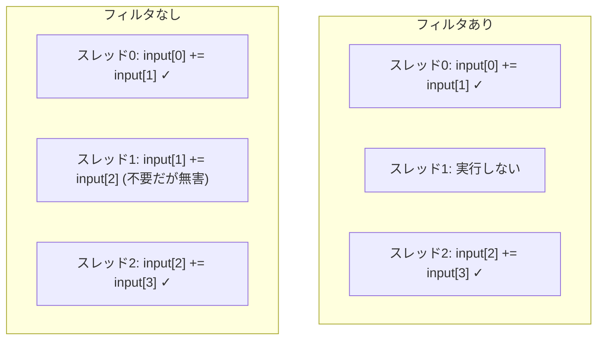

## 概要

ベクトルリダクションの最初の最適化として，偶数スレッドIDをフィルタリングする剰余演算（`%`）の除去を解説する．この最適化により，約40%の性能向上を達成し，アセンブリレベルでの命令数削減を確認する．

## 主要な内容

### whileループによるカーネル起動の自動化

前回のレクチャーでは複数カーネルを手動で起動していたが，`while`ループで自動化する．グリッドサイズが1より大きい間はカーネルを繰り返し起動し，`n`の値を更新していく．

```cpp
while (gridSize > 1) {
    reduce_in_place<<<gridSize, blockSize>>>(d_input, n);
    cudaDeviceSynchronize();
    n = gridSize;
    gridSize = (n + blockSize - 1) / blockSize;
}
// 最終ステップ
reduce_in_place<<<1, blockSize>>>(d_input, n);
```

### フィルタ除去の原理

ベースラインでは `tid % (2 * stride) == 0` による剰余演算で偶数スレッドのみを実行させていた．しかし，奇数スレッドが実行する加算結果は後続ステップで参照されない．



例えばスレッド1が`input[1] = input[1] + input[2]`を実行して値が変わっても，ステップ2ではストライド2で`input[0]`と`input[2]`を加算するため，`input[1]`は参照されない．

### 剰余演算のコスト

GPUにおける剰余演算（`%`）や除算は非常に高コストである．加算が2〜4サイクルで完了するのに対し，除算・剰余は約290サイクルを要する．フィルタを除去することで，`if`文のアセンブリ命令数が約60命令から約6命令に削減される．

### プロファイリング結果の比較

フィルタ除去による性能変化をNsight Computeで計測した結果:

- ベースライン（フィルタあり）: 約283マイクロ秒
- フィルタ除去後: 約176マイクロ秒
- 性能向上: 約38%

L1スループットも約134%向上している．

## コード例

```cuda
__global__ void reduce_in_place(float* input, int n) {
    int tid = threadIdx.x;
    int index = blockDim.x * blockIdx.x + threadIdx.x;

    for (int stride = 1; stride < blockDim.x; stride *= 2) {
        // フィルタ（剰余演算）を除去
        if ((index + stride) < n) {
            input[index] += input[index + stride];
        }
        __syncthreads();
    }

    if (tid == 0) {
        input[blockIdx.x * blockDim.x] = input[index];
    }
}
```

## まとめ

- 剰余演算（`%`）はGPU上で約290サイクルを要する高コスト命令であり，除去することで大幅な性能向上が得られる
- 奇数スレッドによる不要な加算結果は後続ステップで参照されないため，最終結果に影響しない
- フィルタ除去によりアセンブリ命令数が約60命令から約6命令に削減される
- 実行時間は283マイクロ秒から176マイクロ秒に改善（約38%向上）
