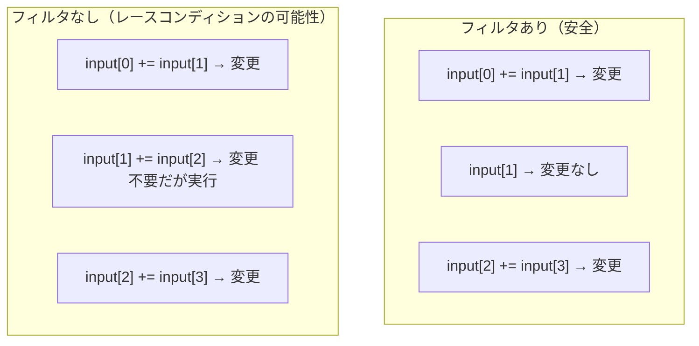

import Quiz from '@/components/content/Quiz.astro'

## 概要

フィルタ除去後のベクトルリダクションにおけるレースコンディション（競合状態）の発生原因と，`-G`デバッグオプションがコンパイラ最適化を無効化することで出力結果に影響を与える仕組みを解説する．

## 主要な内容

### レースコンディションとは

レースコンディションとは，スレッドの実行順序によって異なる結果が得られる状態を指す．フィルタを除去したベクトルリダクションでは，全スレッドが同時に加算を実行するため，この問題が発生しうる．

### フィルタあり/なしの比較

フィルタありの場合，偶数スレッドのみが加算を実行し，奇数位置の値は変更されない．フィルタなしの場合，全スレッドが加算を実行するため，全位置の値が変更される．

### レースコンディションの具体例

スレッド1が先にスレッド0より実行された場合を考える．

1. スレッド1: `input[1] = input[1] + input[2]` → `input[1]`が1から9に変化
2. スレッド0: `input[0] = input[0] + input[1]` → `input[1]`の新しい値9を読み取ってしまう
3. 正しくは`input[0] = 10 + 1 = 11`だが，`input[0] = 10 + 9 = 19`という不正な結果になる

### `-G`デバッグオプションの影響

NVCCコンパイラの`-G`オプションは，デバイスコードのすべての最適化を無効にする．最適化が有効な場合，コンパイラは命令の並べ替え（リオーダリング）などを行い，レースコンディションが顕在化しやすくなる．

- `-G`オプションあり: 最適化無効 → スレッドが順序通りに実行されやすく，正しい結果が得られる
- `-G`オプションなし: 最適化有効 → 命令の並べ替えにより実行順序が変わり，不正な結果が発生する

Visual Studioでは，プロジェクトのプロパティから CUDA > Device > Generate GPU Debug Information で設定できる．

### compute capabilityの設定

Visual Studioのデフォルトのcompute capabilityは古い値（52）に設定されている場合がある．使用するGPUに合わせて適切な値（例: Ampereアーキテクチャでは80）に変更する必要がある．

## まとめ

- レースコンディションは，スレッドの実行順序によって異なる結果が得られる状態であり，フィルタ除去後に発生しうる
- `-G`オプションはデバイスコードの全最適化を無効にし，デバッグ時の実行順序を保証する
- 最適化が有効な場合，コンパイラによる命令の並べ替えがレースコンディションを顕在化させる
- Visual Studioのデフォルト設定（compute capability，デバッグオプション）は必ず確認・修正すべきである

<Quiz questions={[
  {
    question: "レースコンディション（競合状態）の説明として正しいものはどれか？",
    options: [
      "スレッドが同一のメモリアドレスに同時に書き込みを行うこと",
      "スレッドの実行順序によって異なる結果が得られる状態",
      "すべてのスレッドが同じ値を読み込むこと",
      "メモリが不足してスレッドが停止すること"
    ],
    answer: 1,
    explanation: "レースコンディションとは，スレッドの実行順序によって異なる結果が得られる状態を指す．フィルタ除去後のリダクションでは，全スレッドが同時に加算を実行するため，実行順序により異なる値が読み込まれる可能性がある．"
  },
  {
    question: "NVCCコンパイラの -G オプションの効果として正しいものはどれか？",
    options: [
      "GPUのクロック周波数を最大にする",
      "グラフィックス出力を有効にする",
      "デバイスコードのすべての最適化を無効にし，デバッグ情報を生成する",
      "グローバルメモリの使用量を制限する"
    ],
    answer: 2,
    explanation: "-G オプションはデバイスコードのすべての最適化を無効にする．最適化が無効の場合，命令の並べ替え（リオーダリング）が発生しないため，スレッドが順序通りに実行されやすくなり，レースコンディションが顕在化しにくくなる．"
  },
  {
    question: "-G オプションなし（最適化有効）の場合にレースコンディションが顕在化しやすくなる理由として正しいものはどれか？",
    options: [
      "最適化によりスレッド数が増加するため",
      "コンパイラによる命令の並べ替え（リオーダリング）により実行順序が変わるため",
      "最適化により使用するメモリが増加するため",
      "最適化によりワープサイズが変更されるため"
    ],
    answer: 1,
    explanation: "最適化が有効な場合，コンパイラは命令の並べ替え（リオーダリング）などを行う．これにより，あるスレッドが他のスレッドより先にメモリを更新し，後続のスレッドが更新済みの値を読み取ってしまうことで，不正な結果が発生する．"
  }
]} />
