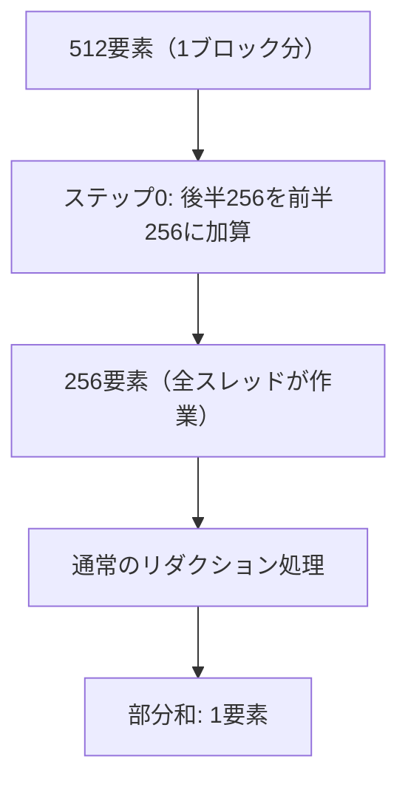

## 概要

各スレッドにより多くの作業を割り当てる最適化手法を解説する．1ブロックあたりの処理要素数を256から512に倍増させることで，スレッド使用率を向上させ，実行時間を176マイクロ秒から100マイクロ秒に改善する．

## 主要な内容

### スレッド使用率の問題

ベースラインでは，`blockSize = 256`スレッドに対し256要素を割り当てている．しかし，リダクションの最初のステップで半分のスレッド（偶数IDのみ）しか作業を行わないため，128スレッドがアイドル状態となる．これはストリーミングマルチプロセッサのリソースを浪費している．

### 1スレッドあたりの作業量の倍増

解決策として，1ブロックに512要素を割り当てる．最初のステップで後半256要素を前半256要素に加算し，以降は通常のリダクションを適用する．



### グリッドサイズへの影響

1ブロックあたり512要素を処理するため，グリッドサイズは半減する．

- 従来: `gridSize = n / blockSize = 1,048,576 / 256 = 4096`
- 最適化後: `gridSize = n / (blockSize * 2) = 1,048,576 / 512 = 2048`

グリッドサイズの削減は，各SMが実行するウェーブ数の減少につながり，性能向上に寄与する．

### インデックス計算の変更

1ブロックが512要素を担当するため，インデックス計算を`2`倍に修正する．ブロック1は要素512〜1023を担当し，`index = 2 * blockDim.x * blockIdx.x + threadIdx.x`で正しい位置を参照する．

## コード例

```cuda
__global__ void reduce_in_place(float* input, int n) {
    int tid = threadIdx.x;
    int index = 2 * blockDim.x * blockIdx.x + threadIdx.x;

    // ステップ0: 後半256要素を前半に加算
    if (index + blockDim.x < n) {
        input[index] += input[index + blockDim.x];
    }
    __syncthreads();

    // 通常のリダクション
    for (int stride = blockDim.x / 2; stride > 0; stride >>= 1) {
        if (tid < stride && (index + stride) < n) {
            input[index] += input[index + stride];
        }
        __syncthreads();
    }

    if (tid == 0) {
        input[blockIdx.x * blockDim.x * 2] = input[index];
    }
}
```

### forループの方向とシフト演算

`for`ループを大きいストライドから開始し除算で減少させる方法と，小さいストライドから開始し乗算で増加させる方法がある．除算（`/`）はGPU上で高コストなため，ビットシフト演算（`>>=1`）に置き換えることで約2%の性能向上が得られる．

### プロファイリング結果

- ベースライン: 283マイクロ秒
- フィルタ除去: 176マイクロ秒（38%向上）
- スレッド作業量倍増: 100マイクロ秒（さらに43%向上）
- オキュパンシは約90%に到達

## まとめ

- 1スレッドあたりの作業量を倍増させることで，アイドルスレッドを削減し使用率を向上させる
- グリッドサイズが半減し，各SMのウェーブ数が減少して性能が改善する
- 除算を右ビットシフト（`>>=1`）に置き換えることでさらなる最適化が可能
- 実行時間は100マイクロ秒に改善され，ベースラインから約65%の性能向上を達成
