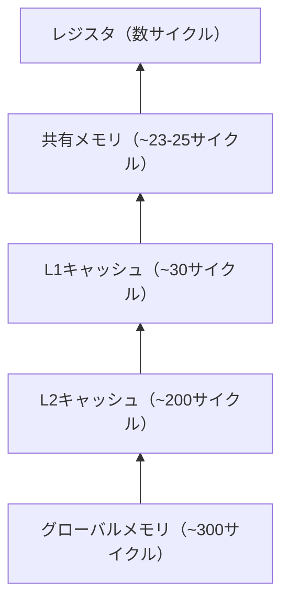

## 概要

共有メモリとループアンローリングを組み合わせたベクトルリダクションの最適化を解説する．共有メモリによりグローバルメモリへの書き込みを大幅に削減し，アンローリングによりストライド32未満の同期オーバーヘッドを排除して，実行時間を82マイクロ秒まで改善する．

## 主要な内容

### GPUのメモリ階層の復習

NVIDIAのGPUには以下のメモリ階層がある．下位ほどアクセスレイテンシが低い．



L1キャッシュと共有メモリは同一の物理ユニットに配置されている．L1はハードウェア制御であるのに対し，共有メモリはプログラマが明示的に管理する．

### 共有メモリによる最適化

前回までの実装ではすべてのリダクションステップでグローバルメモリへの読み書きが発生していた．共有メモリを導入することで，最初にグローバルメモリから1回ロードし，以降の計算は共有メモリ上で完結させる．

- グローバルメモリへの書き込みデータ量: 18〜19MB → 1MB未満に削減
- 最終結果のみをグローバルメモリに書き戻す

### 境界チェックの重要性

共有メモリを使用する際，インデックスがベクトルサイズを超えないよう境界チェックが必須である．範囲外のアクセスにはゼロを格納する三項演算子が有効である．

```cuda
shared_data[tid] = (index < n) ? input[index] : 0.0f;
shared_data[tid] += (index + blockDim.x < n) ? input[index + blockDim.x] : 0.0f;
```

### ループアンローリング

ストライドが32未満（1ワープ内）の場合，`for`ループの各反復と`__syncthreads()`を展開して，`__device__`関数として分離する．これにより同期オーバーヘッドが排除される．

```cuda
__device__ void warp_reduce(volatile float* sdata, int tid) {
    sdata[tid] += sdata[tid + 32];
    sdata[tid] += sdata[tid + 16];
    sdata[tid] += sdata[tid + 8];
    sdata[tid] += sdata[tid + 4];
    sdata[tid] += sdata[tid + 2];
    sdata[tid] += sdata[tid + 1];
}
```

## コード例

```cuda
__device__ void warp_reduce(volatile float* sdata, int tid) {
    sdata[tid] += sdata[tid + 32];
    sdata[tid] += sdata[tid + 16];
    sdata[tid] += sdata[tid + 8];
    sdata[tid] += sdata[tid + 4];
    sdata[tid] += sdata[tid + 2];
    sdata[tid] += sdata[tid + 1];
}

__global__ void reduce_shared(float* input, int n) {
    __shared__ float sdata[256];
    int tid = threadIdx.x;
    int index = 2 * blockDim.x * blockIdx.x + threadIdx.x;

    // グローバルメモリから共有メモリへロード（512→256要素）
    sdata[tid] = (index < n) ? input[index] : 0.0f;
    sdata[tid] += (index + blockDim.x < n) ? input[index + blockDim.x] : 0.0f;
    __syncthreads();

    // 共有メモリ上でリダクション
    for (int stride = blockDim.x / 2; stride > 32; stride >>= 1) {
        if (tid < stride) {
            sdata[tid] += sdata[tid + stride];
        }
        __syncthreads();
    }

    // 最後のワープをアンローリング
    if (tid < 32) warp_reduce(sdata, tid);

    // 結果をグローバルメモリに書き戻し
    if (tid == 0) {
        input[blockIdx.x * blockDim.x * 2] = sdata[0];
    }
}
```

### バンクコンフリクトの回避

`for`ループを大きいストライドから開始する方向（`stride >>= 1`）にすることで，共有メモリのバンクコンフリクトがゼロになる．逆方向（`stride = 1`から開始）では数十のコンフリクトが発生し，実行時間が約115マイクロ秒に悪化する．

### プロファイリング結果

- 共有メモリのみ: 約103マイクロ秒
- 共有メモリ + アンローリング: 約90マイクロ秒
- ブロックサイズを128に変更: 約82マイクロ秒（最良値）

## まとめ

- 共有メモリの導入により，グローバルメモリへの書き込みを18MBから1MB未満に削減できる
- ストライド32未満のループをアンローリングすることで，同期オーバーヘッドを排除し約10%の性能向上を達成
- `for`ループの方向（大→小）によりバンクコンフリクトをゼロに維持する
- ブロックサイズの調整（256→128）も性能に影響し，実行時間82マイクロ秒を達成
