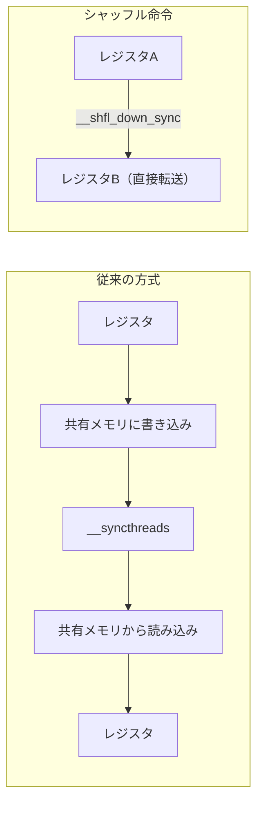
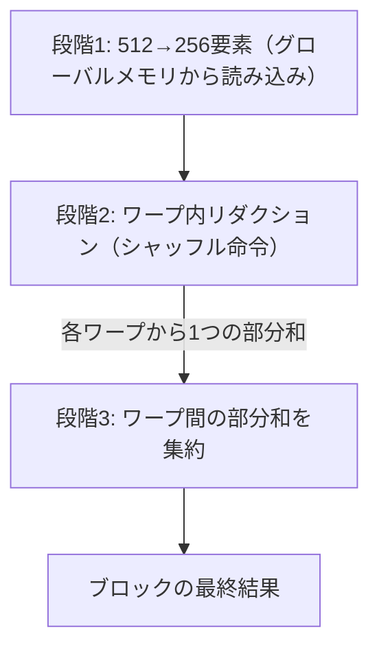

import Quiz from '@/components/content/Quiz.astro'

## 概要

シャッフル命令（`__shfl_down_sync`）を用いたベクトルリダクションの最適化を解説する．シャッフル命令によりワープ内のスレッド間でレジスタの値を直接交換できるため，共有メモリやグローバルメモリを経由せずに高速なリダクションが可能となり，実行時間を約18マイクロ秒まで改善する（ベースライン比約4倍の高速化）．

## 主要な内容

### レジスタとスレッド間通信の課題

GPUのレジスタはスレッドごと（per-thread）のリソースであり，スレッド間でデータを共有できない．通常のリダクションでは，各ステップの結果を共有メモリやグローバルメモリに書き出し，次のステップで読み戻す必要がある．



### シャッフル命令の種類

CUDAには4種類のシャッフル命令がある．ベクトルリダクションでは `__shfl_down_sync` を使用する．

- `__shfl_sync`: 指定レーンIDから直接コピー
- `__shfl_up_sync`: 低いIDのレーンからコピー
- `__shfl_down_sync`: 高いIDのレーンから低いIDへ値を転送
- `__shfl_xor_sync`: XOR演算でレーンIDを決定してコピー

シャッフル命令はワープ（32スレッド）単位で動作する．ワープ内のスレッドIDは「レーン」と呼ばれる（0〜31）．

### `__shfl_down_sync`のパラメータ

```cpp
__shfl_down_sync(unsigned mask, T var, unsigned delta, int width=warpSize);
```

- `mask`: 参加するスレッドのマスク（通常は`0xFFFFFFFF`で全レーン）
- `var`: 転送する値（高いIDのレジスタ値）
- `delta`: ストライド（オフセット幅）
- `width`: ワープサイズ（通常32で固定）

### 実装の3段階構成

シャッフル命令によるリダクションは以下の3段階で構成される．



1. 512要素を256に集約（スレッドあたり2要素の加算）
2. 各ワープ内でシャッフル命令によりリダクション（ストライド16→8→4→2→1）
3. 全ワープの部分和を共有メモリに格納し，最初のワープでもう一度シャッフルリダクション

## コード例

```cuda
__global__ void reduce_shuffle(float* input, int n) {
    __shared__ float sdata[32]; // ワープ数分の共有メモリ
    int tid = threadIdx.x;
    int index = 2 * blockDim.x * blockIdx.x + threadIdx.x;

    // 段階1: 512→256要素に集約（レジスタに格納）
    float sum = 0.0f;
    if (index < n) sum = input[index];
    if (index + blockDim.x < n) sum += input[index + blockDim.x];

    // 段階2: ワープ内シャッフルリダクション
    for (int offset = warpSize / 2; offset > 0; offset >>= 1) {
        sum += __shfl_down_sync(0xFFFFFFFF, sum, offset);
    }

    // 各ワープの部分和を共有メモリに格納
    if (tid % warpSize == 0) {
        sdata[tid / warpSize] = sum;
    }
    __syncthreads();

    // 段階3: 最初のワープで最終リダクション
    if (tid < warpSize) {
        sum = (tid < blockDim.x / warpSize) ? sdata[tid] : 0.0f;
        for (int offset = warpSize / 2; offset > 0; offset >>= 1) {
            sum += __shfl_down_sync(0xFFFFFFFF, sum, offset);
        }
    }

    if (tid == 0) {
        input[blockIdx.x * blockDim.x * 2] = sum;
    }
}
```

### プロファイリング結果

Nsight Computeでの計測結果は以下の通りである．

- ベースライン（グローバルメモリのみ）: 283マイクロ秒
- フィルタ除去: 176マイクロ秒
- スレッド作業量倍増: 100マイクロ秒
- 共有メモリ + アンローリング: 82マイクロ秒
- シャッフル命令: 約18マイクロ秒

シャッフル命令により，前回のベスト（82マイクロ秒）から約4倍の高速化を達成した．

## まとめ

- シャッフル命令（`__shfl_down_sync`）によりワープ内のレジスタ間で直接データ交換が可能となり，共有メモリやグローバルメモリへの書き込みを回避できる
- ワープ内リダクション → ワープ間部分和集約 → 最終リダクションの3段階で実装する
- 共有メモリはワープ数分（32要素）のみ使用し，ワープ間の部分和受け渡しに限定される
- 実行時間は約18マイクロ秒に改善され，ベースライン（283マイクロ秒）から約15倍，前回ベスト（82マイクロ秒）から約4倍の高速化を達成

<Quiz questions={[
  {
    question: "__shfl_down_sync 命令の役割として正しいものはどれか？",
    options: [
      "共有メモリ上のデータを別のブロックに転送する",
      "グローバルメモリのデータを並べ替える",
      "ワープ内のスレッド間でレジスタの値を直接交換し，高いIDのレーンから低いIDへ値を転送する",
      "複数ワープ間でデータを同期的に交換する"
    ],
    answer: 2,
    explanation: "__shfl_down_sync はワープ内のスレッド間でレジスタの値を直接交換するシャッフル命令である．高いIDのレーンから低いIDのレーンへ値を転送し，共有メモリやグローバルメモリを経由せずにデータ交換が可能となる．"
  },
  {
    question: "シャッフル命令によるリダクションの3段階構成として正しいものはどれか？",
    options: [
      "グローバルメモリ読み込み → 共有メモリリダクション → グローバルメモリ書き戻し",
      "512→256要素集約 → ワープ内シャッフルリダクション → ワープ間部分和集約",
      "全要素のソート → 先頭要素の抽出 → 結果の書き戻し",
      "L2キャッシュ読み込み → L1リダクション → レジスタ書き戻し"
    ],
    answer: 1,
    explanation: "シャッフル命令によるリダクションは3段階で構成される．段階1で512要素を256に集約し，段階2で各ワープ内でシャッフル命令によるリダクションを実行し，段階3で全ワープの部分和を共有メモリ経由で最初のワープが最終集約する．"
  },
  {
    question: "シャッフル命令による最適化後の実行時間と，ベースラインからの高速化倍率として正しいものはどれか？",
    options: [
      "約50マイクロ秒，約6倍の高速化",
      "約18マイクロ秒，約15倍の高速化",
      "約82マイクロ秒，約3倍の高速化",
      "約5マイクロ秒，約60倍の高速化"
    ],
    answer: 1,
    explanation: "シャッフル命令による最適化後の実行時間は約18マイクロ秒である．ベースライン（283マイクロ秒）から約15倍，前回ベスト（82マイクロ秒）から約4倍の高速化を達成した．"
  }
]} />
