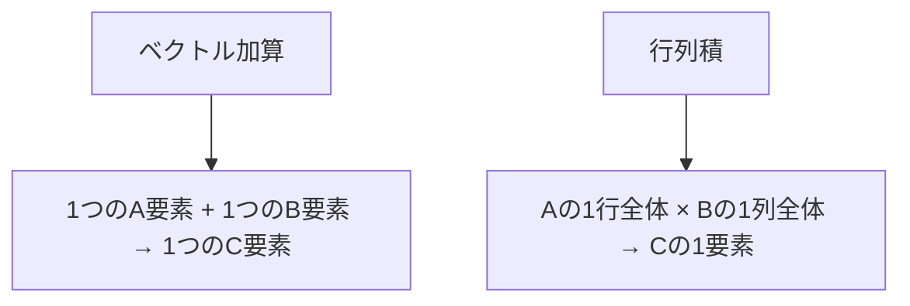

## 概要

行列積（Matrix Multiplication）は，深層学習，科学計算，画像処理など幅広い分野で使用される基本演算である．本レクチャーでは，行列積がなぜ重要かを説明した上で，CPUでの3重ループによる実装とGPUでの`naive`（最適化なし）な実装を比較し，CUDAカーネルの書き方を解説する．

## 主要な内容

### 行列積の重要性

行列積は以下の分野で中核的な役割を果たす．

- 深層学習: ニューラルネットワークの層は行列演算として表現される
- 科学シミュレーション: 流体力学，量子力学などの線形システムやソルバー
- 画像・信号処理: フィルタの適用や変換処理

主要ベンダーは専用のソフトウェアとハードウェアを提供している．

- NVIDIA: `CUTLASS`（カスタマイズ可能），`cuBLAS`（最適化済みライブラリ）
- AMD: `Tensile`（構成ベースライブラリ），`Matrix Cores`（ハードウェア）
- NVIDIA: `Tensor Cores`（行列積専用ハードウェアユニット）

### ベクトル加算と行列積の違い



ベクトル加算ではC[i] = A[i] + B[i]のように1対1の対応だが，行列積ではCの1要素を計算するためにAの行全体とBの列全体が必要になる．行列サイズの標準表記として，AはM×K，BはK×N，CはM×Nとなる．

### CPUでの行列積: 3重ループ

CPUでは行の反復，列の反復，k次元の反復の3つの`for`ループが必要である．

```cpp
// CPU版の行列積
void matmul_cpu(float* a, float* b, float* c, int n) {
    for (int i = 0; i < n; i++) {        // 行の反復
        for (int j = 0; j < n; j++) {    // 列の反復
            float sum = 0.0f;
            for (int k = 0; k < n; k++) { // k次元の反復
                sum += a[i * n + k] * b[k * n + j];
            }
            c[i * n + j] = sum;
        }
    }
}
```

### GPUでのNaive実装

GPUでは外側の2つのループをスレッドIDとブロックIDで置き換え，k次元のループのみ残す．

```cuda
__global__ void mm_naive(float* a, float* b, float* c, int n) {
    int row = blockIdx.y * blockDim.y + threadIdx.y;
    int col = blockIdx.x * blockDim.x + threadIdx.x;

    if (row < n && col < n) {
        float sum = 0.0f;
        for (int k = 0; k < n; k++) {
            sum += a[row * n + k] * b[k * n + col];
        }
        c[row * n + col] = sum;
    }
}
```

グリッドとブロックの構成は以下のように設定する．

```cpp
int block_size = 16;
dim3 threads_per_block(block_size, block_size);  // 16×16 = 256スレッド
dim3 num_blocks((n + block_size - 1) / block_size,
                (n + block_size - 1) / block_size);
```

### 性能比較

n = 1024の行列積の場合，CPUでは約7000ミリ秒かかるのに対し，GPUでは約28ミリ秒で完了する．Nsight Computeによる詳細なプロファイリングでは，Naive版の実行時間は約325マイクロ秒であった．

## コード例

7ステップのCUDAアプリケーション構造:

```cpp
int main() {
    const int N = 512;
    // 1. ホスト・デバイスメモリの確保
    float* h_a = new float[N * N];
    float* h_b = new float[N * N];
    float* h_c = new float[N * N];
    float *d_a, *d_b, *d_c;
    cudaMalloc((void**)&d_a, N * N * sizeof(float));
    // 2. 初期化
    // 3. ホスト→デバイスへコピー
    cudaMemcpy(d_a, h_a, N * N * sizeof(float), cudaMemcpyHostToDevice);
    // 4. カーネル起動
    mm_naive<<<num_blocks, threads_per_block>>>(d_a, d_b, d_c, N);
    // 5. デバイス→ホストへ結果コピー
    // 6. 検証
    // 7. メモリ解放
}
```

## まとめ

- 行列積は深層学習や科学計算の基盤であり，GPU最適化の主要なターゲットである
- CPUの3重ループのうち外側2つをGPUのスレッド/ブロックIDで置き換えることでNaive GPU実装を実現する
- Naive実装はグローバルメモリのみを使用し，最適化の余地が大きい
- 次のステップとして`shared memory`とタイリングによる最適化が必要である
