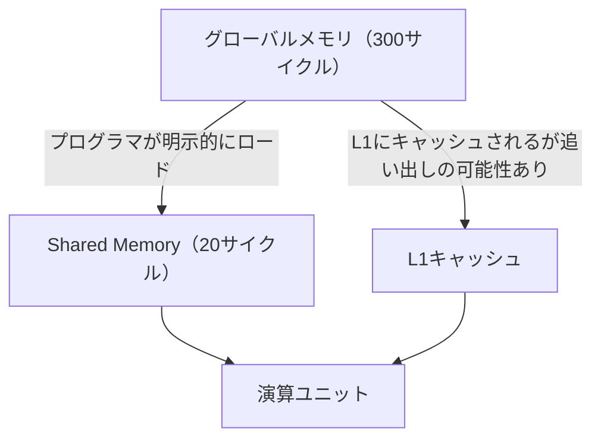
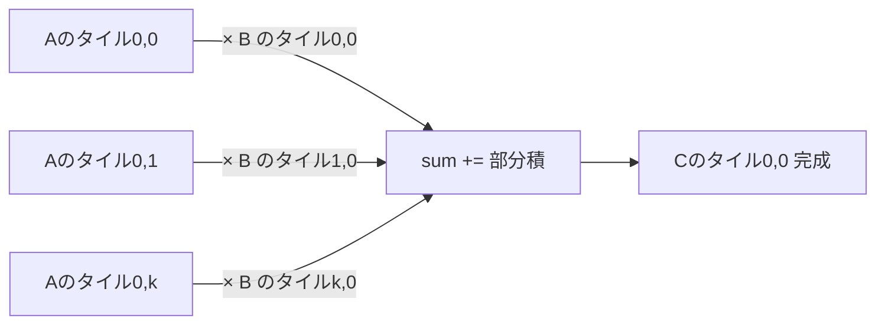

## 概要

Naive行列積ではグローバルメモリから同じデータを何度も読み込むボトルネックがある．本レクチャーでは，`tiling`（タイリング）と`shared memory`を組み合わせて，グローバルメモリアクセスを削減し，行列積の性能を向上させる手法を解説する．

## 主要な内容

### グローバルメモリの繰り返しアクセス問題

Naive実装では，行列Aの1行目を行列Cの1行分の全要素を計算するために何度も読み込む．例えばBがN列を持つ場合，Aの1行目はN回グローバルメモリから読み込まれる．

- グローバルメモリのレイテンシ: 約300サイクル
- `shared memory`のレイテンシ: 約20〜22サイクル

L1キャッシュにデータが載る可能性はあるが，複数ブロックが同一SMで実行される場合にキャッシュから追い出される保証がない．`shared memory`はプログラマが制御できるため，データの残留を保証できる．



### タイリングの概念

行列Cを小さなブロック（タイル）に分割し，各CUDAブロックが1つのタイルを担当する．

- C行列を16×16のタイルに分割する（N=512の場合，32×32 = 1024タイル）
- 1つのCタイルを計算するには，Aの対応する行群とBの対応する列群が全て必要
- k次元に沿ってAとBのタイルを順次ロードし，部分和を蓄積する



### Shared Memoryを使った実装

```cuda
__global__ void mm_shared(float* a, float* b, float* c, int n) {
    __shared__ float sa[TILE_SIZE][TILE_SIZE];
    __shared__ float sb[TILE_SIZE][TILE_SIZE];

    int row = blockIdx.y * TILE_SIZE + threadIdx.y;
    int col = blockIdx.x * TILE_SIZE + threadIdx.x;
    float sum = 0.0f;
    int num_tiles = n / TILE_SIZE;

    for (int t = 0; t < num_tiles; t++) {
        // グローバル→Shared Memoryへロード
        sa[threadIdx.y][threadIdx.x] = a[row * n + t * TILE_SIZE + threadIdx.x];
        sb[threadIdx.y][threadIdx.x] = b[(t * TILE_SIZE + threadIdx.y) * n + col];
        __syncthreads();

        // タイル内の行列積を計算
        for (int k = 0; k < TILE_SIZE; k++) {
            sum += sa[threadIdx.y][k] * sb[k][threadIdx.x];
        }
        __syncthreads();
    }
    c[row * n + col] = sum;
}
```

重要なポイント:
- `__syncthreads()`はロード完了後と演算完了後の2箇所で必要
- タイルサイズ16×16の場合，shared memoryの使用量は16×16×4バイト×2 = 2KBで，十分に小さい

### 性能結果

n = 1024での実行時間比較:
- Naive版: 約3ミリ秒
- Shared Memory版: 約2ミリ秒（約30〜40%の改善）

タイルサイズの選択:
- 16×16（256スレッド/ブロック）: 最良の性能
- 32×32（1024スレッド/ブロック）: 最大スレッド数のため性能が若干低下
- 64×64（4096スレッド/ブロック）: ブロックあたり最大1024スレッドの制限を超えるため実行不可

## まとめ

- グローバルメモリからの繰り返しアクセスがNaive行列積のボトルネックである
- タイリングにより行列をタイル単位に分割し，k次元で反復して部分和を蓄積する
- `shared memory`を使うことでグローバルメモリアクセスを削減し，約30〜40%の性能向上を達成できる
- タイルサイズはブロックあたり最大スレッド数（1024）とshared memoryサイズの両方を考慮して選択する必要がある
