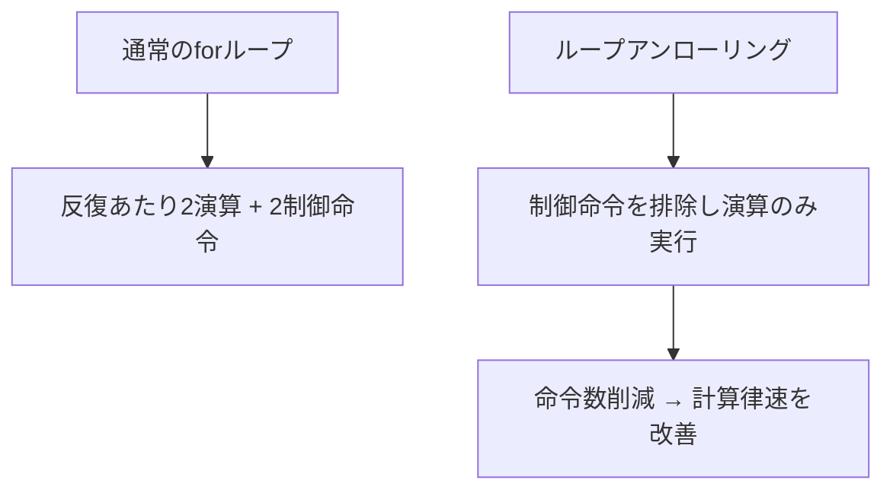

import Quiz from '@/components/content/Quiz.astro'

## 概要

前回のshared memory最適化に加え，`float4`を用いたベクトル化ロードとループアンローリングを組み合わせることで，行列積の性能をさらに向上させる．本レクチャーでは，1スレッドが4要素を同時にロードすることで計算律速とメモリ律速の両方を改善する手法を解説する．

## 主要な内容

### ループアンローリングによる計算最適化

`for`ループには反復ごとにカウンタの更新と条件判定のオーバーヘッドがある．タイルサイズが16の場合，ループ本体の展開（ループアンローリング）により，不要な命令を削減できる．



### float4によるベクトル化ロード（プリフェッチ）

`float4`はC++の型で，4つの`float`値を1回のメモリトランザクションでロードできる．

- 通常: 1スレッドが1つの`float`をロード → 16スレッドで16要素
- `float4`: 1スレッドが4つの`float`をロード → 4スレッドで16要素

これにより，同じタイルサイズでも使用スレッド数を1/4に削減しつつ，メモリ帯域の利用効率が向上する．

行メジャー（Row Major）でデータが格納されている場合，同一行内の連続する要素は`float4`で効率的にロードできるが，異なる行にまたがるロードは不可能である．

### 実装の変更点

前回のshared memory版からの主な変更:

- x次元のスレッド数を4倍にスケーリング（`threadIdx.x * 4`）
- 4つの部分和配列（`sum[4]`）を使用
- `reinterpret_cast<float4*>`によるキャスティングでグローバル→shared memoryへのベクトル化ロードを実現
- 部分和の計算でdot演算（`.x`，`.y`，`.z`，`.w`）を使用

```cuda
// float4によるロード（概念）
float4 tmp = *reinterpret_cast<float4*>(a + offset);
// shared memoryへの書き込み
*reinterpret_cast<float4*>(&sa[threadIdx.y][threadIdx.x * 4]) = tmp;

// 部分和の計算（ループアンローリング）
float4 b_val = *reinterpret_cast<float4*>(&sb[k][threadIdx.x * 4]);
sum[0] += sa[threadIdx.y][k] * b_val.x;
sum[1] += sa[threadIdx.y][k] * b_val.y;
sum[2] += sa[threadIdx.y][k] * b_val.z;
sum[3] += sa[threadIdx.y][k] * b_val.w;
```

### アドレスのキャスティングが必要な理由

shared memoryとグローバルメモリではアドレス空間が異なる（shared memoryは約6桁，グローバルメモリは約12桁の16進アドレス）．`reinterpret_cast`を使ってアドレスの解釈を強制することで，`float4`としての正しいロード/ストアを実現する．

### 性能結果

n = 1024での実行時間比較:
- Naive版: 約360マイクロ秒
- Shared Memory版: 約250マイクロ秒
- `float4`最適化版: 約148マイクロ秒

Naive版から200マイクロ秒以上の削減，shared memory版からも約100マイクロ秒の削減を達成した．

## まとめ

- ループアンローリングにより不要な制御命令を排除し，計算律速を改善できる
- `float4`によるベクトル化ロードで1スレッドあたり4要素を同時に取得し，メモリ帯域の利用効率を向上させる
- メモリ空間の違いに対応するため`reinterpret_cast`によるキャスティングが必要である
- Naive版と比較して約2.4倍の性能向上を達成した

<Quiz questions={[
  {
    question: "float4を使ったベクトル化ロードでは，1スレッドあたり何個のfloat値を同時にロードできるか？",
    options: [
      "1個",
      "2個",
      "4個",
      "8個"
    ],
    answer: 2,
    explanation: "float4はC++の型で，4つのfloat値（.x，.y，.z，.w）を1回のメモリトランザクションでロードできる．これにより，同じタイルサイズでも使用スレッド数を1/4に削減できる．"
  },
  {
    question: "ループアンローリングによって改善されるのは主にどの側面か？",
    options: [
      "メモリ帯域幅の利用効率",
      "shared memoryの使用量",
      "ループ制御命令（カウンタ更新・条件判定）の排除による計算律速の改善",
      "グローバルメモリのcoalescing"
    ],
    answer: 2,
    explanation: "ループアンローリングは，forループの反復ごとに発生するカウンタ更新と条件判定のオーバーヘッドを排除することで，不要な制御命令を削減し計算律速を改善する．"
  },
  {
    question: "shared memoryとグローバルメモリ間でfloat4としてロード/ストアする際にreinterpret_castが必要な理由は何か？",
    options: [
      "float4はCUDA固有の型であり，標準C++では扱えないため",
      "shared memoryとグローバルメモリのアドレス空間が異なるため，アドレスの解釈を強制する必要があるため",
      "float4はアライメント要件が厳しく，コンパイラが自動変換できないため",
      "shared memoryはfloat型のみをサポートしているため"
    ],
    answer: 1,
    explanation: "shared memoryとグローバルメモリではアドレス空間が異なる（shared memoryは約6桁，グローバルメモリは約12桁の16進アドレス）．reinterpret_castを使ってアドレスの解釈を強制することで，float4としての正しいロード/ストアを実現する．"
  }
]} />
