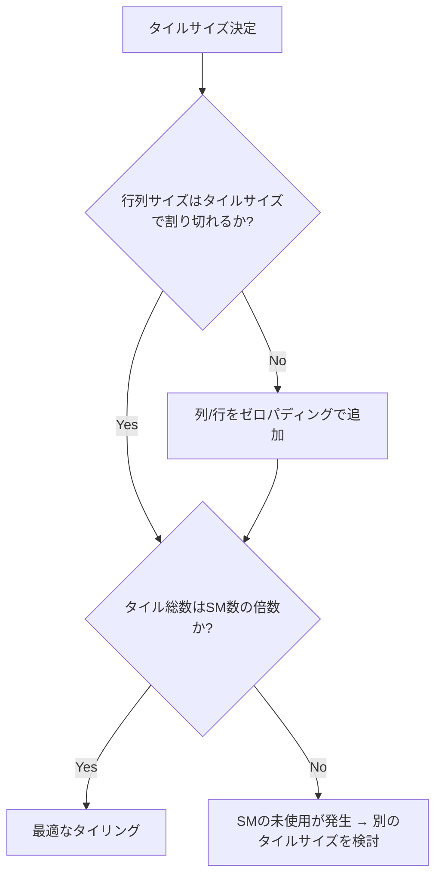

## 概要

タイリングは行列積のGPU実装における最も重要な設計判断の一つである．本レクチャーでは，タイルサイズの選択がGPUのSM使用率に与える影響を具体例とともに解説し，正方行列だけでなく非正方行列への対応方法も説明する．

## 主要な内容

### タイルサイズ選択の3つのパラメータ

タイルサイズを決定する際に考慮すべきパラメータは以下の3つである．

- 行列サイズ: 正方行列か非正方行列か
- SM数: GPUに搭載されているStreaming Multiprocessorの数
- タイルサイズ自体: shared memoryに収まるか，スレッド数制限を超えないか

最も重要な原則は，タイル総数がSM数の倍数になるようにタイルサイズを選ぶことである．



### 具体例による比較

GPUのSM数が16の場合:

正方行列 40×40，タイルサイズ 10×10の場合:
- タイル数: (40/10) × (40/10) = 4 × 4 = 16タイル
- SM数16の倍数 → 最適

正方行列 40×40，タイルサイズ 4×4の場合:
- タイル数: (40/4) × (40/4) = 10 × 10 = 100タイル
- 100は16の倍数ではない → 非最適

非正方行列 40×50，タイルサイズ 10×10の場合:
- タイル数: (40/10) × (50/10) = 4 × 5 = 20タイル
- 20は16の倍数ではない → 第1ラウンドで16SM使用，第2ラウンドで4SMのみ使用

行列サイズがタイルサイズで割り切れない場合（例: 40×41，タイルサイズ 10×10）:
- 最後のタイルが1列のみとなり，非効率
- 解決策: 行列にゼロの列/行を追加してパディングする

### 非正方タイルの活用

タイルは正方でなくてもよい．例えば32×16，16×32，8×16なども使用可能である．

```
例: 64×32の行列
- タイルサイズ 16×4 → x方向4タイル × y方向8タイル = 32タイル
- SM数が32またはその約数なら最適
```

重要な制約:
- タイルのx次元は行列のx次元の約数であること
- タイルのy次元は行列のy次元の約数であること
- タイル総数がSM数の倍数であること
- タイルがshared memoryに収まること
- スレッド数がブロックあたり最大1024を超えないこと

## まとめ

- タイル総数はGPUのSM数の倍数にすることで，全SMを有効活用できる
- 非正方行列では非正方タイル（例: 32×16）を使うことで最適なタイリングが可能になる
- 行列サイズがタイルサイズで割り切れない場合はゼロパディングで対応する
- 実行時間を様々なタイルサイズでプロファイリングし，最適な構成を選択することが重要である
- 次のステップとしてTensor Coreを活用した行列積を学ぶ（通常コアと比較して最大9倍の性能向上）
