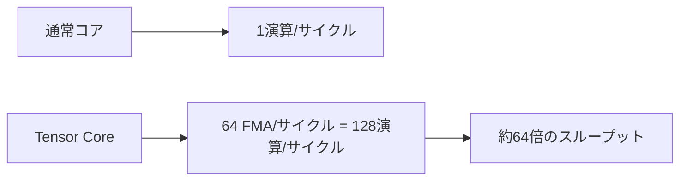

import Quiz from '@/components/content/Quiz.astro'

## 概要

`Tensor Core`は，行列積を高速に実行するためにNVIDIA GPUに搭載された専用ハードウェアユニットである．本レクチャーでは，Tensor Coreの仕組み，対応データ型，アーキテクチャの進化，そして通常コアと比較した性能差について解説する．

## 主要な内容

### Tensor Coreとは

Tensor Coreは，2017年のVoltaアーキテクチャで初めて導入された行列積専用のハードウェアユニットである．通常コアが1サイクルに1演算を実行するのに対し，1つのTensor Coreは1サイクルで64回のFMA（Fused Multiply-Add）演算，すなわち128回の浮動小数点演算を実行できる．

### アーキテクチャの進化

Tensor Coreは以下のアーキテクチャで搭載されている．

- Volta（2017）: FP16→FP16，FP16→FP32
- Turing: 上記 + INT8/INT4/INT1
- Ampere: 上記 + BF16，TF32，FP64
- Hopper，Ada Lovelace，Blackwell: さらに拡張

### A100 GPUのTensor Core構成

- 各SMに8つのTensor Core（各パーティションに2つ，4パーティション/SM）
- A100 GPUには合計640のTensor Core（80 SM × 8 Tensor Core）
- 1 SMあたり512 FMA/サイクル = 1024個別浮動小数点演算/サイクル

### 通常コアとTensor Coreの性能比較

A100 GPUの場合:
- 通常コア（FP32）: 約19.5 TFLOPS
- Tensor Core（TF32）: 約156 TFLOPS（スパース性なし），約312 TFLOPS（スパース性あり）
- Tensor Core（FP16）: さらに高い性能

Voltaアーキテクチャでは，Pascal世代と比較してTensor Coreにより最大9倍の性能向上が実証されている（V100: 125 TFLOPSに対しP100: 約15 TFLOPS）．

### 対応データ型

Tensor Coreの入出力の組み合わせは以下の通りである．

- FP16入力 → FP16出力
- FP16入力 → FP32出力（入力の範囲を超える結果に対応）
- BF16: FP32と同じ範囲だが精度は7ビット
- TF32: FP32と同様のフォーマットだが仮数部のビット数が異なる
- INT8，INT4，INT1（Turing以降）
- FP64（Ampere以降）

### ソフトウェアエコシステム

Tensor Coreの導入に伴い，以下のライブラリが更新された．

- `cuBLAS`: 線形代数ライブラリ
- `cuDNN`: 深層学習ライブラリ
- `cuSPARSE`: スパース行列ライブラリ
- `cuSOLVER`: ソルバーライブラリ
- `cuFFT`: FFTライブラリ

PyTorchなどのフレームワークも内部的にTensor Coreを活用している．

## まとめ

- Tensor Coreは1サイクルで64 FMA演算を実行できる行列積専用ハードウェアである
- Volta（2017）で初めて導入され，以降のアーキテクチャで対応データ型が拡張されている
- 通常コアと比較して最大9倍以上の性能向上が可能である
- `cuBLAS`や`WMMA API`など複数の方法でプログラミングできる

<Quiz questions={[
  {
    question: "Tensor Coreが初めて導入されたNVIDIA GPUアーキテクチャはどれか？",
    options: [
      "Pascal（2016）",
      "Volta（2017）",
      "Turing（2018）",
      "Ampere（2020）"
    ],
    answer: 1,
    explanation: "Tensor Coreは2017年のVoltaアーキテクチャで初めて導入された．以降のTuring，Ampere，Hopper等で対応データ型が拡張されている．"
  },
  {
    question: "1つのTensor Coreが1サイクルで実行できるFMA（Fused Multiply-Add）演算の回数はいくつか？",
    options: [
      "1回",
      "16回",
      "64回",
      "128回"
    ],
    answer: 2,
    explanation: "1つのTensor Coreは1サイクルで64回のFMA演算を実行できる．FMAは乗算と加算の2演算を含むため，浮動小数点演算としては128回に相当する．"
  },
  {
    question: "A100 GPUにおけるTensor Coreの総数はいくつか？",
    options: [
      "80個（1 SM × 80 SM）",
      "320個（4 SM × 80 SM）",
      "640個（8 SM × 80 SM）",
      "1280個（16 SM × 80 SM）"
    ],
    answer: 2,
    explanation: "A100 GPUには各SMに8つのTensor Coreが搭載されており，80 SM × 8 Tensor Core = 合計640のTensor Coreが存在する．"
  }
]} />
