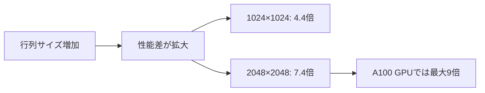

## 概要

本レクチャーでは，Tensor Coreと通常コアの性能差を実際に測定する．同じ行列サイズ，同じ精度（半精度）で行列積を実行し，Nsight Computeを用いて実行時間を比較する．

## 主要な内容

### 実験条件

2つのアプリケーションを比較する．

- Naive版: 通常コアを使用した行列積（最適化なし）
- Tensor Core版: Tensor Coreを使用した行列積（WMMA API）

共通条件:
- 行列サイズ: 1024×1024の正方行列
- データ型: 半精度（FP16）

### コンパイル時の注意点

Tensor Core用のコードをコンパイルする際は，`compute capability`の指定が必須である．

```bash
# Tensor Core版のコンパイル（Ampere GPUの場合）
nvcc -arch=sm_80 -o tensor tensor.cu

# 指定しない場合，古いアーキテクチャ（sm_52等）でコンパイルされ，
# WMMA関連の関数が未定義エラーとなる
```

`sm_80`はAmpereアーキテクチャのcompute capabilityである．Volta以前のアーキテクチャにはTensor Coreが存在しないため，`sm_70`以上を指定する必要がある．

### 性能測定結果

Nsight Computeを使用した実行時間の比較:

行列サイズ 1024×1024の場合:
- Naive版: 2.454ミリ秒
- Tensor Core版: 577マイクロ秒
- 性能向上: 約4.4倍

行列サイズ 2048×2048の場合:
- Naive版: 20.17ミリ秒
- Tensor Core版: 2.73ミリ秒
- 性能向上: 約7.4倍



RTX 3060（一般ユーザー向けGPU）での測定であり，A100（HPC向けGPU）ではより大きな性能差（8〜9倍）が期待される．

### 性能差の意味

7.4倍の性能向上は実用面で以下を意味する．

- 10日かかる大規模言語モデルの学習が約1.3日に短縮される
- 電力消費と計算コストの大幅削減
- さらにshared memoryやタイリングの最適化を追加すれば，より大きな性能向上が可能

## まとめ

- Tensor Coreはコード変更なし（同じ精度，同じ行列サイズ）で通常コアの4〜7倍以上の性能を発揮する
- 行列サイズが大きいほどTensor Coreの優位性が増す
- コンパイル時には`-arch=sm_70`以上のcompute capabilityの指定が必須である
- HPC向けGPU（A100等）ではさらに大きな性能差が期待できる
