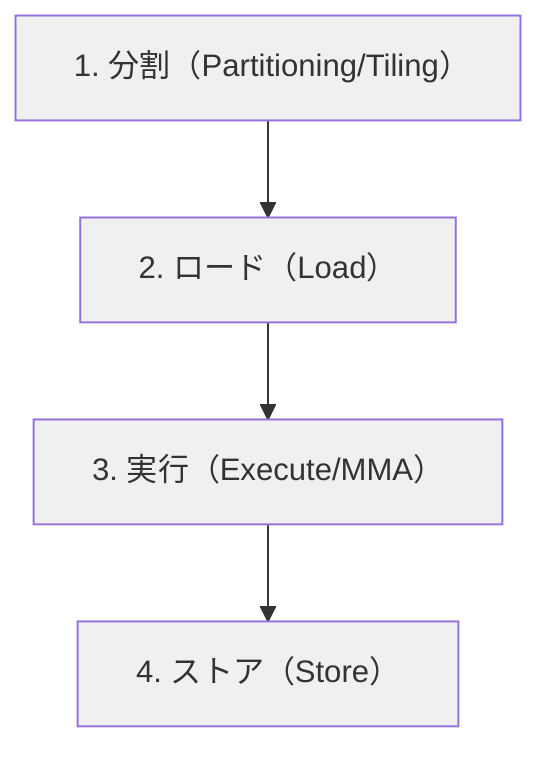

import Quiz from '@/components/content/Quiz.astro'

## 概要

`WMMA`（Warp-level Matrix Multiply-Accumulate）APIは，Tensor Coreをプログラムするための低レベルAPIである．本レクチャーでは，WMMAの4つのステップ（分割，ロード，実行，ストア），`fragment`の概念，ワープIDの計算方法を解説する．

## 主要な内容

### GPU行列積カーネルの4ステップ

行列積カーネルは通常コア版もTensor Core版も共通の4ステップで構成される．



通常コア版との違い:
- 通常コア: ブロック単位でタイルを割り当て，shared memoryにロード
- WMMA: ワープ単位でタイルを割り当て，レジスタ上のfragmentにロード

### WMMAの基本概念

WMMAは「Warp Asynchronous Matrix Multiply Accumulate」の略で，compute capability 7.0（Volta）以上で使用可能である．

`fragment`とは，行列のタイルをワープ内の全スレッドに分散して保持するデータ構造である．

```cpp
// fragmentの宣言例
wmma::fragment<wmma::matrix_a, 16, 16, 16, half, wmma::col_major> a_frag;
wmma::fragment<wmma::matrix_b, 16, 16, 16, half, wmma::row_major> b_frag;
wmma::fragment<wmma::accumulator, 16, 16, 16, float> c_frag;
```

WMMA APIがサポートするタイルサイズは限定されている（例: 16×16×16，32×8×16，8×32×16）．任意のサイズは選択できない．

### マトリクスレイアウト

- Row Major: 行単位で連続してメモリに格納（A[0][0], A[0][1], A[0][2], ...）
- Column Major: 列単位で連続してメモリに格納（A[0][0], A[1][0], A[2][0], ...）

行列Aをrow major，行列Bをcolumn majorにすることで，メモリアクセスの効率を向上させることができる．

### ワープIDの計算

WMMAはワープ単位で動作するため，CUDAに組み込み変数が存在しないワープIDを手動で計算する必要がある．

```cuda
// 1Dグリッドの場合
int warpId = threadIdx.x / 32 + (blockDim.x / 32) * blockIdx.x;

// 2Dグリッドの場合
int warpId = threadIdx.x / 32
           + (blockDim.x / 32) * (blockIdx.x + blockIdx.y * gridDim.x);
```

例: ブロックサイズ128スレッド，グリッドサイズ2ブロックの場合:
- 各ブロック内に4ワープ（128/32）
- ブロック0: ワープ0〜3
- ブロック1: ワープ4〜7

### WMMAカーネルの構造

```cuda
__global__ void wmma_gemm(half* a, half* b, float* c, int m, int n, int k) {
    // ワープIDとタイル位置の計算
    int warpId = ...;
    int tileRow = warpId / (n / 16);
    int tileCol = warpId % (n / 16);

    // fragmentの宣言
    wmma::fragment<wmma::matrix_a, 16, 16, 16, half, wmma::col_major> a_frag;
    wmma::fragment<wmma::matrix_b, 16, 16, 16, half, wmma::row_major> b_frag;
    wmma::fragment<wmma::accumulator, 16, 16, 16, float> c_frag;

    // Cの初期化
    wmma::fill_fragment(c_frag, 0.0f);

    // k次元でのタイル反復
    for (int t = 0; t < k; t += 16) {
        half* a_sub = a + tileRow * 16 * lda + t;
        half* b_sub = b + t * ldb + tileCol * 16;
        wmma::load_matrix_sync(a_frag, a_sub, lda);
        wmma::load_matrix_sync(b_frag, b_sub, ldb);
        wmma::mma_sync(c_frag, a_frag, b_frag, c_frag);
    }

    // 結果の格納
    float* c_sub = c + tileRow * 16 * ldc + tileCol * 16;
    wmma::store_matrix_sync(c_sub, c_frag, ldc, wmma::mem_row_major);
}
```

### WMMA APIの4つの主要関数

- `wmma::fill_fragment()`: fragmentをゼロ等の定数で初期化
- `wmma::load_matrix_sync()`: グローバルメモリからfragmentにロード
- `wmma::mma_sync()`: D = A × B + C の行列積累算を実行
- `wmma::store_matrix_sync()`: fragmentからグローバルメモリに格納

## まとめ

- WMMAはワープ単位でTensor Coreをプログラムするための低レベルAPIである
- `fragment`はタイルデータをワープ内の全スレッドに分散保持するデータ構造である
- ワープIDの計算が必要で，タイルの割り当てはブロック単位ではなくワープ単位で行う
- サポートされるタイルサイズは限定的だが，`load_matrix_sync`，`mma_sync`，`store_matrix_sync`の3関数で行列積を簡潔に記述できる

<Quiz questions={[
  {
    question: "WMMA APIにおけるfragmentとは何か？",
    options: [
      "shared memory上に確保されるタイルデータの格納領域",
      "行列のタイルをワープ内の全スレッドに分散して保持するデータ構造",
      "グローバルメモリ上の行列の部分領域へのポインタ",
      "Tensor Coreのハードウェアレジスタへの直接参照"
    ],
    answer: 1,
    explanation: "fragmentは，行列のタイルデータをワープ内の全スレッド（32スレッド）に分散して保持するデータ構造である．通常コア版のshared memoryとは異なり，レジスタ上にデータを保持する．"
  },
  {
    question: "WMMA APIで行列積の累算演算（D = A × B + C）を実行する関数はどれか？",
    options: [
      "wmma::fill_fragment()",
      "wmma::load_matrix_sync()",
      "wmma::mma_sync()",
      "wmma::store_matrix_sync()"
    ],
    answer: 2,
    explanation: "wmma::mma_sync()がD = A × B + Cの行列積累算演算を実行する関数である．fill_fragmentは初期化，load_matrix_syncはロード，store_matrix_syncは格納を行う．"
  },
  {
    question: "WMMA APIが通常コア版と異なる点として，タイルの割り当て単位はどうなるか？",
    options: [
      "スレッド単位で割り当てる",
      "ブロック単位で割り当てる",
      "ワープ単位で割り当てる",
      "SM単位で割り当てる"
    ],
    answer: 2,
    explanation: "通常コア版ではブロック単位でタイルを割り当てるが，WMMA APIではワープ単位でタイルを割り当てる．そのため，CUDAに組み込み変数が存在しないワープIDを手動で計算する必要がある．"
  }
]} />
